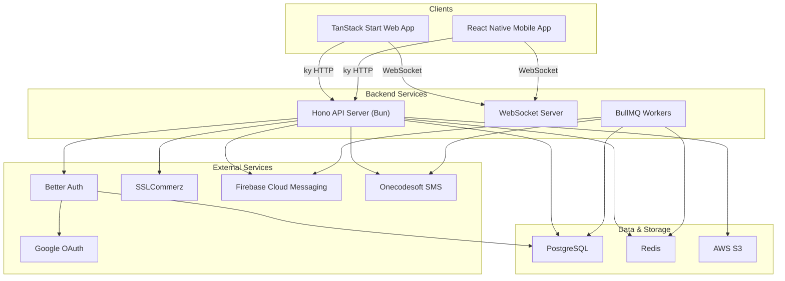
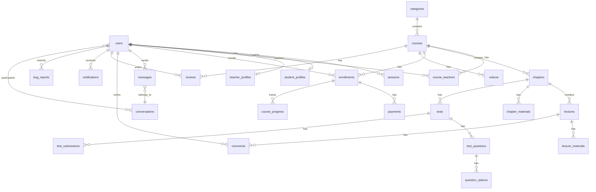

# Mehedi's Math Academy -- LMS Platform Build Plan

**Site Name:** Mehedi's Math Academy
**Domain:** mehedismathacademy.com

## Architecture Overview



## Monorepo Structure

```
mehedi_math_academy/
├── apps/
│   ├── web/                        # TanStack Start frontend
│   │   └── src/
│   │       ├── routes/             # File-based routes (TanStack Router)
│   │       ├── features/           # Feature modules (courses, messaging, etc.)
│   │       ├── components/         # Shared + shadcn/ui components
│   │       ├── hooks/              # Shared custom hooks
│   │       ├── lib/                # API client (ky), auth client, utils
│   │       ├── providers/          # React context providers
│   │       └── styles/             # Global CSS, @theme tokens
│   ├── api/                        # Hono backend API
│   │   └── src/
│   │       ├── routes/             # Hono route definitions
│   │       ├── controllers/        # Request handling, validation
│   │       ├── services/           # Business logic layer
│   │       ├── repositories/       # Drizzle query layer
│   │       ├── middleware/         # Auth, rate-limit, logging, validation
│   │       ├── workers/            # BullMQ background workers
│   │       ├── websocket/          # WebSocket handlers
│   │       └── lib/                # S3, Redis, FCM, SMS service wrappers
│   └── mobile/                     # React Native (Expo SDK 54) app
│       └── src/
│           ├── app/                # Expo Router screens
│           ├── components/         # RN UI components
│           ├── features/           # Feature modules (mirroring web)
│           ├── hooks/              # Custom hooks
│           ├── lib/                # API client, auth, utils
│           └── providers/          # Context providers
├── packages/
│   ├── db/                         # Drizzle schema, migrations, client
│   │   └── src/
│   │       ├── schema/             # One file per table/entity
│   │       ├── migrations/         # Generated migration files
│   │       └── client.ts           # DB client singleton
│   ├── shared/                     # Shared types, validators, constants
│   │   └── src/
│   │       ├── types/              # TypeScript types and enums
│   │       ├── validators/         # Zod schemas (used by frontend + backend)
│   │       └── constants/          # App-wide constants
│   ├── auth/                       # Better Auth config (shared web + api)
│   └── config/                     # Shared ESLint, TypeScript, Tailwind configs
├── tooling/
│   └── scripts/                    # Seed script, migration helpers
├── turbo.json
├── package.json
├── DESIGN.md
└── .env.example
```

## Tech Stack Summary (Verified Latest Stable -- March 2026)

| Layer         | Technology                      | Pinned Version       | Notes                                                   |
| ------------- | ------------------------------- | -------------------- | ------------------------------------------------------- |
| Runtime       | Bun                             | ^1.3.11              | Latest stable                                           |
| Monorepo      | Turborepo + Bun workspaces      | ^2.8.20              | Latest stable                                           |
| Frontend      | TanStack Start + React 19.1     | ^1.166.x (RC)        | RC but API-stable, approaching v1                       |
| UI Library    | shadcn/ui (cli v4)              | `npx shadcn@latest`  | Stable v4 CLI with first-class TanStack Start templates |
| Styling       | Tailwind CSS v4                 | ^4.2.2               | Latest stable                                           |
| Forms         | React Hook Form + Zod           | ^7.72.0 / ^4.3.6     | Latest stable for both                                  |
| HTTP Client   | ky                              | ^1.14.3              | Latest stable                                           |
| Backend       | Hono                            | ^4.12.9              | Latest stable                                           |
| Database      | PostgreSQL 18                   | 18.3                 | Released Sept 2025, latest patch 18.3 (Feb 2026)        |
| ORM           | Drizzle ORM                     | ^0.45.1              | Latest stable (v1.0 beta also available)                |
| ORM Kit       | drizzle-kit                     | latest               | Migrations and studio                                   |
| Auth          | Better Auth + Drizzle adapter   | ^1.5.x               | Latest stable with Drizzle adapter                      |
| Cache         | Redis + ioredis                 | ^5.10.1              | Latest stable                                           |
| Queue         | BullMQ                          | latest               | Background job processing                               |
| Storage       | AWS S3 SDK v3                   | ^3.x                 | `@aws-sdk/client-s3`, `@aws-sdk/s3-request-presigner`   |
| Payments      | sslcommerz-lts                  | ^1.2.0               | Official SSLCommerz Node.js package                     |
| Notifications | Firebase Admin SDK (FCM)        | ^13.x                | Latest modular SDK v10 for client                       |
| PDF           | @react-pdf/renderer             | ^4.3.2               | Latest stable, supports React 19                        |
| Mobile        | React Native 0.81 + Expo SDK 54 | SDK 54               | React 19.1, Reanimated 4, New Architecture              |
| WebSocket     | Hono WebSocket                  | built-in (`hono/ws`) | Native Hono WebSocket support                           |
| Validation    | Zod                             | ^4.3.6               | Latest stable, 2kb gzipped core                         |
| Logging       | pino                            | latest               | Structured logging for backend                          |
| Charts        | Recharts                        | latest               | Analytics dashboards                                    |

---

## Phase 1: Monorepo Setup and Project Foundation

**Goal:** Scaffold the Turborepo monorepo with Bun workspaces, configure TypeScript, ESLint, and establish the project skeleton for all apps and packages.

**Status:** Completed

**Key tasks:**

- Initialize the root `package.json` with Bun `"workspaces": ["apps/*", "packages/*", "tooling/*"]`
- Configure `turbo.json` with pipelines: `build`, `dev`, `lint`, `typecheck`, `db:generate`, `db:migrate`, `db:seed`
- Create `packages/config/` with shared `tsconfig.base.json`, ESLint flat config, and Prettier config
- Create `.env.example` with all required environment variables (DB, Redis, S3, Firebase, SSLCommerz, Better Auth secrets)
- Set up `packages/shared/` with initial Zod validators and TypeScript types for user roles (`STUDENT`, `TEACHER`, `ACCOUNTANT`, `ADMIN`)
- Set up Git with `.gitignore` covering `node_modules`, `.env`, `dist`, `drizzle/`, generated files
- Install and verify Bun, Turborepo, and all root-level dev dependencies

**Key files:**

- `package.json`, `turbo.json`, `packages/config/tsconfig.base.json`
- `packages/shared/src/types/roles.ts`, `packages/shared/src/validators/index.ts`

---

## Phase 2: Database Schema Design and Drizzle ORM Setup

**Goal:** Design the complete PostgreSQL schema using Drizzle ORM in `packages/db/`, covering all entities needed for the LMS.

**Status:** Completed

**Key tables and relationships:**



**Key tasks:**

- Create `packages/db/src/schema/` with modular schema files: `users.ts`, `courses.ts`, `chapters.ts`, `lectures.ts`, `tests.ts`, `enrollments.ts`, `payments.ts`, `messages.ts`, `comments.ts`, `notifications.ts`, `categories.ts`, `reviews.ts`
- Define Drizzle relations for all tables
- Configure `drizzle.config.ts` with PostgreSQL 18 provider
- Create the DB client in `packages/db/src/client.ts` using `drizzle-orm/node-postgres`
- Write initial migration generation script
- Create seed script in `tooling/scripts/seed.ts` for the admin account (credentials from env vars)

**Core schema highlights:**

- `users` table: id (uuid), email, name, role (enum: STUDENT/TEACHER/ACCOUNTANT/ADMIN), emailVerified, image, profileCompleted (boolean), isActive (boolean, default true -- admin can deactivate), createdAt, updatedAt
- `courses` table: id, title, slug (unique, SEO-friendly URL), description, coverImageUrl, price (0 = free), status (enum: DRAFT/PENDING/PUBLISHED/ARCHIVED), categoryId, createdAt, updatedAt
- `enrollments` table: id, userId, courseId, status (ACTIVE/COMPLETED/CANCELLED), enrolledAt, completedAt
- `payments` table: id, enrollmentId, userId, amount, currency, transactionId, status (PENDING/SUCCESS/FAILED/REFUNDED), provider (SSLCOMMERZ), metadata (jsonb)
- `messages` table: id, conversationId, senderId, content, createdAt (no deletedAt -- messages cannot be deleted)
- `conversations` table: id, participantOneId, participantTwoId, lastMessageAt
- `test_questions` table with `type` enum (MCQ/WRITTEN), `options` for MCQ, `correctAnswer`
- `bug_reports` table: id, userId, title, description, screenshotUrl (optional, S3), status (enum: OPEN/IN_PROGRESS/RESOLVED/CLOSED), adminNotes, priority (LOW/MEDIUM/HIGH), createdAt, resolvedAt

---

## Phase 3: Backend Core -- Hono API Server

**Status:** Completed

**Goal:** Set up the Hono API server in `apps/api/` with middleware stack, error handling, route structure, and shared utilities.

**Key tasks:**

- Initialize `apps/api/` with Bun + Hono
- Implement layered architecture: `routes/ -> controllers/ -> services/ -> repositories/`
- Set up middleware stack:
  - CORS (configured for web and mobile origins)
  - Request logging (pino)
  - Rate limiting (with Redis store)
  - Request ID generation
  - Body size limiting
  - Compression
- Create global error handler with `AppError` hierarchy (ValidationError, NotFoundError, UnauthorizedError, ForbiddenError)
- Create standardized API response helpers: `success()`, `error()`, `paginated()`
- Set up Zod validation middleware for request body/params/query
- Configure Redis client (ioredis) as shared singleton
- Set up BullMQ for background job processing with dedicated worker queues: `email`, `notification`, `sms`, `file-processing`
- Health check endpoint at `GET /api/health`

**Route namespace plan:**

```
/api/v1/auth/*         - Authentication
/api/v1/users/*        - User management
/api/v1/profiles/*     - Profile management
/api/v1/categories/*   - Category management
/api/v1/courses/*      - Course CRUD
/api/v1/enrollments/*  - Enrollment & payment
/api/v1/messages/*     - Messaging
/api/v1/notifications/* - Notifications
/api/v1/admin/*        - Admin-specific routes
/api/v1/analytics/*    - Analytics
/api/v1/upload/*       - File upload
```

---

## Phase 4: Authentication System (Better Auth)

**Status:** Completed

**Goal:** Integrate Better Auth with Drizzle adapter, supporting email/password signup (students), Google OAuth, and admin-created accounts for teachers/accountants.

**Key tasks:**

- Create `packages/auth/` with Better Auth configuration shared between web and api
- Configure Better Auth with:
  - Email/password provider (for students)
  - Google OAuth provider
  - Drizzle adapter pointing to `packages/db`
  - `tanstackStartCookies` plugin for the web app
  - Custom session fields (role, profileCompleted)
- Implement role-based middleware in Hono:
  - `requireAuth()` -- verify session and check `isActive === true` (reject deactivated users with 403)
  - `requireRole(...roles)` -- check user role
  - `requireAdmin()` -- shorthand for admin-only
- Build admin endpoints for creating teacher/accountant accounts (generates password, sends invite)
- Run Better Auth CLI to generate auth schema, merge into Drizzle schema
- Implement the seed script to create the single admin account from env vars (`ADMIN_EMAIL`, `ADMIN_PASSWORD`)
- Add auth route handler in TanStack Start at `/api/auth/$`

**Security considerations:**

- Rate limiting on auth endpoints (5 attempts per 15 min)
- Password hashing via Better Auth (Argon2)
- Refresh token rotation
- Session invalidation on role change or account deactivation

---

## Phase 5: Frontend Foundation -- TanStack Start + Design System

**Status:** Completed

**Goal:** Set up the TanStack Start web app with Tailwind CSS v4, shadcn/ui, and implement the "Digital Atelier" design system from [DESIGN.md](DESIGN.md).

**Key tasks:**

- Initialize `apps/web/` with TanStack Start + React 19
- Install and configure Tailwind CSS v4 with PostCSS
- Initialize shadcn/ui using `npx shadcn@latest init` (CLI v4 has stable TanStack Start support)
- Translate DESIGN.md into Tailwind `@theme` tokens:
  - Surface hierarchy: `--color-surface`, `--color-surface-container-low`, `--color-surface-container-lowest`, `--color-surface-container-highest`
  - Primary colors: `--color-primary` (#000000), `--color-on-primary-container` (#028fb0), `--color-secondary-container` (#6063ee)
  - Typography: Manrope (display/headlines) + Inter (body/labels)
  - Radius tokens: DEFAULT (0.25rem), md (0.375rem)
  - Shadow system: tinted shadows using `rgba(19, 27, 46, 0.08)`, ghost borders at 15% opacity
  - "No-Line Rule" enforced via surface layering, not borders
  - Signature CTA gradient: `primary` to `on-primary-container`
  - Frosted navigation: 80% opacity + 24px backdrop-blur
- Create core layout components:
  - `AppShell` with glassmorphic sidebar navigation
  - `DashboardLayout` (role-based sidebar items)
  - `PublicLayout` (for landing page, course catalog)
- Set up the ky API client wrapper with:
  - Base URL configuration
  - Auth token injection (from Better Auth session)
  - Error interceptor with toast notifications
  - Request/response type inference
- Set up React Hook Form + Zod resolver pattern
- Build the skeleton system:
  - Base `Skeleton` primitive component in `components/ui/skeleton.tsx` using DESIGN.md surface colors with shimmer animation
  - `FadeIn` transition wrapper component (`components/common/fade-in.tsx`) for smooth skeleton-to-content transitions (150ms ease-out opacity + translateY)
  - Define the shimmer `@keyframes` in the global Tailwind `@theme` block as `--animate-shimmer`
  - No spinners, loaders, or "Loading..." text anywhere -- custom skeletons only
- Implement error boundaries at every route level using TanStack Router's `errorComponent`
- Configure TanStack Router with route groups: `(public)`, `(auth)`, `(dashboard)`
- Set up base HTML head with default meta tags: site name "Mehedi's Math Academy", favicon, viewport, theme-color
- Configure default `og:site_name` as "Mehedi's Math Academy" and `og:url` base as `https://mehedismathacademy.com`

---

## Phase 6: User and Profile Management

**Status:** Completed

**Goal:** Implement the complete user profile system with role-specific profiles and the first-login profile completion prompt.

**Key tasks:**

- **Backend:**
  - `GET /api/v1/profiles/me` -- get own profile
  - `PUT /api/v1/profiles/me` -- update own profile
  - `GET /api/v1/profiles/teachers/:id` -- public teacher profile
  - `GET /api/v1/admin/users/:id/profile` -- admin views any student profile
  - Student profile fields: name, phone, dateOfBirth, guardianName, guardianPhone, institution, class/grade, address, profilePhoto
  - Teacher profile fields: name, phone, bio, qualifications, specializations, profilePhoto, socialLinks
- **Frontend:**
  - Profile completion modal/page that triggers on first login when `profileCompleted === false`
  - Multi-step profile form with React Hook Form
  - Public teacher profile page showing bio, courses, ratings
  - Student profile page (accessible by the student and admin only)
  - Profile photo upload with S3 integration
  - Skeleton loading states for all profile pages

---

## Phase 7: Admin Dashboard, Account Management, and Bug Reports

**Status:** Completed

**Goal:** Build the admin dashboard with user account CRUD, activate/deactivate users, system overview, and a bug reporting system for students and teachers.

**Key tasks:**

- **Backend -- User Management:**
  - `GET /api/v1/admin/users` -- list all users with filters (role, status, search, pagination)
  - `POST /api/v1/admin/users` -- create teacher/accountant accounts
  - `PUT /api/v1/admin/users/:id` -- update user
  - `PATCH /api/v1/admin/users/:id/status` -- activate or deactivate a user (toggle `isActive`). Backend must enforce: admin cannot deactivate themselves (reject with 403 if `targetId === currentUserId`). Deactivated users cannot log in -- Better Auth session check must verify `isActive === true` and reject otherwise.
  - `DELETE /api/v1/admin/users/:id` -- soft delete user
  - `GET /api/v1/admin/dashboard` -- overview stats (total students, courses, revenue, enrollments, open bugs)
  - Auth middleware update: on every authenticated request, check `isActive` on the user record. If `false`, return 403 "Account deactivated" and invalidate the session.
- **Backend -- Bug Reports:**
  - `POST /api/v1/bugs` -- submit a bug report (students and teachers only). Fields: title, description, screenshotUrl (optional)
  - `GET /api/v1/bugs/me` -- list own submitted bug reports
  - `GET /api/v1/admin/bugs` -- list all bug reports with filters (status, priority, pagination)
  - `PATCH /api/v1/admin/bugs/:id` -- update bug status (OPEN/IN_PROGRESS/RESOLVED/CLOSED), set priority, add admin notes
- **Frontend -- Admin:**
  - Admin dashboard with stats cards (students count, active courses, revenue, pending approvals, open bug count)
  - User management table with search, filter by role and active/inactive status, pagination
  - Activate/deactivate toggle per user row (with confirmation dialog). Admin's own row has the toggle disabled with a tooltip: "Cannot deactivate your own account"
  - Visual indicator for deactivated users: muted row with "Inactive" badge
  - Create account form (teacher/accountant) with auto-generated password option
  - User detail view with activity history
  - Bug report management page: table of all reports with status badges, priority labels, filter/sort
  - Bug detail view: description, screenshot preview, status update dropdown, admin notes textarea
  - All tables use proper skeleton loading states (`DataTableSkeleton`)
- **Frontend -- Student/Teacher:**
  - "Report a Bug" button accessible from the sidebar/footer in the dashboard layout
  - Bug report form: title, description (rich text or plain), optional screenshot upload (S3)
  - "My Bug Reports" page showing submission history with status badges (color-coded: OPEN = amber, IN_PROGRESS = blue, RESOLVED = green, CLOSED = gray)

---

## Phase 8: Category Management

**Status:** Completed

**Goal:** Implement hierarchical course categories (e.g., SSC, HSC, Admission, etc.) managed by admin.

**Key tasks:**

- **Backend:**
  - `categories` table with id, name, slug (unique, SEO-friendly URL), description, parentId (for subcategories), icon, sortOrder, isActive
  - Full CRUD endpoints under `/api/v1/categories/` (admin only for mutations)
  - `GET /api/v1/categories` is public (for course browsing)
- **Frontend:**
  - Admin category management page with drag-and-drop reordering
  - Category tree view for nested categories
  - Category selector component (reusable in course forms)
  - Public category browsing on the course catalog page

---

## Phase 9: Course CRUD and Management

**Goal:** Build the complete course creation, editing, and admin approval workflow.

**Status:** Completed

**Key tasks:**

- **Backend:**
  - `POST /api/v1/courses` -- create course (teacher/admin)
  - `GET /api/v1/courses` -- list courses (public: published only; admin: all; teacher: own courses)
  - `GET /api/v1/courses/:id` -- course detail
  - `PUT /api/v1/courses/:id` -- update course
  - `DELETE /api/v1/courses/:id` -- soft delete
  - `POST /api/v1/courses/:id/submit` -- submit for admin review (changes status to PENDING)
  - `POST /api/v1/admin/courses/:id/approve` -- approve course (PUBLISHED)
  - `POST /api/v1/admin/courses/:id/reject` -- reject with feedback
  - `POST /api/v1/courses/:id/teachers` -- add/remove co-teachers
  - Support for "exam-only" courses (flag: `isExamOnly`)
- **Frontend:**
  - Course creation wizard (multi-step form):
    1. Basic info (title, description, category, price, exam-only toggle)
    2. Cover photo upload with preview
    3. Teacher assignment (multi-select for co-teachers)
    4. Review & submit
  - Course listing page with filters (category, price range, status)
  - Course detail page (public view for published courses)
  - Admin course approval queue with approve/reject actions
  - Teacher's "My Courses" dashboard with status badges

---

## Phase 10: Course Content Structure -- Chapters, Lectures, Materials

**Goal:** Build the content management system for courses: chapters containing lectures (video/link) and downloadable materials.

**Status:** Completed

**Key tasks:**

- **Backend:**
  - Chapter CRUD: `/api/v1/courses/:courseId/chapters`
  - Lecture CRUD: `/api/v1/chapters/:chapterId/lectures`
  - Lecture types: VIDEO_UPLOAD, VIDEO_LINK, TEXT
  - Material upload for chapters: `/api/v1/chapters/:chapterId/materials`
  - Material upload for lectures: `/api/v1/lectures/:lectureId/materials`
  - Drag-and-drop reordering (sortOrder field on chapters and lectures)
  - Materials table: id, title, fileUrl, fileType, fileSize, parentType (CHAPTER/LECTURE), parentId
- **Frontend:**
  - Course content builder (drag-and-drop chapter/lecture ordering)
  - Chapter accordion with inline lecture list
  - Lecture form: toggle between video upload, video link (YouTube/Vimeo embed parser), or text content
  - Material upload with file type validation (PDF, DOC, PPT, images)
  - Preview panel for course structure

---

## Phase 11: File Upload and Media Management (AWS S3)

**Goal:** Implement a robust file upload system using AWS S3 with presigned URLs for direct client uploads.

**Key tasks:**

- **Backend:**
  - S3 service using AWS SDK v3 (`@aws-sdk/client-s3`, `@aws-sdk/s3-request-presigner`)
  - `POST /api/v1/upload/presigned` -- generate presigned upload URL (authenticated)
  - `POST /api/v1/upload/confirm` -- confirm upload, save metadata to DB
  - `DELETE /api/v1/upload/:id` -- delete file from S3 and DB
  - File validation: max sizes per type (videos: 500MB, images: 5MB, documents: 50MB)
  - S3 bucket structure: `/{environment}/{type}/{userId}/{uuid}.{ext}`
  - Background job for video metadata extraction (duration, resolution) using BullMQ
- **Frontend:**
  - Reusable `FileUploader` component with:
    - Drag-and-drop zone
    - Progress bar (direct upload to S3 via presigned URL)
    - File type/size validation on client
    - Preview for images
  - `VideoUploader` component with YouTube/Vimeo URL parser + direct upload option
  - Image cropper for profile photos and course covers

---

## Phase 12: Tests and Assessments (MCQ and Written)

**Goal:** Build the test/exam system supporting MCQ and written questions, with auto-grading for MCQ and manual grading for written.

**Key tasks:**

- **Backend:**
  - Test CRUD: `/api/v1/chapters/:chapterId/tests`
  - Test fields: title, description, duration (minutes), passingScore, isPublished, type (MCQ/WRITTEN/MIXED)
  - Question CRUD: `/api/v1/tests/:testId/questions`
  - MCQ question: questionText, options[] (with isCorrect flag), marks
  - Written question: questionText, marks, expectedAnswer (for teacher reference)
  - Test submission: `/api/v1/tests/:testId/submit`
  - Auto-grade MCQ submissions immediately
  - Teacher grading endpoint for written: `/api/v1/submissions/:id/grade`
  - Result calculation and storage
- **Frontend:**
  - Test builder for teachers: add questions, set marks, set timer
  - MCQ question editor with option management
  - Written question editor with reference answer
  - Student test-taking interface with:
    - Timer countdown
    - Question navigation sidebar
    - Auto-save progress
    - Submit confirmation
  - Results page with score breakdown
  - Teacher grading interface for written answers

---

## Phase 13: Course Enrollment and Payment (SSLCommerz)

**Goal:** Implement free and paid enrollment flows with SSLCommerz payment gateway integration.

**Key tasks:**

- **Backend:**
  - `POST /api/v1/enrollments` -- enroll in a course
  - Free courses: immediate enrollment
  - Paid courses: initiate SSLCommerz payment
  - SSLCommerz integration:
    - `POST /api/v1/payments/init` -- initialize payment session
    - `POST /api/v1/payments/success` -- IPN success callback
    - `POST /api/v1/payments/fail` -- IPN failure callback
    - `POST /api/v1/payments/cancel` -- IPN cancel callback
    - `GET /api/v1/payments/validate/:valId` -- validate transaction
  - Payment status tracking in `payments` table
  - `GET /api/v1/enrollments/me` -- list student's enrolled courses
  - Enrollment verification middleware for accessing course content
- **Frontend:**
  - "Enroll Now" button on course detail page (shows price or "Free")
  - Payment flow: redirect to SSLCommerz -> return to success/failure page
  - "My Courses" page for students showing enrolled courses with progress
  - Payment history page
  - Accountant dashboard: revenue reports, payment logs, refund management

---

## Phase 14: Course Player and Learning Experience

**Goal:** Build the immersive course consumption interface with progress tracking, video player, and material downloads.

**Key tasks:**

- **Frontend:**
  - Course player layout:
    - Left: glassmorphic vertical sidebar with chapter/lecture navigation (from DESIGN.md "Course Navigator")
    - Center: video player / text content / test interface
    - Completion checkmarks per lecture
  - Video player integration:
    - For uploaded videos: HTML5 video with S3 streaming URL
    - For YouTube/Vimeo: embed player with responsive iframe
  - Progress tracking: mark lectures as complete
  - Material download buttons per lecture and chapter
  - "Chunked" progress bar (from DESIGN.md "Progress Trackers")
  - Keyboard navigation support
- **Backend:**
  - `POST /api/v1/progress/:lectureId/complete` -- mark lecture complete
  - `GET /api/v1/courses/:courseId/progress` -- get course progress for student
  - Calculate overall course completion percentage
  - Mark enrollment as COMPLETED when all lectures are done

---

## Phase 15: Community and Discussion System

**Goal:** Build per-lecture comment/discussion sections where students, teachers, and admins can comment and reply.

**Key tasks:**

- **Backend:**
  - `comments` table: id, lectureId, userId, parentId (for replies), content, createdAt, updatedAt
  - `GET /api/v1/lectures/:lectureId/comments` -- list comments (threaded, paginated)
  - `POST /api/v1/lectures/:lectureId/comments` -- create comment
  - `PUT /api/v1/comments/:id` -- edit own comment
  - `DELETE /api/v1/comments/:id` -- soft delete (admin/own)
  - Redis cache for hot comment threads
- **Frontend:**
  - Threaded comment section below each lecture in the course player
  - Reply-to functionality with nested display (max 2 levels deep for readability)
  - User avatar + name + role badge (Teacher, Admin, Student)
  - Real-time optimistic updates when posting
  - Load more / infinite scroll for comments

---

## Phase 16: Real-time Messaging System (WebSocket)

**Goal:** Build a 1-to-1 messaging system between teachers and students with WebSocket real-time delivery. Messages cannot be deleted.

**Key tasks:**

- **Backend:**
  - WebSocket server integrated with Hono using `hono/ws`
  - `conversations` table: id, participantOneId, participantTwoId, lastMessageAt, createdAt
  - `messages` table: id, conversationId, senderId, content, readAt, createdAt (NO deletedAt)
  - REST endpoints:
    - `GET /api/v1/messages/conversations` -- list conversations
    - `GET /api/v1/messages/conversations/:id` -- get messages (paginated, cursor-based)
    - `POST /api/v1/messages/conversations` -- start new conversation
    - `POST /api/v1/messages/conversations/:id` -- send message (also broadcast via WS)
  - WebSocket events: `message:new`, `message:read`, `typing:start`, `typing:stop`
  - Auth verification on WebSocket connection via token
  - Redis pub/sub for scaling WebSocket across instances
- **Frontend:**
  - Messaging page with conversation list sidebar + message thread
  - Real-time message delivery via WebSocket
  - Typing indicators
  - Read receipts
  - Message search
  - Online/offline status indicators
  - Unread message count badge in navigation

---

## Phase 17: Notification System (FCM + In-App)

**Goal:** Implement push notifications via Firebase Cloud Messaging and an in-app notification center.

**Key tasks:**

- **Backend:**
  - `notifications` table: id, userId, title, body, type (enum), data (jsonb), readAt, createdAt
  - `fcm_tokens` table: id, userId, token, deviceType (WEB/ANDROID/IOS), createdAt
  - Notification service that: saves to DB + sends via FCM + broadcasts via WebSocket
  - BullMQ worker for processing notification queue (batching, retries)
  - `POST /api/v1/notifications/register-device` -- register FCM token
  - `GET /api/v1/notifications` -- list user's notifications (paginated)
  - `PUT /api/v1/notifications/:id/read` -- mark as read
  - `PUT /api/v1/notifications/read-all` -- mark all as read
  - Admin/teacher endpoints for sending to groups:
    - `POST /api/v1/admin/notifications/send` -- send to role/individual/course enrollees
- **Frontend:**
  - Firebase SDK v10 setup with service worker (`firebase-messaging-sw.js`)
  - Permission request flow
  - Notification bell icon with unread count
  - Notification dropdown/page with read/unread states
  - Click-through to relevant content (course, message, etc.)

---

## Phase 18: SMS Module, Noticeboard, and Bulk Communication

**Goal:** Implement admin SMS module (Onecodesoft), course noticeboard, and bulk communication tools.

**Key tasks:**

- **Backend:**
  - SMS service abstraction layer (ready for Onecodesoft integration -- actual docs to be provided later)
  - `POST /api/v1/admin/sms/send` -- send bulk SMS to students (by filter: all, course, role)
  - SMS history and delivery tracking table
  - Course noticeboard:
    - `notices` table: id, courseId, teacherId, title, content, isPinned, createdAt
    - `GET /api/v1/courses/:courseId/notices` -- list notices
    - `POST /api/v1/courses/:courseId/notices` -- create notice (teacher/admin)
    - `PUT /api/v1/notices/:id` -- update notice
    - `DELETE /api/v1/notices/:id` -- delete notice
  - BullMQ worker for SMS delivery queue
- **Frontend:**
  - Admin SMS panel: compose message, select recipients (filter by course/role), send
  - SMS history with delivery status
  - Course noticeboard tab in course player
  - Notice cards with pin support
  - Teacher notice creation form

---

## Phase 19: Analytics, Reviews, PDF Generation, and Certificates

**Goal:** Build course analytics dashboards, student reviews, enrollment PDF certificates, and insights.

**Key tasks:**

- **Backend:**
  - Analytics endpoints:
    - `GET /api/v1/analytics/courses/:id` -- course analytics (enrollments over time, completion rate, revenue, avg rating)
    - `GET /api/v1/analytics/admin/overview` -- platform-wide analytics
    - `GET /api/v1/analytics/teacher/overview` -- teacher's courses analytics
  - Accountant analytics: revenue by course, payment status distribution, refund stats
  - Reviews:
    - `POST /api/v1/courses/:id/reviews` -- submit review (only after completion)
    - `GET /api/v1/courses/:id/reviews` -- list reviews
    - Review fields: rating (1-5), comment, createdAt
  - PDF generation endpoints:
    - `GET /api/v1/enrollments/:id/certificate` -- generate completion certificate PDF
    - `GET /api/v1/enrollments/:id/receipt` -- generate payment receipt PDF
- **Frontend:**
  - Admin analytics dashboard with charts (use Recharts):
    - Enrollment trends (line chart)
    - Revenue overview (bar chart)
    - Course completion rates (progress bars)
    - Student demographics
  - Teacher analytics per course
  - Accountant financial reports
  - Course review section with star ratings
  - Review submission form (post-completion)
  - PDF certificate viewer and download (using @react-pdf/renderer)
  - Payment receipt PDF download

---

## Phase 20: SEO Optimization for All Public Pages

**Goal:** Make every public-facing page on mehedismathacademy.com fully SEO-optimized with dynamic meta tags, Open Graph/Twitter cards, structured data (JSON-LD), sitemap, robots.txt, and performance signals -- ensuring discoverability on Google, Facebook, and other platforms.

**Public pages that require SEO:**

| Page                   | Route                | Dynamic Data                                             |
| ---------------------- | -------------------- | -------------------------------------------------------- |
| Homepage / Landing     | `/`                  | Static + featured courses                                |
| Course Catalog         | `/courses`           | Category filters, pagination                             |
| Course Detail          | `/courses/:slug`     | Title, description, cover image, price, teachers, rating |
| Category Listing       | `/categories/:slug`  | Category name, courses in category                       |
| Teacher Public Profile | `/teachers/:slug`    | Teacher name, bio, courses, photo                        |
| Login / Signup         | `/login`, `/signup`  | Static                                                   |
| About / Contact        | `/about`, `/contact` | Static                                                   |

**Key tasks:**

- **TanStack Start Meta System:**
  - Create a reusable `seo()` utility function in `lib/seo.ts` that generates meta tags from page-specific data
  - Use TanStack Start's `createFileRoute` with `head` export (or `Meta` component) to inject meta tags per route via SSR
  - Every public route file must export meta/head with: `title`, `description`, `canonical`, `og:`_, `twitter:`_
  - Title format: `{Page Title} | Mehedi's Math Academy` (max 60 chars)
  - Description: contextual, 150-160 chars, unique per page
- **Open Graph and Twitter Cards:**
  - Default OG image: branded fallback image stored in S3 (1200x630px) with "Mehedi's Math Academy" branding
  - Course detail pages: use the course cover image as `og:image`, with title and price overlay via a dynamic OG image generation endpoint
  - Teacher profile pages: use teacher photo as `og:image`
  - `og:type`: `website` for static pages, `article` for course detail (or `course` via custom type)
  - Twitter card type: `summary_large_image` for all pages
  - `og:url`: canonical URL using `https://mehedismathacademy.com/...`
  - `og:site_name`: `Mehedi's Math Academy`
- **Structured Data (JSON-LD):**
  - **Homepage:** `Organization` schema with name, url, logo, social links
  - **Course Detail:** `Course` schema with name, description, provider, offers (price), aggregateRating, instructor
  - **Teacher Profile:** `Person` schema with name, jobTitle, image, affiliation
  - **Course Catalog:** `ItemList` schema listing courses
  - **Breadcrumbs:** `BreadcrumbList` schema on all nested pages (e.g., Home > Courses > SSC > Physics)
  - Inject JSON-LD via `<script type="application/ld+json">` in the head of each page
- **Sitemap and Robots:**
  - Dynamic `sitemap.xml` generation endpoint at `/sitemap.xml`:
    - Static pages (homepage, about, contact, login)
    - All published courses with `lastmod` from `updatedAt`
    - All active categories
    - All teacher public profiles
    - Priority weighting: homepage (1.0), courses (0.9), categories (0.8), teachers (0.7)
    - Update frequency hints: homepage (daily), courses (weekly), static (monthly)
  - `robots.txt` at `/robots.txt`:
    - Allow all public pages
    - Disallow `/dashboard/`_, `/api/`_, `/admin/\`
    - Reference sitemap: `Sitemap: https://mehedismathacademy.com/sitemap.xml`
- **Canonical URLs and Routing:**
  - Every public page sets `<link rel="canonical" href="...">` with the full `https://mehedismathacademy.com` URL
  - Course URLs use slugs: `/courses/hsc-physics-complete-guide` (not UUIDs)
  - Category URLs use slugs: `/categories/hsc`
  - Teacher URLs use slugs: `/teachers/mehedi-hasan`
  - Add `slug` columns to `courses`, `categories`, and `users` (for teachers) in the DB schema
  - Implement slug generation utility in `packages/shared`: sanitize, deduplicate, append suffix on conflict
- **Performance SEO Signals:**
  - TanStack Start SSR ensures all public pages are server-rendered with full HTML content (no client-only rendering for SEO pages)
  - Preload critical fonts (Manrope, Inter) with `<link rel="preload">`
  - Set proper `Cache-Control` headers for static assets
  - Image optimization: all course covers served with `width`, `height` attributes to prevent CLS (Cumulative Layout Shift)
  - Implement `loading="lazy"` for below-fold images
- **Social Preview Testing:**
  - Validate all OG tags using Facebook Sharing Debugger, Twitter Card Validator, and LinkedIn Post Inspector
  - Create a developer tool/route at `/dev/seo-preview/:route` (dev-only) that renders a preview of how any page will look when shared
- **Backend SEO Endpoints:**
  - `GET /sitemap.xml` -- dynamic sitemap generation (cached in Redis for 1 hour)
  - `GET /robots.txt` -- static response
  - `GET /api/v1/og-image/:type/:id` -- dynamic OG image generation (optional, for richer social previews)

---

## Phase 21: React Native Mobile App

**Goal:** Build the React Native mobile app using Expo, sharing the `packages/shared` types/validators, connecting to the same Hono API.

**Key tasks:**

- Initialize `apps/mobile/` with Expo SDK 54 (React Native 0.81, React 19.1) + TypeScript
- Set up Expo Router for file-based navigation (SDK 54 includes React Native 0.81, React 19.1, Reanimated 4)
- Implement authentication flow (Better Auth client for React Native using expo-secure-store)
- Port key screens from web:
  - Login / signup / Google OAuth
  - Profile completion
  - Course catalog with category filters
  - Course detail and enrollment
  - Course player (video + content)
  - Tests (MCQ and written)
  - Messaging (WebSocket real-time)
  - Notifications (FCM for mobile)
  - My courses with progress
- Design system adaptation:
  - Map the "Digital Atelier" color palette to React Native StyleSheet
  - Manrope + Inter fonts via expo-font
  - Custom components matching web design
- Performance optimizations:
  - FlashList for all lists (memoized items, stable callbacks)
  - Memoized components with React.memo and useCallback
  - Reanimated 4 for 60fps native-thread animations
  - Offline-first with TanStack Query + AsyncStorage persistence
  - Use Expo Image (`expo-image`) for all image rendering
- Push notifications:
  - expo-notifications + FCM integration
  - Token registration on login
- Build configuration:
  - `eas.json` for development, preview, and production builds

---

## Cross-Cutting Concerns (Applied Across All Phases)

**Error Handling:**

- Backend: Centralized error handler with `AppError` hierarchy, structured JSON error responses
- Frontend: Error boundaries at route level, toast notifications for API errors, retry mechanisms

**Loading States (Custom Skeletons Only -- No Spinners/Loaders):**

- **Never use spinner/loader components** (no circular spinners, no progress bars, no "Loading..." text) for data fetching. Every loading state must be a **custom skeleton** that mirrors the exact layout of the content it replaces.
- Each feature builds its own skeleton variants: `CourseCardSkeleton`, `ProfilePageSkeleton`, `MessageListSkeleton`, `DashboardStatsSkeleton`, etc.
- Skeletons must match the content's exact dimensions, spacing, and structure so there is **zero layout shift** when data arrives.
- Skeleton pulse animation uses the DESIGN.md surface colors: animate between `surface-container-low` and `surface-container-highest` for a subtle, premium shimmer effect.
- **Smooth transitions** between skeleton and real content: use CSS `opacity` + `transform` transitions (150-200ms ease-out) so content fades in rather than popping. Never an instant swap.
- Optimistic updates for mutations (comments, messages, progress) -- the UI updates immediately, rolling back only on error.
- TanStack Router `pendingComponent` on each route renders the page-level skeleton. TanStack Query's `isLoading` state renders component-level skeletons inline.

**Security:**

- Role-based access control enforced at API layer via middleware
- Input validation with Zod on both client and server (shared validators from `packages/shared`)
- Rate limiting on sensitive endpoints
- CSRF protection via Better Auth
- SQL injection prevention via Drizzle ORM parameterized queries
- XSS prevention via React's built-in escaping + content sanitization for user input

**Caching Strategy:**

- Redis caching for: course listings, category tree, analytics aggregates, user sessions
- Cache invalidation on mutations via BullMQ events
- TanStack Query on frontend with staleTime and gcTime tuning

**Testing (Progressive, Per Phase):**

- Unit tests for services/validators using Bun's built-in test runner
- Integration tests for API routes
- E2E tests for critical flows (auth, enrollment, payment) using Playwright

---

## Coding Standards and Style Guide

This section defines the project-wide conventions that every file, function, and component must follow. These rules are non-negotiable and enforced via linting, TypeScript strict mode, and code review.

### 1. Language and Runtime

- **TypeScript strict mode everywhere.** `"strict": true` in the base `tsconfig.json`. No `any` types unless explicitly justified with a `// eslint-disable-next-line` comment explaining why.
- **ESM only.** All packages use `"type": "module"` in `package.json`. No CommonJS `require()`.
- **Path aliases.** Every app/package uses `@/` as the import alias mapped to its `src/` directory.
- **Absolute imports only.** No relative imports that traverse upward more than one level (`../` is fine, `../../` is not -- restructure instead).

### 2. File and Folder Naming

- **Files:** `kebab-case.ts` for all files. Examples: `user-service.ts`, `course-controller.ts`, `use-auth.ts`.
- **React components:** `kebab-case.tsx` for files, but `PascalCase` for the exported component. Example: file `course-card.tsx` exports `CourseCard`.
- **Folders:** `kebab-case` always. Examples: `course-player/`, `file-upload/`.
- **Schema files:** `kebab-case.ts` matching the entity name. Example: `packages/db/src/schema/course-teachers.ts`.
- **Test files:** Co-located next to the file they test with `.test.ts` suffix. Example: `user-service.test.ts` next to `user-service.ts`.

### 3. Module Structure and Exports

- **One concern per file.** A service file contains one service class/object. A schema file contains one table (or a tightly coupled pair).
- **Named exports only.** No `export default`. This ensures consistent import naming and better refactoring.
- **Barrel exports via `index.ts`.** Each package exposes a clean public API through `src/index.ts`. Internal modules are not importable from outside the package.

```typescript
// packages/shared/src/index.ts
export * from "./types/roles";
export * from "./validators/user";
export * from "./constants/app";
```

### 4. Backend Code Architecture (Hono API)

The backend follows a strict **layered architecture** with clear separation of concerns:

```
Route (Hono) -> Controller -> Service -> Repository -> Database (Drizzle)
```

- **Routes** (`routes/`): Define HTTP method, path, middleware chain, and call controller. No business logic. Thin as possible.
- **Controllers** (`controllers/`): Parse and validate request input (via Zod), call service, format response. No direct DB access.
- **Services** (`services/`): All business logic lives here. Services are stateless and receive dependencies via constructor injection. Services call repositories, never DB directly.
- **Repositories** (`repositories/`): Encapsulate all Drizzle queries. Return typed data. One repository per table/entity.
- **Middleware** (`middleware/`): Cross-cutting concerns: auth, rate limiting, logging, validation. Reusable and composable.

**Naming convention for backend layers:**

```
routes/course.route.ts        -> defines GET/POST/PUT/DELETE for /courses
controllers/course.controller.ts -> CourseController class
services/course.service.ts       -> CourseService class
repositories/course.repository.ts -> CourseRepository class
```

**Dependency injection pattern:**

```typescript
// Each layer receives its dependencies explicitly
const courseRepo = new CourseRepository(db);
const courseService = new CourseService(courseRepo, s3Service, cacheService);
const courseController = new CourseController(courseService);
```

### 5. Frontend Code Architecture (TanStack Start)

- **Route files** (`routes/`): TanStack Router file-based routes. Each route file defines loaders, components, and error boundaries. Keep route files thin -- delegate to feature components.
- **Features** (`features/`): Feature-based folder structure. Each feature contains its own components, hooks, and utilities.
- **Components** (`components/`): Shared/reusable components only. Feature-specific components go inside `features/`.
- **Hooks** (`hooks/`): Shared custom hooks. Feature-specific hooks go inside `features/`.
- **API layer** (`lib/api/`): ky client wrapper and typed API functions grouped by resource.

```
apps/web/src/
├── routes/                     # TanStack Router file-based routes
│   ├── __root.tsx
│   ├── (public)/
│   ├── (auth)/
│   └── (dashboard)/
├── features/                   # Feature modules
│   ├── courses/
│   │   ├── components/
│   │   ├── hooks/
│   │   └── utils/
│   ├── messaging/
│   ├── profiles/
│   └── ...
├── components/                 # Shared UI components
│   ├── ui/                     # shadcn/ui components + Skeleton primitive
│   ├── layout/                 # AppShell, Sidebar, etc.
│   ├── skeletons/              # Shared skeleton components (DataTableSkeleton, ChartSkeleton, etc.)
│   └── common/                 # FadeIn, ErrorBoundary, etc.
├── hooks/                      # Shared hooks
├── lib/                        # Utilities
│   ├── api/                    # ky client + typed API functions
│   ├── auth/                   # Better Auth client
│   └── utils/                  # cn(), formatDate(), etc.
├── providers/                  # React context providers
└── styles/                     # Global CSS, Tailwind theme
```

### 6. React Component Patterns

- **Functional components only.** No class components.
- **No `forwardRef`.** We use React 19 where `ref` is a regular prop.
- **Props interface naming:** `{ComponentName}Props`. Example: `CourseCardProps`.
- **Composition over prop drilling.** Use compound components (Card + CardHeader + CardContent) and React context where appropriate.
- **Separation of concerns:**
  - **Container components** (in features/): Fetch data, manage state, pass to presentational.
  - **Presentational components** (in components/): Accept props, render UI, zero side effects.
- **Every data-fetching component must have a co-located custom skeleton.** The skeleton is a sibling export in the same file or a `{component-name}.skeleton.tsx` file next to it. No generic loaders, spinners, or "Loading..." text anywhere in the UI.
- **Error boundaries at every route level.** Use TanStack Router's `errorComponent` on each route.

### 7. State Management

- **Server state:** TanStack Query (React Query) for all API data. No `useState` for server-fetched data.
- **Form state:** React Hook Form with Zod resolver. No manual form state management.
- **UI state:** `useState` / `useReducer` for component-local state. Lift state only when needed.
- **Global UI state:** Zustand (lightweight) for truly global UI state (sidebar open/close, theme, toast queue). Not for server data.

### 8. API Client Pattern

All API calls go through typed functions in `lib/api/`, never raw `ky` calls in components:

```typescript
// lib/api/courses.ts
import { api } from "./client";
import type { Course, CreateCourseInput } from "@mma/shared";

export const coursesApi = {
  list: (params?: { categoryId?: string; page?: number }) =>
    api.get("courses", { searchParams: params }).json<PaginatedResponse<Course>>(),

  getById: (id: string) => api.get(`courses/${id}`).json<Course>(),

  create: (data: CreateCourseInput) => api.post("courses", { json: data }).json<Course>()
};
```

### 9. Validation Pattern

- **Single source of truth.** Zod schemas live in `packages/shared/src/validators/` and are used by both frontend (React Hook Form resolver) and backend (Hono middleware).
- **Schema naming:** `{entity}{Action}Schema`. Examples: `createCourseSchema`, `updateProfileSchema`, `loginSchema`.
- **Infer types from schemas:** Use `z.infer<typeof schema>` instead of manually writing duplicate TypeScript types.

```typescript
// packages/shared/src/validators/course.ts
export const createCourseSchema = z.object({
  title: z.string().min(3).max(200),
  description: z.string().min(10),
  categoryId: z.string().uuid(),
  price: z.number().min(0).default(0),
  isExamOnly: z.boolean().default(false)
});

export type CreateCourseInput = z.infer<typeof createCourseSchema>;
```

### 10. Error Handling Pattern

- **Backend:** Every service method that can fail throws a typed `AppError` subclass. The global error handler catches it and returns a structured JSON response. Never return raw Error objects.
- **Frontend:** API errors are caught by the ky error interceptor, which shows a toast notification. Components use TanStack Query's `error` state for inline error display. Critical errors bubble to the route-level `errorComponent`.
- **No silent failures.** Every `catch` block either re-throws, logs, or shows feedback. Empty `catch {}` blocks are forbidden.

### 11. Database and Query Patterns

- **Drizzle query builder** for all queries. No raw SQL strings unless absolutely necessary (and must be documented why).
- **Transactions** for any multi-table mutation. Use Drizzle's `db.transaction()`.
- **Pagination** is cursor-based for infinite scroll (messages, comments) and offset-based for tables (admin user list, course list).
- **Soft deletes** for user-facing data (courses, users, comments). Hard deletes only for transient data (expired tokens, temp uploads).
- **Timestamps** on every table: `createdAt` (default now), `updatedAt` (auto-update via trigger or application logic).

### 12. Skeleton and Transition Rules

**No loaders or spinners.** The only acceptable loading indicator in this project is a **custom skeleton UI** that mirrors the shape and layout of the real content. This applies to every screen, every component, every data-fetching boundary -- web and mobile.

**Skeleton construction rules:**

- Every skeleton must replicate the exact layout grid, card sizes, text line heights, and image aspect ratios of the content it stands in for. A user should be able to predict the final layout from the skeleton alone.
- Skeleton elements use rounded rectangles with `rounded-md` (0.375rem) matching DESIGN.md radius tokens.
- Text skeletons vary in width to simulate natural text: e.g., a title skeleton is 60-75% width, a description line is 90% then 70% for a two-line block.
- Image/avatar skeletons preserve the exact `aspect-ratio` of the real image.

**Skeleton styling (DESIGN.md compliant):**

- Base color: `surface-container-low` (#f2f3ff)
- Shimmer highlight: `surface-container-highest` (#dae2fd)
- Animation: a subtle left-to-right shimmer using CSS `@keyframes` (no JavaScript animation). Duration: 1.5s, ease-in-out, infinite.
- Define the shimmer as a reusable Tailwind `@utility` or a base `Skeleton` primitive component in `components/ui/skeleton.tsx`.

**Content transition rules:**

- When data arrives and replaces a skeleton, the real content must **fade in** using `opacity 0 -> 1` with a `150ms ease-out` transition. No instant swap, no flash of unstyled content.
- Use a thin wrapper component (e.g., `FadeIn`) or a CSS class (`animate-fade-in`) applied to the content container.
- For route transitions (navigating between pages), use TanStack Router's `pendingMs` (set to ~200ms) so that fast navigations skip the skeleton entirely and slow ones show it smoothly.
- **Page-level skeletons** are defined per route via TanStack Router's `pendingComponent`. Each route file exports its own skeleton matching that page's layout.
- **Component-level skeletons** are rendered inline when TanStack Query's `isLoading` is true. Use a ternary, not `&&`, to switch between skeleton and content (prevents flicker).

**What is forbidden:**

- Circular spinners / spinning icons
- Linear progress bars as loading indicators
- "Loading..." or "Please wait" text
- Empty white/blank screens while data loads
- `React.Suspense` with a generic fallback (must always use a custom skeleton as the fallback)
- Layout shift when transitioning from skeleton to content

**Skeleton inventory (each feature must provide these):**

| Feature            | Required Skeletons                                         |
| ------------------ | ---------------------------------------------------------- |
| Course catalog     | `CourseCardSkeleton`, `CourseGridSkeleton` (grid of cards) |
| Course detail      | `CourseDetailSkeleton` (hero + description + sidebar)      |
| Course player      | `PlayerSkeleton` (video area + sidebar nav)                |
| Dashboard          | `DashboardStatsSkeleton`, `RecentActivitySkeleton`         |
| User table (admin) | `DataTableSkeleton` (rows with column placeholders)        |
| Profile            | `ProfilePageSkeleton` (avatar + form fields)               |
| Messages           | `ConversationListSkeleton`, `MessageThreadSkeleton`        |
| Comments           | `CommentThreadSkeleton` (nested comment shapes)            |
| Notifications      | `NotificationListSkeleton`                                 |
| Category tree      | `CategoryTreeSkeleton`                                     |
| Test/exam          | `TestBuilderSkeleton`, `TestTakingSkeleton`                |
| Analytics          | `ChartSkeleton`, `StatsGridSkeleton`                       |

### 13. CSS and Styling Rules

- **Tailwind utility classes only.** No custom CSS files except for the global `@theme` configuration and third-party overrides.
- `**cn()` utility for conditional class merging. Always use `cn()` from `lib/utils.ts` (clsx + tailwind-merge).
- **Design system adherence:** All colors, spacing, and typography must reference the Tailwind theme tokens defined from DESIGN.md. No hardcoded hex values in components.
- **No `1px solid` borders.** Follow the "No-Line Rule" from DESIGN.md -- use surface layering for separation.
- **Mobile-first.** Base styles target mobile. Use `md:` and `lg:` for larger breakpoints.
- **Transitions on all interactive elements.** Every hover, focus, and state change must have a `transition-colors duration-200` or equivalent. No instant visual jumps.

### 14. Git Conventions

- **Branch naming:** `feature/{phase}-{short-description}`, `fix/{issue}`, `refactor/{scope}`. Examples: `feature/phase-04-auth-system`, `fix/enrollment-payment-race`.
- **Commit messages:** Conventional Commits format. `type(scope): description`. Types: `feat`, `fix`, `refactor`, `docs`, `test`, `chore`, `perf`.
- **One logical change per commit.** Don't mix feature code with formatting fixes.
- **PR per phase** (or sub-phase for larger phases). Each PR must pass CI checks (lint, typecheck, test).

### 15. Environment and Configuration

- **All secrets in `.env`.** Never hardcode API keys, database URLs, or tokens.
- **Type-safe env parsing.** Use Zod to validate and parse environment variables at startup. Fail fast if a required variable is missing.
- **Environment tiers:** `.env.development`, `.env.production`, `.env.test`. The `.env.example` file documents every variable with a description.

### 16. Performance Rules

- **No barrel file re-exports in app code.** Import directly from the specific module to enable tree-shaking. Barrel files are only allowed in `packages/*/src/index.ts` for public API.
- **Lazy load heavy components.** Use `React.lazy()` or TanStack Router's built-in code splitting for routes.
- **Memoize expensive computations.** Use `useMemo` for derived data, `useCallback` for stable function references passed to child components.
- **Image optimization.** All images served from S3 must have responsive sizing. Course covers should have thumbnail variants.
- **Database indexes.** Every column used in a `WHERE`, `JOIN`, or `ORDER BY` must have an appropriate index. Defined in the Drizzle schema.

### 17. Accessibility Standards

- **WCAG 2.1 AA compliance** as the baseline.
- **Semantic HTML.** Use `<button>` for actions, `<a>` for navigation, `<form>` for forms. No `<div onClick>`.
- **ARIA labels** on all icon-only buttons and interactive elements without visible text.
- **Keyboard navigable.** Every interactive element must be reachable and operable via keyboard.
- **Color contrast** minimum 4.5:1 for normal text, 3:1 for large text (enforced by the DESIGN.md palette).
- **Focus indicators** visible on all interactive elements (styled, not browser defaults).
