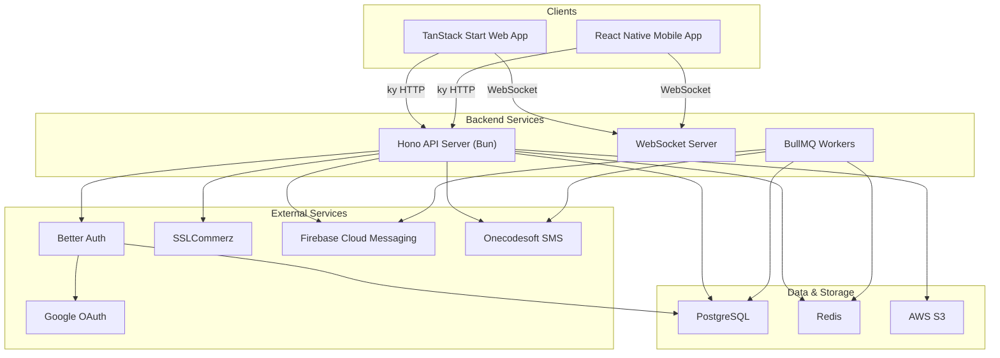
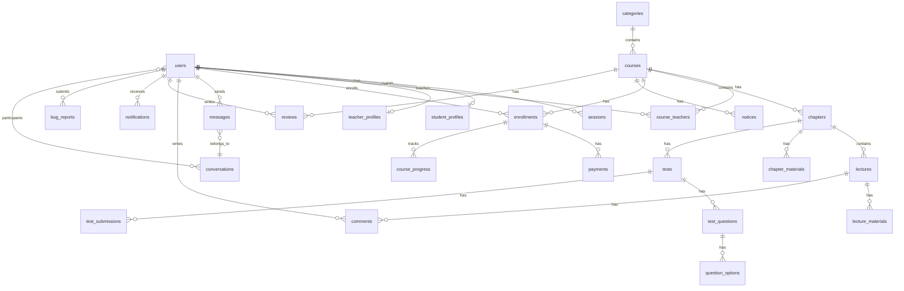

# Mehedi's Math Academy -- LMS Platform Build Plan

**Site Name:** Mehedi's Math Academy
**Domain:** mehedismathacademy.com

---

## Implementation Record -- 2 August 2026

The 2 August audit below produced fourteen design decisions, recorded in [CONTEXT.md](./CONTEXT.md) and
[docs/adr/](./docs/adr/), and sequenced in [docs/implementation-plan.md](./docs/implementation-plan.md).
**All nine stages of that plan have been implemented.** See [SUMMARY.md](./SUMMARY.md) for the outcome and
[BLOCKERS.md](./BLOCKERS.md) for every judgement call made along the way.

What changed since the audit, and which phase sections below it supersedes:

| Change                                                                                                                                             | ADR  | Supersedes    |
| -------------------------------------------------------------------------------------------------------------------------------------------------- | ---- | ------------- |
| Enrolments are created only once payment clears; `payments.course_id`; refund cancels; entitlement (`cancelled_at`) split from progress (`status`) | 0001 | Phase 13      |
| Settlement verifies the gateway's validation status and the paid amount; `SSLCOMMERZ_SANDBOX_MODE` parsed with `z.stringbool()`                    | 0001 | Phase 13      |
| Completion = every lecture watched **and** every published test passed, caused by a student action, latching. Exam-only courses can complete       | 0005 | Phases 12, 14 |
| Course authority on `course_teachers.role` (OWNER/TEACHER); a course always has an owner                                                           | 0006 | Phases 9, 10  |
| Withdraw/restore replaces delete; exam-only is enforced, not decorative                                                                            | --   | Phase 9       |
| Admins can create admins behind re-authentication; the last admin cannot be deactivated                                                            | 0002 | Phase 7       |
| User deletion removed -- deactivation is the only terminal state                                                                                   | 0003 | Phase 7       |
| Reporting a conversation unlocks admin review of it, audited; messages can be hidden, not deleted                                                  | 0004 | Phase 16      |
| Domain events raise notifications (notice, payment, course approval, bug status)                                                                   | --   | Phases 17, 18 |
| 84 unit tests, a `test` task in Turbo, and `tsconfig.build.json` so tests typecheck without being emitted                                          | --   | Cross-cutting |

**Five migrations are applied**: `0000` initial, `0001` enrolment/payment split, `0002` course teacher
role, `0003` owner backfill, `0004` moderation tables. 34 tables.

---

## Implementation Record -- 3 August 2026

The 2 August audit left a backlog: four phases short of complete, three cross-cutting concerns open, and a
polish list. **All of it is now built.** Nothing in the 21-phase plan is outstanding.

| Change                                                                                                                                                         | Closes                 | Commit                          |
| -------------------------------------------------------------------------------------------------------------------------------------------------------------- | ---------------------- | ------------------------------- |
| `file-processing` worker consumes `extract-video-metadata`, with an ISO base media container parser (there is no ffmpeg on the API host) and a backfill script | Phase 11               | `be59710`                       |
| Read-through Redis cache over the public catalogue, the category tree, analytics aggregates and lecture comment threads, invalidated through a key index       | Phase 15, `xc-caching` | `cc83fc0`                       |
| Message moderation UI: report dialog, admin queue at `/dashboard/admin/message-reports`, per-message hide, tombstones for participants                         | Phase 16               | `c904d47`                       |
| TanStack Query owns every server read on the web; Zustand holds the unread badge; the `window` CustomEvent bus is gone                                         | `xc-state-management`  | `0ed4a1f`, `cdbfd7d`, `2d23dc7` |
| API integration tests over the real Hono app, and a Playwright suite in `apps/web/e2e` (4 specs then, 5 now)                                                   | `xc-testing`           | `86d384a`                       |
| `/sitemap.xml` and `/robots.txt` on the public origin, a real 404 component, the missing §12 skeletons, `pendingComponent`, image CLS, and the dead-code sweep | Polish backlog         | `7cfe99a`                       |
| The mobile app: catalogue, enrolment, player, tests, messaging, notifications, profile — on `@mma/shared`, TanStack Query, FlashList and expo-image            | Phase 21               | `e0e8b34`                       |

Two changes reach beyond one workspace and are worth knowing about:

- **`bunfig.toml` sets `linker = "hoisted"`.** React Native links exactly one copy of each native module,
  and bun's default isolated store produced several. `bunx expo-doctor` went from two failing checks to
  20/20. Removing this file breaks the mobile build.
- **`react` is a single copy at 19.2.8.** Expo SDK 57 pins 19.2.3; the mobile workspace excludes React from
  the Expo version check rather than putting two Reacts on disk.

**Everything below this section is the original plan plus the 2 August audit.** Where it disagrees with the
tables above, the tables are what the code does.

---

## Implementation Record -- drift sweep, 3 August 2026

`DRIFT.md` compared the **initial** plan (`PLAN.md` as first committed, `40cd8c4`) against the working tree
and found what the 3 August rewrite had erased: things asked for and never built. Every finding is now
closed.

| Change                                                                                                                                                                                                                                                                 | Closes             |
| ---------------------------------------------------------------------------------------------------------------------------------------------------------------------------------------------------------------------------------------------------------------------- | ------------------ |
| `og:image` rasterises to a 1200×630 PNG. It was `image/svg+xml`, which Facebook, X, LinkedIn, WhatsApp, Slack and iMessage all reject — every share of every page fell back to a bare text card                                                                        | A2                 |
| The homepage reads real data through a new public `GET /api/v1/landing`: featured courses, live category counts, the teachers who actually teach here, real aggregates. It had been hardcoded fiction over eleven images hotlinked from a Google AI-Studio scratch CDN | A1                 |
| 126 validator tests in `@mma/shared`, and Playwright coverage of enrolment and payment. Writing the first caught a live defect: `.partial()` does not strip a `.default()`, so every course patch silently cleared `isExamOnly`                                        | D                  |
| `/login` and `/signup` canonicalise to their `/auth/*` originals instead of each claiming to be one                                                                                                                                                                    | A6                 |
| Mobile: Manrope and Inter actually bundled and loaded (the type scale was silently falling back to the system font), the boot spinner replaced by a Reanimated skeleton, and Google sign-in added — its absence was a lockout, not a missing convenience               | A3, A4, A5, A8     |
| Validation red, chart colours and six sectioning dividers back on the theme; error boundaries on the last two routes                                                                                                                                                   | B2, B3, B4         |
| The five files over the 800-line ceiling split along seams that already existed                                                                                                                                                                                        | B7                 |
| The dead `email` queue deleted, the WebSocket apps moved into the `websocket/` directory scaffolded for them, and the empty `apps/web/src/providers/` removed                                                                                                          | A7, C2, C3         |
| Route files renamed `courses-route.ts` so all four backend layers agree; the `pendingComponent`, feature-structure, mobile default-export and env-tier rules decided and written down rather than left as drift                                                        | B1, B5, B6, B8, C1 |
| `z.coerce.boolean()` replaced by a shared `booleanQueryParamSchema` on `flat`, `includeInactive` and `mine`. `Boolean("false")` is `true`, so `?flat=false` meant flat and every other value did too                                                                   | found on the way   |

Current state at the end of that sweep: lint 8/8, typecheck 8/8, build 7/7, 122 API tests, 134 shared
tests, 34 Playwright tests, all passing.

---

## Implementation Record -- mobile stages, 3 August 2026

`docs/mobile-plan.md` staged the work the mobile app still needed. **Seven of its ten stages are done and
the remaining three are done as far as they go without hardware** — what is left in each is a handset, a
Google account, and an EAS build.

| Change                                                                                                                                                                                                    | Stage      |
| --------------------------------------------------------------------------------------------------------------------------------------------------------------------------------------------------------- | ---------- |
| A mobile checkout returns to the app: `callbackPath` added to `createEnrollmentSchema`, stored on the payment and read back at settlement; `apps/web/src/routes/api/payment-return.ts` 302s into `mma://` | 1          |
| `jest-expo` + `@testing-library/react-native` harness — 60 tests over the pure logic and a smoke render of every screen                                                                                   | 2          |
| Lectures play in the app: `expo-video`, progress driven from `timeUpdate`, `resolveLectureVideo` deciding stream-vs-embed                                                                                 | 4          |
| Profile completion is native. A browser opened from the app arrives signed out — the session cookie lives in this app's keychain — so the web form was never reachable                                    | 5          |
| An `AppState`-driven messaging socket, with the 10s poll as the fallback when it is down                                                                                                                  | 6          |
| Parity with the web client: lecture comments, course reviews, certificate download and share, notices, bug reports, catalogue price filters                                                               | 7          |
| Route error boundaries, offline detection (`ApiError.isOffline`), and a 401 clearing the stored session                                                                                                   | 8          |
| `eas.json` (development/preview/production), `expo-system-ui` so `userInterfaceStyle: light` is honoured on Android, and one application id — `com.mehedismathacademy.app` — on both platforms            | 9          |
| Executing all 15 routes through the react-native-web static export found two unhandled rejections no test caught, each of which blanked a screen through its own error boundary                           | 0 (partly) |
| 8 Playwright assertions over the two hops into the app: the `mma://` allow-list on both routes, a missing payment status defaulting to `pending`, and one-time tokens not mintable over HTTP              | 3 (partly) |

**The application id is a default, not a decision.** `com.mehedismathacademy.app` replaced the
`com.anonymous.*` placeholder `expo prebuild` writes. It is the one field that cannot change once an app is
listed — confirm it before the first submission.

---

## Implementation Record -- thumbnails and the chunked tracker, 3 August 2026

The last two build items from the backlog, both from §16 and DESIGN.md rather than from any phase.

| Change                                                                                                                                                                                                  | Closes                     |
| ------------------------------------------------------------------------------------------------------------------------------------------------------------------------------------------------------- | -------------------------- |
| Every resizable upload is resized into 400/800/1200-wide copies on confirm (`sharp`), stored beside the original as `<name>@<width>.<ext>`, and recorded on `uploads.variant_widths` (migration `0005`) | Thumbnail variants (§16)   |
| The widths are declared **on the URL**, because a single URL string is all that is kept downstream — `courses.cover_image_url` has no upload id beside it to join against                               | The same, at render time   |
| `ResponsiveImage` on the web builds a `srcset` from that marker; `CoverImage` on mobile picks one variant by device pixels; `absolutePublicUrl` strips the marker so `og:image` stays plain             | Responsive sizing (§16)    |
| `ProgressTrack` on web and mobile: chunks in `secondary` over a `surface-container-highest` track, from a shared `resolveProgressChunks`                                                                | Chunked tracker (Phase 14) |

Three decisions worth knowing:

- **Generation is synchronous inside `confirmUpload`, not queued.** The course editor saves the returned
  URL the moment confirm resolves; a worker would finish after that URL was already written to a course,
  leaving a marker nobody had put on it.
- **Failure is never fatal.** A corrupt file, an unresizable format, or S3 refusing the write all log a
  warning and return the original unmarked. The upload the user just made still succeeds.
- **The tracker rounds honestly.** 1 lecture of 30 fills one chunk rather than none, and 29 of 30 fills all
  but one rather than all. A progress bar that says "done" before it is done is the more expensive lie.

The course player already drew a chunked bar — one chunk per lecture, with a third colour for the one
being watched — on both web and mobile. Both were left alone; they model more than the new primitive does.

---

## Verification -- 3 August 2026

Every claim in the sections below was re-read against the working tree, and the stale ones were rewritten
rather than annotated. What the gates say today:

| Gate                | Result                                                              |
| ------------------- | ------------------------------------------------------------------- |
| `bun run lint`      | 8/8                                                                 |
| `bun run typecheck` | 8/8                                                                 |
| `bun run build`     | 7/7                                                                 |
| `bun run test`      | **366 pass** — 145 `@mma/api`, 161 `@mma/shared`, 60 `@mma/mobile`  |
| `bun run test:e2e`  | 42 assertions across 5 specs — 40 pass, 2 skip with a stated reason |

Counts that the tree disagreed with the plan on, now corrected throughout: 6 migrations over 34 tables (not
1 over 32); 46 services and 25 repositories (not 37 and 22); 22 route modules under `routes/v1`, all named
`*-route.ts`; 55 route files in `apps/web/src/routes`, of which 50 are UI routes and all 50 carry an
`errorComponent`; 6 loader routes, each with a `pendingComponent`; 3 BullMQ queues with 3 workers.

What is genuinely not built is now listed in one place — the Remaining Work Backlog at the end of this
file. Every per-phase **Remaining** block agrees with it.

---

## Implementation Status Audit -- 2 August 2026

Every phase below was re-verified against the working tree — first at commit `684289e`, then again on
3 August 2026. Each phase carries a **Delivered** block (what exists, with file paths) and a **Remaining**
block (what the phase promised but the code does not do). Anything not listed under Remaining is built and
wired end to end.

### Phase status at a glance

| Phase | Title                                 | Status      | Outstanding work                                                              |
| ----- | ------------------------------------- | ----------- | ----------------------------------------------------------------------------- |
| 1     | Monorepo Setup                        | ✅ Complete | No CI pipeline; the gates are run by hand                                     |
| 2     | Database Schema + Drizzle             | ✅ Complete | --                                                                            |
| 3     | Backend Core (Hono)                   | ✅ Complete | The `/api/v1/users/*` 501 stub was deleted, not built out                     |
| 4     | Authentication (Better Auth)          | ✅ Complete | Staff invites have no transport; the password is handed over out of band      |
| 5     | Frontend Foundation + Design System   | ✅ Complete | --                                                                            |
| 6     | User and Profile Management           | ✅ Complete | --                                                                            |
| 7     | Admin Dashboard + Bug Reports         | ✅ Complete | Admin creation (ADR-0002), deletion removed (ADR-0003)                        |
| 8     | Category Management                   | ✅ Complete | Category delete is a hard delete despite `isActive` existing                  |
| 9     | Course CRUD + Approval                | ✅ Complete | Ownership (ADR-0006), withdraw/restore, exam-only enforced                    |
| 10    | Chapters, Lectures, Materials         | ✅ Complete | --                                                                            |
| 11    | File Upload + Media (S3)              | ✅ Complete | --                                                                            |
| 12    | Tests and Assessments                 | ✅ Complete | `passingScore` is now evaluated (ADR-0005)                                    |
| 13    | Enrollment + Payment (SSLCommerz)     | ✅ Complete | Reworked per ADR-0001; env flag fixed; still never run against a live gateway |
| 14    | Course Player                         | ✅ Complete | Completion rule reworked (ADR-0005); the tracker is chunked everywhere now    |
| 15    | Community and Discussion              | ✅ Complete | Threads are Redis-cached as records and invalidated on write                  |
| 16    | Real-time Messaging (WebSocket)       | ✅ Complete | Moderation is end to end (ADR-0004); blocking remains out of scope            |
| 17    | Notification System (FCM + in-app)    | ✅ Complete | The service worker's `importScripts` version is hand-synced                   |
| 18    | SMS, Noticeboard, Bulk Comms          | ✅ Complete | Onecodesoft never exercised against the live gateway                          |
| 19    | Analytics, Reviews, PDF, Certificates | ✅ Complete | --                                                                            |
| 20    | SEO Optimization                      | ✅ Complete | OG tags never run through the platform validators                             |
| 21    | React Native Mobile App               | ✅ Complete | Complete and tested; **never run on a phone** — `docs/mobile-plan.md` Stage 0 |

### Cross-cutting gaps (not owned by any single phase)

> **Closed on 3 August 2026.** Every numbered item below has been addressed — see the Implementation
> Record above for what replaced it. The list is kept because the reasoning in it is still the reasoning
> behind the code.

These were the items that cut across the whole codebase.

1. **No TanStack Query, no Zustand.** Neither package is in any `package.json`. Every screen fetches with
   `useEffect` + `useState` (112 `useEffect` call sites in `apps/web/src`). Coding Standards §7 mandates
   TanStack Query for server state and Zustand for global UI state. Consequence: no request dedupe, no
   background refetch, no cache invalidation, hand-rolled loading and error state in every route.
2. **~~No tests of any kind.~~ Partly addressed.** 84 unit tests now cover commerce, progress, test,
   course, staff-account, admin-user, and message services, with a `test` script in `@mma/api` and a `test`
   task in `turbo.json`. Still missing: API integration tests against a live server, and Playwright E2E.
   Nothing outside `apps/api` has any test coverage.
3. **Redis caching is almost unused.** `apps/api/src/lib/redis.ts` is consumed only by BullMQ queues
   (`lib/queues.ts`), the rate limiter (`middleware/rate-limit.ts`), the WebSocket pub/sub services
   (`message-realtime-service.ts`, `notification-realtime-service.ts`), the health check, and
   `sitemap-service.ts`. Course listings, the category tree, and analytics aggregates hit Postgres on
   every request.
4. **One BullMQ queue has a producer but no consumer** (was two; the `email` enqueue was removed in
   Stage 5, and the queue itself was deleted on 3 August — it was still holding a Redis connection and
   showing up in dashboards as a queue that never drains). `queueNames` declared `email`, `notification`,
   `sms`, and `file-processing`, but only `workers/notification-worker.ts` and `workers/sms-worker.ts`
   existed. Both orphaned queues are actively written to:
   - `upload-service.ts:263` enqueues `extract-video-metadata` onto `file-processing` on every confirmed
     video upload.
   - `staff-account-service.ts:61` enqueues `staff-account-invite` onto `email` with the new staff member's
     temporary password in the payload.

   `extract-video-metadata` jobs still accumulate in Redis and are never processed — this is the one
   genuinely unfinished item from the original audit backlog. The `email` case was resolved by removing the
   enqueue: no transport is installed, so staff credentials reach the new user via the creation response,
   read off by the admin and passed along out of band.

5. **No `pendingComponent` anywhere.** 0 of 49 route files use TanStack Router's `pendingComponent`, which
   §12 requires for page-level skeletons. Skeletons are rendered inline from component state instead.
   `errorComponent` is in place on 47 of 49 route files, so error boundaries are effectively complete.
6. **Skeleton inventory is roughly half built.** Nine skeletons exist: `Skeleton`, `AnalyticsSkeleton`,
   `CourseContentBuilderSkeleton`, `CourseEditorSkeleton`, `CourseGridSkeleton`, `CourseListSkeleton`,
   `CoursePlayerSkeleton`, `DataTableSkeleton`, `ProfilePageSkeleton`. Still missing from the §12 inventory:
   `CourseDetailSkeleton`, `DashboardStatsSkeleton`, `RecentActivitySkeleton`, `ConversationListSkeleton`,
   `MessageThreadSkeleton`, `CommentThreadSkeleton`, `NotificationListSkeleton`, `CategoryTreeSkeleton`,
   `TestBuilderSkeleton`, `TestTakingSkeleton`, `ChartSkeleton`, `StatsGridSkeleton`.
7. **`apps/mobile` is untouched.** See Phase 21.

### Deviations from the plan that are working as intended

These differ from the written plan but are deliberate and should not be "fixed" without a decision.

- **Soft deletes use domain flags, not `deletedAt`.** No table has a `deletedAt` column. Courses soft-delete
  by moving to `status: "ARCHIVED"` (`course-service.ts:376`), users by `isActive: false`
  (`admin-user-service.ts:124`), comments by `isDeleted` (`comment-service.ts:253`). Categories, chapters,
  lectures, materials, tests, questions, notices, and uploads hard-delete.
- **Backend file naming is `kebab-noun-layer.ts`, not `noun.layer.ts`.** The tree uses
  `course-service.ts` / `course-repository.ts`, not the `course.service.ts` shown in §4. The layering itself
  matches the plan exactly. **Settled 3 August 2026:** the routes were the last holdout at
  `courses.route.ts` and are now `courses-route.ts`, so all four layers agree. The rule is stated in
  `apps/api/AGENTS.md`.
- **Frontend is not organised by feature.** `src/features/` holds only `landing/`. Everything else lives in
  `src/components/<domain>/` (courses, tests, uploads, categories, notifications, profile, certificates,
  bugs, messages). **Settled 3 August 2026:** this is now the rule rather than the drift — see §5. The
  empty `src/providers/` directory has been deleted; providers are composed in `routes/__root.tsx`.
- **No route groups.** Routes are flat, with `auth.tsx` and `dashboard.tsx` acting as layout routes instead
  of the planned `(public)` / `(auth)` / `(dashboard)` groups.
- **A single root `.env`.** Not the `.env.development` / `.env.production` / `.env.test` tiers in §15. Every
  workspace loads the root file (`apps/api/src/load-root-env.ts`, `bun --env-file ../../.env`), and
  `.env.example` is the contract. Kept deliberately: tier files nothing reads would be decoration, and
  the one place tiers would actually apply — Vite's `loadEnv(mode, repoRoot)` — already layers a
  `.env.[mode]` if anyone adds one.
- **SSLCommerz is hand-rolled**, not the `sslcommerz-lts` package. `services/sslcommerz-service.ts` calls the
  sandbox/live REST API directly and supports a mock gateway mode for local development.
- **Server-side PDFs use `pdf-lib`, not `@react-pdf/renderer`.** The API generates certificates and receipts
  with `pdf-lib`; `@react-pdf/renderer` is a web dependency used for the in-browser certificate preview
  (`components/certificates/certificate-pdf-document.tsx`).
- ~~**`turbo.json` declares a `db:repair-course-review-feedback` task that no workspace implements.**~~
  Removed. `turbo.json` now declares nine tasks, all of them implemented somewhere: `build`, `dev`, `lint`,
  `typecheck`, `test`, `db:generate`, `db:migrate`, `db:seed`, `db:backfill-user-slugs`.
- ~~**Six `animate-spin` submit-button indicators exist.**~~ Removed on 3 August 2026. There is no
  `animate-spin` left in `apps/web/src`, and no `ActivityIndicator` left in `apps/mobile`.

---

## Architecture Overview


```mermaid
graph TB
    subgraph Clients ["Clients"]
        WebApp["TanStack Start Web App"]
        MobileApp["React Native Mobile App"]
    end

    subgraph Backend ["Backend Services"]
        HonoAPI["Hono API Server (Bun)"]
        WebSocketServer["WebSocket Server"]
        BullMQ["BullMQ Workers"]
    end

    subgraph Storage ["Data & Storage"]
        PostgreSQL["PostgreSQL"]
        Redis["Redis"]
        S3["AWS S3"]
    end

    subgraph External ["External Services"]
        BetterAuth["Better Auth"]
        SSLCommerz["SSLCommerz"]
        FCM["Firebase Cloud Messaging"]
        SMS["Onecodesoft SMS"]
        Google["Google OAuth"]
    end

    WebApp -->|ky HTTP| HonoAPI
    MobileApp -->|ky HTTP| HonoAPI
    WebApp -->|WebSocket| WebSocketServer
    MobileApp -->|WebSocket| WebSocketServer

    HonoAPI --> PostgreSQL
    HonoAPI --> Redis
    HonoAPI --> S3
    HonoAPI --> BetterAuth
    HonoAPI --> SSLCommerz
    HonoAPI --> FCM
    HonoAPI --> SMS

    BullMQ --> Redis
    BullMQ --> PostgreSQL
    BullMQ --> FCM
    BullMQ --> SMS

    BetterAuth --> Google
    BetterAuth --> PostgreSQL
```

## Monorepo Structure

Actual tree as of the 3 August 2026 verification. Differences from the original plan are called out inline.

```
mehedi_math_academy/
├── apps/
│   ├── web/                        # TanStack Start frontend (port 3000)
│   │   ├── e2e/                    # 5 Playwright specs, outside the Turbo test task
│   │   └── src/
│   │       ├── routes/             # 55 files: 50 UI routes (all with errorComponent) + 5 server
│   │       │                       #   routes (auth catch-all, 2 mobile hops, robots, sitemap).
│   │       │                       #   Flat -- no (public)/(auth)/(dashboard) groups.
│   │       ├── features/           # ONLY landing/ -- everything else lives in components/
│   │       ├── components/
│   │       │   ├── ui/             # 9 shadcn primitives + skeleton.tsx
│   │       │   ├── layout/         # app-shell, dashboard-layout, public-layout, auth-layout
│   │       │   ├── common/         # fade-in, route-error, skeletons.tsx, data-table-skeleton
│   │       │   ├── courses/ tests/ uploads/ categories/
│   │       │   └── notifications/ profile/ certificates/ bugs/ messages/
│   │       ├── hooks/              # use-auth-session, use-messaging-socket
│   │       ├── stores/             # ui-store.ts (Zustand) -- the unread badge, nothing else
│   │       ├── lib/
│   │       │   ├── api/            # typed ky modules + client.ts
│   │       │   ├── query/          # query-client.ts, keys.ts (the single key factory)
│   │       │   ├── firebase/       # web-push.ts
│   │       │   ├── forms/          # use-zod-form.ts
│   │       │   └── seo.ts site.ts ssr-api.ts auth.ts auth-server.ts ws-url.ts app-link.ts
│   │       └── styles/app.css      # Tailwind v4 @theme tokens
│   ├── api/                        # Hono backend API (port 3001, dev PORT=3010)
│   │   └── src/
│   │       ├── routes/v1/          # 21 route modules + index.ts (`*-route.ts`)
│   │       ├── routes/             # health, site-seo, public-config
│   │       ├── controllers/        # 23 controllers
│   │       ├── services/           # 46 service modules (co-located *.test.ts included)
│   │       ├── repositories/       # 25 repositories
│   │       ├── middleware/         # auth, error-handler, rate-limit, request-id,
│   │       │                       #   request-logger, session-context, validate
│   │       ├── workers/            # notification-worker, sms-worker, file-processing-worker
│   │       ├── websocket/          # messages-ws-app.ts, notifications-ws-app.ts
│   │       ├── lib/                # container, env, logger, queues, redis, s3, cache
│   │       └── utils/              # errors, response, phone-bd
│   └── mobile/                     # Expo SDK 57 app (e0e8b34, extended through docs/mobile-plan.md)
│       ├── app/                    # 15 routes: (tabs)/ shell + course, learn, tests, messages,
│       │                           #   auth, profile-complete, bug-report, and the two deep-link
│       │                           #   landing pads (auth-callback, payment-callback)
│       ├── src/lib/                # env, api-client, api, auth, session-store, query, payment,
│       │                           #   lecture-video, profile-form, documents, hooks (+ tests)
│       ├── src/components/         # ui.tsx primitives, lecture-player, lecture-comments,
│       │                           #   course-reviews, route-error, google-sign-in-button
│       ├── src/theme/tokens.ts     # Digital Atelier palette, radii, spacing, type scale
│       ├── eas.json                # development / preview / production build profiles
│       └── jest.config.mjs jest.setup.ts
├── packages/
│   ├── db/src/
│   │   ├── schema/                 # 15 entity files + enums.ts, relations.ts, index.ts
│   │   ├── migrations/             # 0000-0005, 34 tables + meta/
│   │   └── client.ts
│   ├── shared/src/
│   │   ├── types/roles.ts
│   │   ├── validators/             # Zod modules + index.ts, each with a co-located test
│   │   ├── constants/app.ts
│   │   └── slug.ts
│   ├── auth/src/                   # client, server, tanstack-server, index
│   └── config/                     # eslint.config.mjs, tsconfig.base.json, prettier
├── tooling/
│   └── scripts/                    # seed.ts, backfill-user-slugs.ts, slug.ts (stale copy)
├── docs/                           # adr/ (6 ADRs), implementation-plan.md, mobile-plan.md
├── turbo.json                      # build, dev, lint, typecheck, test, db:*
├── package.json
├── bunfig.toml                     # linker = "hoisted" -- removing it breaks the mobile build
├── AGENTS.md / CLAUDE.md           # per-workspace agent docs
├── DESIGN.md
├── PLAN.md / DRIFT.md / BLOCKERS.md / SUMMARY.md / CONTEXT.md
└── .env / .env.example             # single root env file, no per-tier files
```

## Tech Stack Summary (Actually Installed -- 2 August 2026)

Every dependency was bumped to its latest stable release on 2 August 2026. This table reflects what is in
the lockfile, not what the March 2026 plan proposed. Rows where reality diverged from the plan are flagged.

| Layer           | Technology                                                         | Installed Range       | Notes                                                                   |
| --------------- | ------------------------------------------------------------------ | --------------------- | ----------------------------------------------------------------------- |
| Runtime         | Bun                                                                | 1.3.11                | `packageManager` pin in root `package.json`                             |
| Monorepo        | Turborepo + Bun workspaces                                         | ^2.10.8               | `apps/*`, `packages/*`, `tooling/*`                                     |
| Language        | TypeScript                                                         | ^6.0.3                | TS 7 was trialled and reverted -- typescript-eslint has no TS 7 support |
| Lint            | ESLint + typescript-eslint                                         | ^10.8.0 / ^8.65.0     | Flat config in `packages/config/eslint.config.mjs`                      |
| Frontend        | TanStack Router / Start                                            | ^1.170.18 / ^1.168.34 | React 19.2.8                                                            |
| Bundler         | Vite                                                               | ^8.2.0                | `@vitejs/plugin-react` ^6.0.5                                           |
| UI Library      | shadcn/ui                                                          | `components.json`     | 9 primitives vendored so far                                            |
| Styling         | Tailwind CSS v4                                                    | ^4.3.3                | `@theme` in `styles/app.css`, no config file                            |
| Forms           | React Hook Form + Zod                                              | ^7.84.0 / ^4.4.3      | via `lib/forms/use-zod-form.ts`                                         |
| HTTP Client     | ky                                                                 | ^2                    | **v2**, not the planned v1 -- hook signatures are the state-object form |
| Server state    | TanStack Query                                                     | ^5.101.4              | Web and mobile; mobile adds `@tanstack/react-query-persist-client`      |
| Global UI state | Zustand                                                            | ^5.0.14               | `apps/web/src/stores/ui-store.ts` -- the unread badge, nothing else     |
| Backend         | Hono                                                               | ^4.12.33              | Bun runtime                                                             |
| Database        | PostgreSQL                                                         | 18.x                  | via `pg` ^8.22.0 Pool                                                   |
| ORM             | Drizzle ORM / drizzle-kit                                          | ^0.45.2 / ^0.31.10    | `drizzle-orm/node-postgres`                                             |
| Auth            | Better Auth + Drizzle adapter                                      | ^1.6.25               | `admin()` and `customSession()` plugins                                 |
| Cache           | ioredis                                                            | ^6                    | **v6** (RESP3 default); fall back to `protocol: 2` if queues misbehave  |
| Queue           | BullMQ                                                             | ^6                    | 3 queues, 3 workers -- the producerless `email` queue was deleted       |
| Storage         | AWS S3 SDK v3                                                      | ^3.1101.0             | `@aws-sdk/client-s3`, `@aws-sdk/s3-request-presigner`                   |
| Image resizing  | sharp                                                              | ^0.35.3               | Thumbnail variants on upload confirm. Native, and it runs under Bun     |
| Payments        | _hand-rolled SSLCommerz_                                           | --                    | ⚠️ `sslcommerz-lts` not used; direct REST calls + mock mode             |
| Notifications   | firebase-admin / firebase                                          | ^14 / ^12             | Web SW `importScripts` pinned to 12.17.0 -- update by hand on each bump |
| PDF             | pdf-lib (API) / @react-pdf/renderer (web)                          | ^1.17.1 / ^4.5.1      | ⚠️ Server-side generation uses pdf-lib                                  |
| Mobile          | React Native 0.86.2 + Expo SDK 57                                  | SDK 57                | ⚠️ Plan said SDK 54; React 19.2.8, Reanimated 4.5.1                     |
| Mobile media    | expo-video / expo-file-system / expo-sharing                       | ~57.0.x               | Lecture playback, certificate download, the share sheet                 |
| Test runners    | bun test (API, shared) / jest-expo (mobile) / Playwright (web E2E) | --                    | Three runners behind one Turbo `test` task, plus `test:e2e`             |
| WebSocket       | Hono WebSocket                                                     | built-in (`hono/ws`)  | Two separate WS apps, outside the main middleware chain                 |
| Validation      | Zod                                                                | ^4.4.3                | Shared via `@mma/shared`                                                |
| Logging         | pino                                                               | ^10.3.1               | Structured JSON logs                                                    |
| Charts          | Recharts                                                           | ^3.10.1               | Bar, Line, Pie in admin analytics                                       |
| Icons           | lucide-react                                                       | ^1.28.0               |                                                                         |
| Toasts          | sonner                                                             | ^2.0.7                | Driven by the ky `afterResponse` hook                                   |

---

## Phase 1: Monorepo Setup and Project Foundation

**Goal:** Scaffold the Turborepo monorepo with Bun workspaces, configure TypeScript, ESLint, and establish the project skeleton for all apps and packages.

**Status:** Completed

**Key tasks:**

- Initialize the root `package.json` with Bun `"workspaces": ["apps/*", "packages/*", "tooling/*"]`
- Configure `turbo.json` with pipelines: `build`, `dev`, `lint`, `typecheck`, `db:generate`, `db:migrate`, `db:seed`
- Create `packages/config/` with shared `tsconfig.base.json`, ESLint flat config, and Prettier config
- Create `.env.example` with all required environment variables (DB, Redis, S3, Firebase, SSLCommerz, Better Auth secrets)
- Set up `packages/shared/` with initial Zod validators and TypeScript types for user roles (`STUDENT`, `TEACHER`, `ACCOUNTANT`, `ADMIN`)
- Set up Git with `.gitignore` covering `node_modules`, `.env`, `dist`, `drizzle/`, generated files
- Install and verify Bun, Turborepo, and all root-level dev dependencies

**Key files:**

- `package.json`, `turbo.json`, `packages/config/tsconfig.base.json`
- `packages/shared/src/types/roles.ts`, `packages/shared/src/validators/index.ts`

**Delivered:**

- Bun 1.3.11 workspaces over `apps/*`, `packages/*`, `tooling/*`; 7 workspaces total.
- `turbo.json` defines `build`, `dev`, `lint`, `typecheck`, `db:generate`, `db:migrate`, `db:seed`,
  `db:backfill-user-slugs`.
- `packages/config/` holds the shared flat ESLint config, `tsconfig.base.json`, and Prettier config.
- `.env.example` documents 40 variables across DB, Redis, S3, Firebase (admin + web), SSLCommerz,
  Onecodesoft, Better Auth, and the seeded admin account.
- `packages/shared/src/types/roles.ts` defines `STUDENT` / `TEACHER` / `ACCOUNTANT` / `ADMIN`.
- `lint`, `typecheck`, and `build` all pass 7/7 as of commit `684289e`.

**Remaining:**

- `turbo.json` declares `db:repair-course-review-feedback`, but no workspace implements that script.
- No CI pipeline is checked in; the lint/typecheck/build gates are run by hand.

---

## Phase 2: Database Schema Design and Drizzle ORM Setup

**Goal:** Design the complete PostgreSQL schema using Drizzle ORM in `packages/db/`, covering all entities needed for the LMS.

**Status:** Completed

**Key tables and relationships:**


```mermaid
erDiagram
    users ||--o{ sessions : has
    users ||--o| student_profiles : has
    users ||--o| teacher_profiles : has
    users ||--o{ course_teachers : teaches
    users ||--o{ enrollments : enrolls
    users ||--o{ messages : sends
    users ||--o{ comments : writes
    users ||--o{ reviews : writes
    users ||--o{ notifications : receives
    users ||--o{ bug_reports : submits

    categories ||--o{ courses : contains
    courses ||--o{ course_teachers : has
    courses ||--o{ chapters : contains
    courses ||--o{ enrollments : has
    courses ||--o{ notices : has
    courses ||--o{ reviews : has

    chapters ||--o{ lectures : contains
    chapters ||--o{ chapter_materials : has
    chapters ||--o{ tests : has

    lectures ||--o{ lecture_materials : has
    lectures ||--o{ comments : has

    tests ||--o{ test_questions : has
    test_questions ||--o{ question_options : has
    tests ||--o{ test_submissions : has

    enrollments ||--o{ payments : has
    enrollments ||--o{ course_progress : tracks

    messages }o--|| conversations : belongs_to
    conversations }o--o{ users : participants
```

**Key tasks:**

- Create `packages/db/src/schema/` with modular schema files: `users.ts`, `courses.ts`, `chapters.ts`, `lectures.ts`, `tests.ts`, `enrollments.ts`, `payments.ts`, `messages.ts`, `comments.ts`, `notifications.ts`, `categories.ts`, `reviews.ts`
- Define Drizzle relations for all tables
- Configure `drizzle.config.ts` with PostgreSQL 18 provider
- Create the DB client in `packages/db/src/client.ts` using `drizzle-orm/node-postgres`
- Write initial migration generation script
- Create seed script in `tooling/scripts/seed.ts` for the admin account (credentials from env vars)

**Core schema highlights:**

- `users` table: id (uuid), email, name, role (enum: STUDENT/TEACHER/ACCOUNTANT/ADMIN), emailVerified, image, profileCompleted (boolean), isActive (boolean, default true -- admin can deactivate), createdAt, updatedAt
- `courses` table: id, title, slug (unique, SEO-friendly URL), description, coverImageUrl, price (0 = free), status (enum: DRAFT/PENDING/PUBLISHED/ARCHIVED), categoryId, createdAt, updatedAt
- `enrollments` table: id, userId, courseId, status (ACTIVE/COMPLETED/CANCELLED), enrolledAt, completedAt
- `payments` table: id, enrollmentId, userId, amount, currency, transactionId, status (PENDING/SUCCESS/FAILED/REFUNDED), provider (SSLCOMMERZ), metadata (jsonb)
- `messages` table: id, conversationId, senderId, content, createdAt (no deletedAt -- messages cannot be deleted)
- `conversations` table: id, participantOneId, participantTwoId, lastMessageAt
- `test_questions` table with `type` enum (MCQ/WRITTEN), `options` for MCQ, `correctAnswer`
- `bug_reports` table: id, userId, title, description, screenshotUrl (optional, S3), status (enum: OPEN/IN_PROGRESS/RESOLVED/CLOSED), adminNotes, priority (LOW/MEDIUM/HIGH), createdAt, resolvedAt

**Delivered:**

- 16 entity files in `packages/db/src/schema/`: `users`, `courses`, `chapters`, `lectures`, `tests`,
  `enrollments`, `payments`, `messages`, `comments`, `notifications`, `categories`, `reviews`,
  `bug-reports`, `sms`, `uploads`, plus `enums.ts`, `relations.ts`, `index.ts`.
- Six applied migrations over 34 tables: `0000_charming_thunderbolt` (the initial 32 -- the extra tables
  over the ERD are the Better Auth tables, join tables, materials, submissions, FCM tokens, and SMS
  batches), `0001` the enrolment/payment split, `0002` the course-teacher role, `0003` the owner backfill,
  `0004` the moderation tables, `0005` `uploads.variant_widths`.
- Indexes are dense: `users` 12, `tests` 11, `courses` 8, `enrollments` 6, `messages` 6, `sms` 5,
  `uploads` 4, and 3 each on the rest. Unique slug indexes on `courses`, `categories`, `users`.
- `packages/db/src/client.ts` exports a `pg` Pool-backed Drizzle singleton; `drizzle.config.ts` targets pg.
- `tooling/scripts/seed.ts` provisions the admin account from `ADMIN_EMAIL` / `ADMIN_PASSWORD`;
  `backfill-user-slugs.ts` fills `users.slug` for accounts created before the SEO work.

**Remaining:**

- Nothing outstanding. Note that no table has a `deletedAt` column -- soft deletion is modelled with
  `status`, `isActive`, and `isDeleted` flags instead (see Deviations).

---

## Phase 3: Backend Core -- Hono API Server

**Status:** Completed

**Goal:** Set up the Hono API server in `apps/api/` with middleware stack, error handling, route structure, and shared utilities.

**Key tasks:**

- Initialize `apps/api/` with Bun + Hono
- Implement layered architecture: `routes/ -> controllers/ -> services/ -> repositories/`
- Set up middleware stack:
  - CORS (configured for web and mobile origins)
  - Request logging (pino)
  - Rate limiting (with Redis store)
  - Request ID generation
  - Body size limiting
  - Compression
- Create global error handler with `AppError` hierarchy (ValidationError, NotFoundError, UnauthorizedError, ForbiddenError)
- Create standardized API response helpers: `success()`, `error()`, `paginated()`
- Set up Zod validation middleware for request body/params/query
- Configure Redis client (ioredis) as shared singleton
- Set up BullMQ for background job processing with dedicated worker queues: `email`, `notification`, `sms`, `file-processing`
- Health check endpoint at `GET /api/health`

**Route namespace plan:**

```
/api/v1/auth/*         - Authentication
/api/v1/users/*        - User management
/api/v1/profiles/*     - Profile management
/api/v1/categories/*   - Category management
/api/v1/courses/*      - Course CRUD
/api/v1/enrollments/*  - Enrollment & payment
/api/v1/messages/*     - Messaging
/api/v1/notifications/* - Notifications
/api/v1/admin/*        - Admin-specific routes
/api/v1/analytics/*    - Analytics
/api/v1/upload/*       - File upload
```

**Delivered:**

- `apps/api/src/app.ts` wires the full middleware chain in order: request ID, pino request logger, CORS
  (with `X-Request-Id` and rate-limit headers exposed), `bodyLimit`, `compress`, Redis-backed rate limiting,
  then `sessionContextMiddleware` on `/api/v1/*`.
- Layering is enforced across 21 route modules, 23 controllers, 46 service modules (tests included),
  25 repositories. Manual DI singletons live in `lib/container.ts`.
- `utils/errors.ts` defines the `AppError` hierarchy (`ValidationError`, `NotFoundError`,
  `UnauthorizedError`, `ForbiddenError`, `ConflictError`); `middleware/error-handler.ts` is the global
  `app.onError`. `utils/response.ts` exports `success()`, `error()`, `paginated()`.
- `middleware/validate.ts` provides the Zod body/params/query validator.
- `lib/redis.ts` is the shared ioredis singleton; `lib/queues.ts` declares three BullMQ queues --
  `notification`, `sms`, `file-processing` -- each with a worker. `lib/cache.ts` is the read-through cache.
- Health check at `GET /api/health` with a DB-and-Redis probe (`health-repository.ts`).
- 22 namespaces mounted under `/api/v1` -- the planned list plus `public`, `chapters`, `lectures`,
  `comments`, `questions`, `tests`, `notices`, `og-image`, `progress`.

**Remaining:**

- **The `/api/v1/users/*` namespace does not exist.** The 501 stub was deleted rather than built out; all
  user management is served from `/api/v1/admin/users/*`. Nothing calls the missing namespace, but the
  original route plan above still lists it.
- Rate limiting is skipped entirely when `NODE_ENV === "development"` (`app.ts:33`). Intentional, but it
  means the limiter path is never exercised locally.

---

## Phase 4: Authentication System (Better Auth)

**Status:** Completed

**Goal:** Integrate Better Auth with Drizzle adapter, supporting email/password signup (students), Google OAuth, and admin-created accounts for teachers/accountants.

**Key tasks:**

- Create `packages/auth/` with Better Auth configuration shared between web and api
- Configure Better Auth with:
  - Email/password provider (for students)
  - Google OAuth provider
  - Drizzle adapter pointing to `packages/db`
  - `tanstackStartCookies` plugin for the web app
  - Custom session fields (role, profileCompleted)
- Implement role-based middleware in Hono:
  - `requireAuth()` -- verify session and check `isActive === true` (reject deactivated users with 403)
  - `requireRole(...roles)` -- check user role
  - `requireAdmin()` -- shorthand for admin-only
- Build admin endpoints for creating teacher/accountant accounts (generates password, sends invite)
- Run Better Auth CLI to generate auth schema, merge into Drizzle schema
- Implement the seed script to create the single admin account from env vars (`ADMIN_EMAIL`, `ADMIN_PASSWORD`)
- Add auth route handler in TanStack Start at `/api/auth/$`

**Security considerations:**

- Rate limiting on auth endpoints (5 attempts per 15 min)
- Password hashing via Better Auth (Argon2)
- Refresh token rotation
- Session invalidation on role change or account deactivation

**Delivered:**

- `packages/auth/src/server.ts` configures Better Auth with the Drizzle adapter, email/password
  (8-128 chars, `autoSignIn`), Google OAuth (auto-disabled when the client ID is still `replace-me`),
  the `admin()` plugin, and `customSession()` exposing `role`, `slug`, `profileCompleted`, `isActive`.
- Auth rate limits match the plan exactly: 15-minute window, max 5 on `/sign-in/email` and
  `/sign-up/email`, 100 globally, disabled in development.
- `databaseHooks` generate a unique user slug on creation via `generateUniqueSlug` from `@mma/shared`.
- Role guards live in `apps/api/src/middleware/auth.ts` and `services/auth-guard-service.ts`.
- `apps/web/src/routes/api/auth/$.ts` mounts the TanStack Start auth handler; `packages/auth/src/client.ts`
  is the browser client.
- Deactivation invalidates sessions: `admin-user-service.ts` calls
  `authSessionRepository.deleteByUserId()` on both status change and soft delete.
- Trusted origins cover web (3000), API (3001), and Expo (8081) so the mobile app can authenticate later.

**Remaining:**

- Admin-created staff accounts still receive no invite, but nothing is left half-done about it: the enqueue
  was removed and the `email` queue deleted, so no temporary password sits in Redis in plaintext. The
  creation response is the only delivery channel — the admin reads it off and passes it along out of band.
  Reinstate the queue together with a transport, not before. (ADR-0002)
- `packages/auth/src/server.ts` and `tanstack-server.ts` are hand-synced duplicates that differ only by
  `tanstackStartCookies()` and the slug `databaseHooks`. Edits must be applied to both.
- ~~`packages/auth/src/factory.ts` is dead code.~~ Deleted.
- The `oneTimeToken` plugin (`disableClientRequest: true`) mints the handoff token the Expo app trades for
  a session. That path has only been exercised anonymously — see Phase 21 and `docs/mobile-plan.md`
  Stage 3.

---

## Phase 5: Frontend Foundation -- TanStack Start + Design System

**Status:** Completed

**Goal:** Set up the TanStack Start web app with Tailwind CSS v4, shadcn/ui, and implement the "Digital Atelier" design system from [DESIGN.md](DESIGN.md).

**Key tasks:**

- Initialize `apps/web/` with TanStack Start + React 19
- Install and configure Tailwind CSS v4 with PostCSS
- Initialize shadcn/ui using `npx shadcn@latest init` (CLI v4 has stable TanStack Start support)
- Translate DESIGN.md into Tailwind `@theme` tokens:
  - Surface hierarchy: `--color-surface`, `--color-surface-container-low`, `--color-surface-container-lowest`, `--color-surface-container-highest`
  - Primary colors: `--color-primary` (#000000), `--color-on-primary-container` (#028fb0), `--color-secondary-container` (#6063ee)
  - Typography: Manrope (display/headlines) + Inter (body/labels)
  - Radius tokens: DEFAULT (0.25rem), md (0.375rem)
  - Shadow system: tinted shadows using `rgba(19, 27, 46, 0.08)`, ghost borders at 15% opacity
  - "No-Line Rule" enforced via surface layering, not borders
  - Signature CTA gradient: `primary` to `on-primary-container`
  - Frosted navigation: 80% opacity + 24px backdrop-blur
- Create core layout components:
  - `AppShell` with glassmorphic sidebar navigation
  - `DashboardLayout` (role-based sidebar items)
  - `PublicLayout` (for landing page, course catalog)
- Set up the ky API client wrapper with:
  - Base URL configuration
  - Auth token injection (from Better Auth session)
  - Error interceptor with toast notifications
  - Request/response type inference
- Set up React Hook Form + Zod resolver pattern
- Build the skeleton system:
  - Base `Skeleton` primitive component in `components/ui/skeleton.tsx` using DESIGN.md surface colors with shimmer animation
  - `FadeIn` transition wrapper component (`components/common/fade-in.tsx`) for smooth skeleton-to-content transitions (150ms ease-out opacity + translateY)
  - Define the shimmer `@keyframes` in the global Tailwind `@theme` block as `--animate-shimmer`
  - No spinners, loaders, or "Loading..." text anywhere -- custom skeletons only
- Implement error boundaries at every route level using TanStack Router's `errorComponent`
- Configure TanStack Router with route groups: `(public)`, `(auth)`, `(dashboard)`
- Set up base HTML head with default meta tags: site name "Mehedi's Math Academy", favicon, viewport, theme-color
- Configure default `og:site_name` as "Mehedi's Math Academy" and `og:url` base as `https://mehedismathacademy.com`

**Delivered:**

- TanStack Start + React 19.2 on Vite 8, Tailwind v4 via `@tailwindcss/vite` with all Digital Atelier
  tokens declared in `styles/app.css` `@theme` (no `tailwind.config`).
- shadcn/ui initialised (`components.json`); 9 primitives vendored into `components/ui/`: badge, button,
  card, input, label, password-input, select, skeleton, textarea.
- Layout components: `layout/app-shell.tsx`, `layout/dashboard-layout.tsx` (role-aware sidebar),
  `layout/public-layout.tsx`, `layout/auth-layout.tsx`.
- `lib/api/client.ts` is the ky v2 wrapper -- `credentials: "include"`, `prefix` from `clientEnv`, a
  `beforeRequest` header merger, and an `afterResponse` hook that raises a sonner toast from the API error
  envelope. `lib/ssr-api.ts` is the server-side twin used by route loaders. Do not add a second toast on
  top of the interceptor.
- `lib/forms/use-zod-form.ts` wraps React Hook Form + `@hookform/resolvers` Zod.
- Skeleton primitive with a shimmer keyframe, plus `components/common/fade-in.tsx`; `FadeIn` is used in
  13 files.
- `errorComponent` is set on all 50 UI route files, backed by `components/common/route-error.tsx`.
- `pendingComponent` is set on all 6 routes that have a `loader` — `/`, `/courses`, `/courses/$slug`,
  `/categories`, `/categories/$slug`, `/teachers/$slug`. Routes without a loader render their skeleton
  inline from TanStack Query's `isPending`; that split is the rule, see §12.
- TanStack Query owns server state (`lib/query/query-client.ts`, `lib/query/keys.ts`), Zustand holds the
  unread badge (`stores/ui-store.ts`).
- `__root.tsx` sets the default head, favicon, viewport, theme-color, `og:site_name`, and preloads the
  Manrope and Inter woff2 subsets. Providers are composed there; there is no `src/providers/` directory.

**Remaining:**

- No `(public)` / `(auth)` / `(dashboard)` route groups; the tree is flat with `auth.tsx` and
  `dashboard.tsx` as layout routes. Deliberate — see Deviations.

---

## Phase 6: User and Profile Management

**Status:** Completed

**Goal:** Implement the complete user profile system with role-specific profiles and the first-login profile completion prompt.

**Key tasks:**

- **Backend:**
  - `GET /api/v1/profiles/me` -- get own profile
  - `PUT /api/v1/profiles/me` -- update own profile
  - `GET /api/v1/profiles/teachers/:id` -- public teacher profile
  - `GET /api/v1/admin/users/:id/profile` -- admin views any student profile
  - Student profile fields: name, phone, dateOfBirth, guardianName, guardianPhone, institution, class/grade, address, profilePhoto
  - Teacher profile fields: name, phone, bio, qualifications, specializations, profilePhoto, socialLinks
- **Frontend:**
  - Profile completion modal/page that triggers on first login when `profileCompleted === false`
  - Multi-step profile form with React Hook Form
  - Public teacher profile page showing bio, courses, ratings
  - Student profile page (accessible by the student and admin only)
  - Profile photo upload with S3 integration
  - Skeleton loading states for all profile pages

**Delivered:**

- Endpoints: `GET/PUT /api/v1/profiles/me`, `GET /api/v1/profiles/teachers/:id`,
  `GET /api/v1/profiles/teachers/by-slug/:slug`, `GET /api/v1/admin/users/:id/profile`.
- `profile-service.ts` / `profile-repository.ts` cover both student and teacher profile shapes; validators
  in `packages/shared/src/validators/profiles.ts`. Bangladeshi phone normalisation in `utils/phone-bd.ts`.
- First-login gate is a redirect, not a modal: `routes/dashboard.tsx:31` pushes any session with
  `profileCompleted === false` to `/dashboard/profile-complete`.
- `components/profile/profile-editor.tsx` is the multi-step form; `profile-photo-upload-field.tsx` drives
  the S3 presigned upload.
- Pages: `routes/dashboard/profile.tsx`, `routes/dashboard/profile-complete.tsx`,
  `routes/dashboard/students/$id.tsx` (student + admin only), `routes/teachers/$slug.tsx` (public).
- `ProfilePageSkeleton` exists.

**Remaining:**

- Nothing outstanding.

---

## Phase 7: Admin Dashboard, Account Management, and Bug Reports

**Status:** Completed

**Goal:** Build the admin dashboard with user account CRUD, activate/deactivate users, system overview, and a bug reporting system for students and teachers.

**Key tasks:**

- **Backend -- User Management:**
  - `GET /api/v1/admin/users` -- list all users with filters (role, status, search, pagination)
  - `POST /api/v1/admin/users` -- create teacher/accountant accounts
  - `PUT /api/v1/admin/users/:id` -- update user
  - `PATCH /api/v1/admin/users/:id/status` -- activate or deactivate a user (toggle `isActive`). Backend must enforce: admin cannot deactivate themselves (reject with 403 if `targetId === currentUserId`). Deactivated users cannot log in -- Better Auth session check must verify `isActive === true` and reject otherwise.
  - `DELETE /api/v1/admin/users/:id` -- soft delete user
  - `GET /api/v1/admin/dashboard` -- overview stats (total students, courses, revenue, enrollments, open bugs)
  - Auth middleware update: on every authenticated request, check `isActive` on the user record. If `false`, return 403 "Account deactivated" and invalidate the session.
- **Backend -- Bug Reports:**
  - `POST /api/v1/bugs` -- submit a bug report (students and teachers only). Fields: title, description, screenshotUrl (optional)
  - `GET /api/v1/bugs/me` -- list own submitted bug reports
  - `GET /api/v1/admin/bugs` -- list all bug reports with filters (status, priority, pagination)
  - `PATCH /api/v1/admin/bugs/:id` -- update bug status (OPEN/IN_PROGRESS/RESOLVED/CLOSED), set priority, add admin notes
- **Frontend -- Admin:**
  - Admin dashboard with stats cards (students count, active courses, revenue, pending approvals, open bug count)
  - User management table with search, filter by role and active/inactive status, pagination
  - Activate/deactivate toggle per user row (with confirmation dialog). Admin's own row has the toggle disabled with a tooltip: "Cannot deactivate your own account"
  - Visual indicator for deactivated users: muted row with "Inactive" badge
  - Create account form (teacher/accountant) with auto-generated password option
  - User detail view with activity history
  - Bug report management page: table of all reports with status badges, priority labels, filter/sort
  - Bug detail view: description, screenshot preview, status update dropdown, admin notes textarea
  - All tables use proper skeleton loading states (`DataTableSkeleton`)
- **Frontend -- Student/Teacher:**
  - "Report a Bug" button accessible from the sidebar/footer in the dashboard layout
  - Bug report form: title, description (rich text or plain), optional screenshot upload (S3)
  - "My Bug Reports" page showing submission history with status badges (color-coded: OPEN = amber, IN_PROGRESS = blue, RESOLVED = green, CLOSED = gray)

**Delivered:**

- Admin user endpoints, all present: `GET /admin/users`, `POST /admin/users`, `GET /admin/users/:id`,
  `PUT /admin/users/:id`, `PATCH /admin/users/:id/status`, `DELETE /admin/users/:id`,
  `GET /admin/users/:id/profile`, `GET /admin/dashboard`.
- Self-protection is enforced server-side in `admin-user-service.ts`: `softDeleteUser` and the status
  toggle both reject `targetUserId === currentUserId` with a `ForbiddenError`, and both purge the target's
  sessions through `authSessionRepository.deleteByUserId()`.
- Bug endpoints: `POST /api/v1/bugs`, `GET /api/v1/bugs/me`, `GET /admin/bugs`, `GET /admin/bugs/:id`,
  `PATCH /admin/bugs/:id`.
- Frontend: `routes/dashboard/admin/users.tsx` + `users/$id.tsx`, `routes/dashboard/admin/bugs.tsx` +
  `bugs/$id.tsx`, `routes/dashboard/bugs/index.tsx` ("My Bug Reports"), `routes/dashboard/bugs/report.tsx`,
  `components/bugs/bug-screenshot-upload-field.tsx`, and `routes/dashboard/index.tsx` for the stats
  overview. `DataTableSkeleton` backs the tables.

**Remaining:**

- Nothing outstanding for this phase's key tasks.

---

## Phase 8: Category Management

**Status:** Completed

**Goal:** Implement hierarchical course categories (e.g., SSC, HSC, Admission, etc.) managed by admin.

**Key tasks:**

- **Backend:**
  - `categories` table with id, name, slug (unique, SEO-friendly URL), description, parentId (for subcategories), icon, sortOrder, isActive
  - Full CRUD endpoints under `/api/v1/categories/` (admin only for mutations)
  - `GET /api/v1/categories` is public (for course browsing)
- **Frontend:**
  - Admin category management page with drag-and-drop reordering
  - Category tree view for nested categories
  - Category selector component (reusable in course forms)
  - Public category browsing on the course catalog page

**Delivered:**

- `categories` table carries id, name, slug (unique index), description, parentId, icon, sortOrder,
  isActive.
- Endpoints: public `GET /api/v1/categories` and `GET /api/v1/categories/by-slug/:slug`; admin-guarded
  `POST /`, `GET /:id`, `PUT /:id`, `PATCH /reorder`, `DELETE /:id`.
- Frontend: `routes/dashboard/admin/categories.tsx` with reordering, `components/categories/category-tree.tsx`,
  `category-selector.tsx`, `icon-picker.tsx`, `lib/category-tree.ts` for the nesting helper, and the public
  `routes/categories.tsx` + `routes/categories/$slug.tsx`.

**Remaining:**

- Category deletion is a hard delete (`category-repository.ts:160`) despite `isActive` existing on the
  table. Decide whether that is intended. This is the one item from the 2 August audit still open.
- ~~No `CategoryTreeSkeleton`.~~ Built, in `components/common/skeletons.tsx`.

---

## Phase 9: Course CRUD and Management

**Goal:** Build the complete course creation, editing, and admin approval workflow.

**Status:** Completed

**Key tasks:**

- **Backend:**
  - `POST /api/v1/courses` -- create course (teacher/admin)
  - `GET /api/v1/courses` -- list courses (public: published only; admin: all; teacher: own courses)
  - `GET /api/v1/courses/:id` -- course detail
  - `PUT /api/v1/courses/:id` -- update course
  - `DELETE /api/v1/courses/:id` -- soft delete
  - `POST /api/v1/courses/:id/submit` -- submit for admin review (changes status to PENDING)
  - `POST /api/v1/admin/courses/:id/approve` -- approve course (PUBLISHED)
  - `POST /api/v1/admin/courses/:id/reject` -- reject with feedback
  - `POST /api/v1/courses/:id/teachers` -- add/remove co-teachers
  - Support for "exam-only" courses (flag: `isExamOnly`)
- **Frontend:**
  - Course creation wizard (multi-step form):
    1. Basic info (title, description, category, price, exam-only toggle)
    2. Cover photo upload with preview
    3. Teacher assignment (multi-select for co-teachers)
    4. Review & submit
  - Course listing page with filters (category, price range, status)
  - Course detail page (public view for published courses)
  - Admin course approval queue with approve/reject actions
  - Teacher's "My Courses" dashboard with status badges

**Delivered:**

- Every planned endpoint exists: `POST /courses`, `GET /courses`, `GET /courses/:id`,
  `GET /courses/by-slug/:slug`, `PUT /courses/:id`, `DELETE /courses/:id`, `POST /courses/:id/submit`,
  `POST /admin/courses/:id/approve`, `POST /admin/courses/:id/reject`, `POST /courses/:id/teachers`,
  plus `GET /courses/support/teachers` for the co-teacher picker.
- `DELETE /courses/:id` archives rather than deletes: `course-service.ts:376` sets `status: "ARCHIVED"` and
  clears `publishedAt` / `submittedAt` / `rejectedAt` / `reviewFeedback`.
- `ensureCanManageCourse` gates every mutation on ownership or the ADMIN role.
- Frontend: the wizard at `routes/dashboard/courses/new.tsx` plus `components/courses/course-editor.tsx`
  (with `CourseEditorSkeleton`), `routes/dashboard/courses/index.tsx` (teacher "My Courses" with
  `course-status-badge.tsx`), `routes/dashboard/admin/courses.tsx` (approval queue), the public
  `routes/courses/index.tsx` and `routes/courses/$slug.tsx`, and `components/courses/course-card.tsx` with
  `CourseGridSkeleton` / `CourseListSkeleton`.
- `isExamOnly` is modelled on the `courses` table and honoured by the editor.

**Remaining:**

- Nothing outstanding. `CourseDetailSkeleton` was the last gap and is now both a component and the route's
  `pendingComponent`.

---

## Phase 10: Course Content Structure -- Chapters, Lectures, Materials

**Goal:** Build the content management system for courses: chapters containing lectures (video/link) and downloadable materials.

**Status:** Completed

**Key tasks:**

- **Backend:**
  - Chapter CRUD: `/api/v1/courses/:courseId/chapters`
  - Lecture CRUD: `/api/v1/chapters/:chapterId/lectures`
  - Lecture types: VIDEO_UPLOAD, VIDEO_LINK, TEXT
  - Material upload for chapters: `/api/v1/chapters/:chapterId/materials`
  - Material upload for lectures: `/api/v1/lectures/:lectureId/materials`
  - Drag-and-drop reordering (sortOrder field on chapters and lectures)
  - Materials table: id, title, fileUrl, fileType, fileSize, parentType (CHAPTER/LECTURE), parentId
- **Frontend:**
  - Course content builder (drag-and-drop chapter/lecture ordering)
  - Chapter accordion with inline lecture list
  - Lecture form: toggle between video upload, video link (YouTube/Vimeo embed parser), or text content
  - Material upload with file type validation (PDF, DOC, PPT, images)
  - Preview panel for course structure

**Delivered:**

- Chapters: `POST /courses/:courseId/chapters`, `PATCH /courses/:courseId/chapters/reorder`,
  `PUT /chapters/:id`, `DELETE /chapters/:id`.
- Lectures: `POST /chapters/:id/lectures`, `PATCH /chapters/:id/lectures/reorder`, `PUT /lectures/:id`,
  `DELETE /lectures/:id`.
- Materials on both parents: `POST /chapters/:id/materials`, `PUT /chapters/materials/:materialId`,
  `DELETE /chapters/materials/:materialId`, and the same trio under `/lectures`.
- `GET /courses/:courseId/content` returns the assembled tree for the builder and the player.
- All of it flows through `content-service.ts` / `content-repository.ts` and
  `packages/shared/src/validators/content.ts`.
- Frontend: `components/courses/course-content-builder.tsx` (drag-and-drop chapter and lecture ordering,
  accordion, inline lecture list, `CourseContentBuilderSkeleton`), mounted at
  `routes/dashboard/courses/$id/content.tsx`. Lecture type toggle covers video upload, video link, and
  text; `components/uploads/video-uploader.tsx` parses YouTube and Vimeo URLs.

**Remaining:**

- Nothing outstanding.

---

## Phase 11: File Upload and Media Management (AWS S3)

**Goal:** Implement a robust file upload system using AWS S3 with presigned URLs for direct client uploads.

**Status:** Completed -- the upload path and the background processing half both landed.

**Key tasks:**

- **Backend:**
  - S3 service using AWS SDK v3 (`@aws-sdk/client-s3`, `@aws-sdk/s3-request-presigner`)
  - `POST /api/v1/upload/presigned` -- generate presigned upload URL (authenticated)
  - `POST /api/v1/upload/confirm` -- confirm upload, save metadata to DB
  - `DELETE /api/v1/upload/:id` -- delete file from S3 and DB
  - File validation: max sizes per type (videos: 500MB, images: 5MB, documents: 50MB)
  - S3 bucket structure: `/{environment}/{type}/{userId}/{uuid}.{ext}`
  - Background job for video metadata extraction (duration, resolution) using BullMQ
- **Frontend:**
  - Reusable `FileUploader` component with:
    - Drag-and-drop zone
    - Progress bar (direct upload to S3 via presigned URL)
    - File type/size validation on client
    - Preview for images
  - `VideoUploader` component with YouTube/Vimeo URL parser + direct upload option
  - Image cropper for profile photos and course covers

**Delivered:**

- `lib/s3.ts` wraps AWS SDK v3 with `createSignedUploadUrl`, `getPublicFileUrl`, `deleteStoredFile`.
- Endpoints: `POST /api/v1/upload/presigned`, `POST /api/v1/upload/confirm`, `DELETE /api/v1/upload/:id`.
- `upload-service.ts` enforces per-purpose limits exactly as planned -- videos 500MB, images 5MB,
  documents 50MB -- across five purposes: `LECTURE_VIDEO`, `COURSE_COVER`, `COURSE_MATERIAL`,
  `PROFILE_PHOTO`, `BUG_SCREENSHOT`. Bad content types and oversize files throw `ValidationError`.
- Key layout matches the spec: `${NODE_ENV}/${pathSegment}/${userId}/${uuid}.${ext}`.
- `requireS3Configuration()` returns 409 when S3 env vars are absent, so the app degrades rather than
  crashing in local development.
- `uploads` table tracks status (`PENDING` -> `READY`), kind, size, dimensions, duration, owner.
- Frontend: `components/uploads/file-uploader.tsx` (drag-and-drop, progress, client-side validation,
  image preview), `video-uploader.tsx`, `image-crop-uploader.tsx` (react-easy-crop) for avatars and covers.

**Remaining:**

- ~~**The `file-processing` worker was never written.**~~ Written. `workers/file-processing-worker.ts`
  consumes `extract-video-metadata`, parses duration and dimensions with the ISO base media container
  reader in `services/video-metadata.ts` (there is no ffmpeg on the API host), and writes back through
  `upload-repository`. Run it with `bun run --filter @mma/api worker:file-processing`. It skips cleanly when
  S3 is unconfigured, and `apps/api/src/scripts/backfill-video-metadata.ts` covers videos confirmed before
  it existed.
- ~~No thumbnail variants are generated for course covers.~~ Built. Every resizable image is resized on
  confirm into the widths in `@mma/shared`'s `imageVariantWidths` (400/800/1200) by `services/image-variants.ts`,
  stored beside the original as `<name>@<width>.<ext>`, and recorded on `uploads.variant_widths`. The row's
  URL is marked with the widths that exist, which is what lets a client build a `srcset` — a single URL
  string is all that is kept downstream, so there is nothing else to ask.
- Nothing outstanding.

---

## Phase 12: Tests and Assessments (MCQ and Written)

**Goal:** Build the test/exam system supporting MCQ and written questions, with auto-grading for MCQ and manual grading for written.

**Status:** Completed

**Key tasks:**

- **Backend:**
  - Test CRUD: `/api/v1/chapters/:chapterId/tests`
  - Test fields: title, description, duration (minutes), passingScore, isPublished, type (MCQ/WRITTEN/MIXED)
  - Question CRUD: `/api/v1/tests/:testId/questions`
  - MCQ question: questionText, options[] (with isCorrect flag), marks
  - Written question: questionText, marks, expectedAnswer (for teacher reference)
  - Test submission: `/api/v1/tests/:testId/submit`
  - Auto-grade MCQ submissions immediately
  - Teacher grading endpoint for written: `/api/v1/submissions/:id/grade`
  - Result calculation and storage
- **Frontend:**
  - Test builder for teachers: add questions, set marks, set timer
  - MCQ question editor with option management
  - Written question editor with reference answer
  - Student test-taking interface with:
    - Timer countdown
    - Question navigation sidebar
    - Auto-save progress
    - Submit confirmation
  - Results page with score breakdown
  - Teacher grading interface for written answers

**Delivered:**

- Test CRUD: `POST /chapters/:id/tests`, `GET /tests/:id`, `PUT /tests/:id`, `DELETE /tests/:id`,
  `GET /courses/:courseId/tests`.
- Question CRUD: `POST /tests/:testId/questions`, `PATCH /tests/:testId/questions/reorder`,
  `PUT /questions/:id`, `DELETE /questions/:id`. MCQ options live in a `question_options` table with an
  `isCorrect` flag; written questions carry `expectedAnswer` for teacher reference.
- Submission lifecycle is richer than the plan: `POST /tests/:id/submissions/start` (server-stamped start
  time for the timer), `PUT /tests/submissions/:id/answers` (auto-save), `POST /tests/:id/submit`,
  `GET /tests/:id/submissions`, `GET /tests/submissions/:id`, `PUT /tests/submissions/:id/grade`.
- MCQ auto-grading and score calculation live in `test-service.ts`; `tests.ts` schema has 11 indexes.
- Frontend: `components/tests/assessment-builder.tsx` at `routes/dashboard/courses/$id/tests.tsx`;
  student runner at `routes/dashboard/tests/$testId.tsx` with a countdown driven off the server start time
  and a debounced `saveSubmissionAnswers` autosave; results at
  `routes/dashboard/tests/$testId/results/$submissionId.tsx`; teacher grading at
  `routes/dashboard/tests/$testId/submissions.tsx` and `submissions/$submissionId.tsx`.

**Remaining:**

- Nothing outstanding. `TestBuilderSkeleton` and `TestTakingSkeleton` were the last gap and both exist.

---

## Phase 13: Course Enrollment and Payment (SSLCommerz)

**Goal:** Implement free and paid enrollment flows with SSLCommerz payment gateway integration.

**Status:** Completed

**Key tasks:**

- **Backend:**
  - `POST /api/v1/enrollments` -- enroll in a course
  - Free courses: immediate enrollment
  - Paid courses: initiate SSLCommerz payment
  - SSLCommerz integration:
    - `POST /api/v1/payments/init` -- initialize payment session
    - `POST /api/v1/payments/success` -- IPN success callback
    - `POST /api/v1/payments/fail` -- IPN failure callback
    - `POST /api/v1/payments/cancel` -- IPN cancel callback
    - `GET /api/v1/payments/validate/:valId` -- validate transaction
  - Payment status tracking in `payments` table
  - `GET /api/v1/enrollments/me` -- list student's enrolled courses
  - Enrollment verification middleware for accessing course content
- **Frontend:**
  - "Enroll Now" button on course detail page (shows price or "Free")
  - Payment flow: redirect to SSLCommerz -> return to success/failure page
  - "My Courses" page for students showing enrolled courses with progress
  - Payment history page
  - Accountant dashboard: revenue reports, payment logs, refund management

**Delivered:**

- `POST /api/v1/enrollments` handles free courses inline and hands paid courses to the payment flow;
  `GET /enrollments/me` and `GET /enrollments/courses/:id/me` back the student views.
- Payments: `POST /payments/init`, `GET|POST /payments/success`, `GET|POST /payments/fail`,
  `GET|POST /payments/cancel`, `GET /payments/validate/:valId`, `GET /payments/me`, `GET /payments`,
  `GET /payments/:id`, and `POST /payments/:id/refund` (beyond the plan).
  Both GET and POST are accepted on the IPN callbacks because SSLCommerz varies by configuration.
- `services/sslcommerz-service.ts` targets `sandbox.sslcommerz.com` or `securepay.sslcommerz.com` off
  `SSLCOMMERZ_SANDBOX_MODE`, and exposes an `isMock` gateway mode so the flow can be walked end to end
  without credentials -- `routes/dashboard/payments/mock.tsx` is that stand-in gateway.
- `payments` table tracks amount, currency, transactionId, status, provider, jsonb metadata.
- Enrollment gating for content access lives in `enrollment-repository` checks called from the content and
  progress services.
- Frontend: enroll CTA on `routes/courses/$slug.tsx`, `routes/dashboard/payments/return.tsx` for the
  gateway hand-back, `routes/dashboard/payments/index.tsx` for history,
  `routes/dashboard/my-courses.tsx` for enrolled courses with progress, and
  `routes/dashboard/accountant/analytics.tsx` for the accountant's revenue view.

**Remaining:**

- ~~**The sandbox/live switch cannot currently be flipped.**~~ Fixed under ADR-0001. There is now one
  variable, `SSLCOMMERZ_SANDBOX_MODE`, parsed with `z.stringbool().default(true)` (`lib/env.ts:20`) and
  documented in `.env.example:42`. The phantom `SSLCOMMERZ_IS_LIVE` is gone. `SSLCOMMERZ_SANDBOX_MODE="false"`
  now genuinely reaches the live gateway — which is exactly why the item below matters.
- The live SSLCommerz gateway has never been exercised -- only sandbox and the built-in mock. Validate the
  IPN callbacks against a real store before launch. Settlement changed materially under ADR-0001: it
  verifies the gateway's own validation status and the amount actually paid.
- **A mobile checkout returns through a second hop.** `createEnrollmentSchema` takes an optional
  `callbackPath`, stored on the payment and read back at settlement — never from the callback body, which
  is someone else's choice of destination. `apps/web/src/routes/api/payment-return.ts` is where the browser
  lands before the `mma://` deep link. The origin half (`callbackOrigin`) is still trusted as given; see the
  backlog.

---

## Phase 14: Course Player and Learning Experience

**Goal:** Build the immersive course consumption interface with progress tracking, video player, and material downloads.

**Status:** Completed

**Key tasks:**

- **Frontend:**
  - Course player layout:
    - Left: glassmorphic vertical sidebar with chapter/lecture navigation (from DESIGN.md "Course Navigator")
    - Center: video player / text content / test interface
    - Completion checkmarks per lecture
  - Video player integration:
    - For uploaded videos: HTML5 video with S3 streaming URL
    - For YouTube/Vimeo: embed player with responsive iframe
  - Progress tracking: mark lectures as complete
  - Material download buttons per lecture and chapter
  - "Chunked" progress bar (from DESIGN.md "Progress Trackers")
  - Keyboard navigation support
- **Backend:**
  - `POST /api/v1/progress/:lectureId/complete` -- mark lecture complete
  - `GET /api/v1/courses/:courseId/progress` -- get course progress for student
  - Calculate overall course completion percentage
  - Mark enrollment as COMPLETED when all lectures are done

**Delivered:**

- `POST /api/v1/progress/:lectureId/complete` and `GET /api/v1/courses/:courseId/progress`, served by
  `progress-service.ts`, which computes the completion percentage and flips the enrollment to `COMPLETED`
  when the last lecture lands.
- `components/courses/course-player.tsx` (727 lines) mounted at `routes/dashboard/learn/$courseId.tsx`:
  glassmorphic chapter/lecture sidebar, per-lecture completion checkmarks, HTML5 video for S3 uploads,
  responsive iframe embeds for YouTube and Vimeo, text lectures, and per-lecture and per-chapter material
  download lists.
- Keyboard navigation is real: a `keydown` listener at `course-player.tsx:238` moves between lectures.
- `CoursePlayerSkeleton` exists. The noticeboard tab is `components/courses/course-notices-panel.tsx` and
  the discussion thread is `components/courses/lecture-discussion.tsx`.

**Remaining:**

- ~~The progress indicator is a plain bar, not the segmented "chunked" tracker described in DESIGN.md.~~
  Chunked everywhere as of 3 August. The player always drew one chunk per lecture, with a third colour for
  the lecture being watched, on both web and mobile; what was still a filled bar — "My courses", the two
  analytics completion rates, the mobile learning tab — now uses the `ProgressTrack` primitive over the
  shared `resolveProgressChunks`.
- Nothing outstanding.

---

## Phase 15: Community and Discussion System

**Goal:** Build per-lecture comment/discussion sections where students, teachers, and admins can comment and reply.

**Status:** Completed

**Key tasks:**

- **Backend:**
  - `comments` table: id, lectureId, userId, parentId (for replies), content, createdAt, updatedAt
  - `GET /api/v1/lectures/:lectureId/comments` -- list comments (threaded, paginated)
  - `POST /api/v1/lectures/:lectureId/comments` -- create comment
  - `PUT /api/v1/comments/:id` -- edit own comment
  - `DELETE /api/v1/comments/:id` -- soft delete (admin/own)
  - Redis cache for hot comment threads
- **Frontend:**
  - Threaded comment section below each lecture in the course player
  - Reply-to functionality with nested display (max 2 levels deep for readability)
  - User avatar + name + role badge (Teacher, Admin, Student)
  - Real-time optimistic updates when posting
  - Load more / infinite scroll for comments

**Delivered:**

- `comments` table with `lectureId`, `userId`, `parentId`, `content`, `isDeleted`, timestamps, 3 indexes.
- `GET /api/v1/lectures/:lectureId/comments`, `POST /api/v1/lectures/:lectureId/comments`,
  `PUT /api/v1/comments/:id`, `DELETE /api/v1/comments/:id`.
- Soft delete via the `isDeleted` flag (`comment-service.ts:253`); delete is allowed for the author or an
  ADMIN, and `requireLectureDiscussionAccess` gates every operation on enrollment or teaching rights.
- `components/courses/lecture-discussion.tsx` renders the threaded view with avatar, name, and role badge.

**Remaining:**

- ~~**No Redis cache for hot comment threads.**~~ Built. `comment-service.ts` reads through `lib/cache.ts`
  and invalidates by key index on every write. The thread is cached **as records, not as a view**: `isOwn`
  and `isEditable` differ per reader, so the projection stays outside the cache.
- ~~No `CommentThreadSkeleton`.~~ Built.
- Nothing outstanding.

---

## Phase 16: Real-time Messaging System (WebSocket)

**Goal:** Build a 1-to-1 messaging system between teachers and students with WebSocket real-time delivery. Messages cannot be deleted.

**Status:** Completed

**Key tasks:**

- **Backend:**
  - WebSocket server integrated with Hono using `hono/ws`
  - `conversations` table: id, participantOneId, participantTwoId, lastMessageAt, createdAt
  - `messages` table: id, conversationId, senderId, content, readAt, createdAt (NO deletedAt)
  - REST endpoints:
    - `GET /api/v1/messages/conversations` -- list conversations
    - `GET /api/v1/messages/conversations/:id` -- get messages (paginated, cursor-based)
    - `POST /api/v1/messages/conversations` -- start new conversation
    - `POST /api/v1/messages/conversations/:id` -- send message (also broadcast via WS)
  - WebSocket events: `message:new`, `message:read`, `typing:start`, `typing:stop`
  - Auth verification on WebSocket connection via token
  - Redis pub/sub for scaling WebSocket across instances
- **Frontend:**
  - Messaging page with conversation list sidebar + message thread
  - Real-time message delivery via WebSocket
  - Typing indicators
  - Read receipts
  - Message search
  - Online/offline status indicators
  - Unread message count badge in navigation

**Delivered:**

- Two standalone WebSocket Hono apps -- `websocket/messages-ws-app.ts` and
  `websocket/notifications-ws-app.ts` -- mounted outside the main middleware chain, so they do their own
  session verification. They were moved into the `websocket/` directory the plan scaffolded for them.
- REST: `GET /messages/conversations`, `POST /messages/conversations`,
  `GET /messages/conversations/:id`, `POST /messages/conversations/:id`,
  `POST /messages/conversations/:id/read`, `GET /messages/participants` for starting a new thread.
- `message-realtime-service.ts` publishes over Redis pub/sub and emits every planned event plus one more:
  `message:new`, `message:read`, `typing:start`, `typing:stop`, `presence:update`.
- `messages` table has no `deletedAt` and no delete endpoint exists -- the "messages cannot be deleted"
  rule holds at the schema level.
- `routes/dashboard/messages.tsx` implements the conversation sidebar and thread, live delivery, typing
  indicators, read receipts, presence, conversation search _and_ in-thread message search, and an unread
  badge. `lib/ws-url.ts` resolves the socket endpoint.

**Remaining:**

- ~~No `ConversationListSkeleton` or `MessageThreadSkeleton`.~~ Both built, plus `MessagesPageSkeleton`.
- Redis pub/sub fan-out has not been verified against more than one API instance.
- Moderation is end to end as of ADR-0004: reporting a conversation unlocks audited admin review, and
  messages can be hidden but never deleted — a hidden message keeps its place as a tombstone.
- Blocking is still not implemented. A student who reports a teacher stays in a channel with them until an
  admin acts. Out of scope by decision, and worth revisiting.

---

## Phase 17: Notification System (FCM + In-App)

**Goal:** Implement push notifications via Firebase Cloud Messaging and an in-app notification center.

**Status:** Completed

**Key tasks:**

- **Backend:**
  - `notifications` table: id, userId, title, body, type (enum), data (jsonb), readAt, createdAt
  - `fcm_tokens` table: id, userId, token, deviceType (WEB/ANDROID/IOS), createdAt
  - Notification service that: saves to DB + sends via FCM + broadcasts via WebSocket
  - BullMQ worker for processing notification queue (batching, retries)
  - `POST /api/v1/notifications/register-device` -- register FCM token
  - `GET /api/v1/notifications` -- list user's notifications (paginated)
  - `PUT /api/v1/notifications/:id/read` -- mark as read
  - `PUT /api/v1/notifications/read-all` -- mark all as read
  - Admin/teacher endpoints for sending to groups:
    - `POST /api/v1/admin/notifications/send` -- send to role/individual/course enrollees
- **Frontend:**
  - Firebase SDK v10 setup with service worker (`firebase-messaging-sw.js`)
  - Permission request flow
  - Notification bell icon with unread count
  - Notification dropdown/page with read/unread states
  - Click-through to relevant content (course, message, etc.)

**Delivered:**

- `notifications` and `fcm_tokens` tables (4 indexes on notifications).
- `POST /notifications/register-device`, `GET /notifications`, `GET /notifications/unread-count`,
  `PUT /notifications/:id/read`, `PUT /notifications/read-all`,
  `POST /admin/notifications/send` (target a role, an individual, or a course's enrollees).
- `notification-service.ts` writes to the DB, enqueues onto the `notification` queue, and broadcasts over
  the WebSocket via `notification-realtime-service.ts`.
- `workers/notification-worker.ts` consumes the queue at concurrency 4 and delivers through
  `notification-fcm-processor.ts` / `fcm-push-service.ts` (firebase-admin 14).
  Run it with `bun run --filter @mma/api worker:notifications`.
- Web push: `lib/firebase/web-push.ts` handles the permission prompt and token registration;
  `public/firebase-messaging-sw.js` is the service worker, pulling its config at runtime from
  `GET /api/v1/public/firebase-config` so no keys are baked into the bundle.
- `components/notifications/notification-bell.tsx` shows the unread count (capped at "99+");
  `routes/dashboard/notifications/send.tsx` is the admin composer.

**Remaining:**

- `public/firebase-messaging-sw.js` hardcodes its gstatic `importScripts` URLs (currently 12.17.0). It does
  not track the `firebase` package version -- bump it by hand whenever the dependency moves, or the page
  and the worker will run different SDK majors.
- ~~No `NotificationListSkeleton`.~~ Built.
- Mobile push registers a **device** token (`apps/mobile/src/lib/use-push-registration.ts` calls
  `Notifications.getDevicePushTokenAsync()`), which needs a real build and a real device to test — nothing
  in the web export exercises it.

---

## Phase 18: SMS Module, Noticeboard, and Bulk Communication

**Goal:** Implement admin SMS module (Onecodesoft), course noticeboard, and bulk communication tools.

**Status:** Completed

**Key tasks:**

- **Backend:**
  - SMS service abstraction layer (ready for Onecodesoft integration -- actual docs to be provided later)
  - `POST /api/v1/admin/sms/send` -- send bulk SMS to students (by filter: all, course, role)
  - SMS history and delivery tracking table
  - Course noticeboard:
    - `notices` table: id, courseId, teacherId, title, content, isPinned, createdAt
    - `GET /api/v1/courses/:courseId/notices` -- list notices
    - `POST /api/v1/courses/:courseId/notices` -- create notice (teacher/admin)
    - `PUT /api/v1/notices/:id` -- update notice
    - `DELETE /api/v1/notices/:id` -- delete notice
  - BullMQ worker for SMS delivery queue
- **Frontend:**
  - Admin SMS panel: compose message, select recipients (filter by course/role), send
  - SMS history with delivery status
  - Course noticeboard tab in course player
  - Notice cards with pin support
  - Teacher notice creation form

**Delivered:**

- SMS is fully wired to a real provider, not just abstracted: `services/onecodesoft-sms-provider.ts` posts
  to `https://sms.onecodesoft.com/api/send-bulk-sms` and self-reports `isConfigured()` when
  `ONECODESOFT_API_KEY` and `ONECODESOFT_SENDER_ID` are set.
- `GET /admin/sms/status`, `POST /admin/sms/send`, `GET /admin/sms/history`. Recipients resolve by role,
  by course, or across all students. `packages/db/src/schema/sms.ts` carries batch and delivery tracking
  with 5 indexes; `utils/phone-bd.ts` normalises Bangladeshi numbers before dispatch.
- `workers/sms-worker.ts` drains the `sms` queue at concurrency 2 via `sms-batch-processor.ts`.
  Run it with `bun run --filter @mma/api worker:sms`.
- Noticeboard: `notices` table, `GET|POST /courses/:courseId/notices`, `PUT /notices/:id`,
  `DELETE /notices/:id`, all through `notice-service.ts`.
- Frontend: `routes/dashboard/admin/sms.tsx` (composer, recipient filters, history with delivery status),
  `components/courses/course-notice-manager.tsx` (teacher form, pin support), and
  `components/courses/course-notices-panel.tsx` (the player's noticeboard tab).

**Remaining:**

- The live Onecodesoft gateway has never been called -- the provider path is untested against real
  credentials.

---

## Phase 19: Analytics, Reviews, PDF Generation, and Certificates

**Status:** Completed

**Goal:** Build course analytics dashboards, student reviews, enrollment PDF certificates, and insights.

**Key tasks:**

- **Backend:**
  - Analytics endpoints:
    - `GET /api/v1/analytics/courses/:id` -- course analytics (enrollments over time, completion rate, revenue, avg rating)
    - `GET /api/v1/analytics/admin/overview` -- platform-wide analytics
    - `GET /api/v1/analytics/teacher/overview` -- teacher's courses analytics
  - Accountant analytics: revenue by course, payment status distribution, refund stats
  - Reviews:
    - `POST /api/v1/courses/:id/reviews` -- submit review (only after completion)
    - `GET /api/v1/courses/:id/reviews` -- list reviews
    - Review fields: rating (1-5), comment, createdAt
  - PDF generation endpoints:
    - `GET /api/v1/enrollments/:id/certificate` -- generate completion certificate PDF
    - `GET /api/v1/enrollments/:id/receipt` -- generate payment receipt PDF
- **Frontend:**
  - Admin analytics dashboard with charts (use Recharts):
    - Enrollment trends (line chart)
    - Revenue overview (bar chart)
    - Course completion rates (progress bars)
    - Student demographics
  - Teacher analytics per course
  - Accountant financial reports
  - Course review section with star ratings
  - Review submission form (post-completion)
  - PDF certificate viewer and download (using @react-pdf/renderer)
  - Payment receipt PDF download

**Delivered:**

- Analytics: `GET /analytics/admin/overview`, `GET /analytics/teacher/overview`,
  `GET /analytics/accountant/overview`, `GET /analytics/courses/:id`, backed by
  `analytics-service.ts` / `analytics-repository.ts`.
- Reviews: `POST /courses/:id/reviews`, `GET /courses/:id/reviews`, `GET /courses/:id/review-summary`
  (the summary endpoint also feeds `aggregateRating` into the Course JSON-LD).
- PDFs: `GET /enrollments/:id/certificate` and `GET /enrollments/:id/receipt`, generated server-side by
  `enrollment-pdf-service.ts` using `pdf-lib`.
- Frontend: `routes/dashboard/admin/analytics.tsx` renders Recharts `BarChart`, `LineChart`, and
  `PieChart`; `routes/dashboard/accountant/analytics.tsx` renders the revenue `BarChart`;
  `routes/dashboard/analytics.tsx` and `routes/dashboard/courses/$id/analytics.tsx` cover the teacher
  views. `AnalyticsSkeleton` backs them.
- Certificates in the browser: `components/certificates/certificate-pdf-document.tsx`,
  `certificate-preview-dialog.tsx`, `certificate-display-name.ts` (@react-pdf/renderer).
- Review submission and star ratings appear on `routes/courses/$slug.tsx` and
  `routes/dashboard/my-courses.tsx`.

**Remaining:**

- ~~No `ChartSkeleton` or `StatsGridSkeleton` as distinct components.~~ Both built, used by three analytics
  pages.
- ~~Analytics aggregates are recomputed per request with no Redis caching.~~ All four overviews read through
  `lib/cache.ts`. Invalidation is TTL-only here rather than index-based — the reasoning is in BLOCKERS.md.
- Nothing outstanding.

---

## Phase 20: SEO Optimization for All Public Pages

**Status:** Completed

**Goal:** Make every public-facing page on mehedismathacademy.com fully SEO-optimized with dynamic meta tags, Open Graph/Twitter cards, structured data (JSON-LD), sitemap, robots.txt, and performance signals -- ensuring discoverability on Google, Facebook, and other platforms.

**Public pages that require SEO:**

| Page                   | Route                     | Dynamic Data                                             |
| ---------------------- | ------------------------- | -------------------------------------------------------- |
| Homepage / Landing     | `/`                       | Static + featured courses                                |
| Course Catalog         | `/courses`                | Category filters, pagination                             |
| Course Detail          | `/courses/:slug`          | Title, description, cover image, price, teachers, rating |
| Category Listing       | `/categories/:slug`       | Category name, courses in category                       |
| Teacher Public Profile | `/teachers/:slug`         | Teacher name, bio, courses, photo                        |
| Login / Signup         | `/login`, `/auth/sign-up` | Static                                                   |
| About / Contact        | `/about`, `/contact`      | Static                                                   |

**Key tasks:**

- **TanStack Start Meta System:**
  - Create a reusable `seo()` utility function in `lib/seo.ts` that generates meta tags from page-specific data
  - Use TanStack Start's `createFileRoute` with `head` export (or `Meta` component) to inject meta tags per route via SSR
  - Every public route file must export meta/head with: `title`, `description`, `canonical`, `og:`_, `twitter:`_
  - Title format: `{Page Title} | Mehedi's Math Academy` (max 60 chars)
  - Description: contextual, 150-160 chars, unique per page
- **Open Graph and Twitter Cards:**
  - Default OG image: branded fallback image stored in S3 (1200x630px) with "Mehedi's Math Academy" branding
  - Course detail pages: use the course cover image as `og:image`, with title and price overlay via a dynamic OG image generation endpoint
  - Teacher profile pages: use teacher photo as `og:image`
  - `og:type`: `website` for static pages, `article` for course detail (or `course` via custom type)
  - Twitter card type: `summary_large_image` for all pages
  - `og:url`: canonical URL using `https://mehedismathacademy.com/...`
  - `og:site_name`: `Mehedi's Math Academy`
- **Structured Data (JSON-LD):**
  - **Homepage:** `Organization` schema with name, url, logo, social links
  - **Course Detail:** `Course` schema with name, description, provider, offers (price), aggregateRating, instructor
  - **Teacher Profile:** `Person` schema with name, jobTitle, image, affiliation
  - **Course Catalog:** `ItemList` schema listing courses
  - **Breadcrumbs:** `BreadcrumbList` schema on all nested pages (e.g., Home > Courses > SSC > Physics)
  - Inject JSON-LD via `<script type="application/ld+json">` in the head of each page
- **Sitemap and Robots:**
  - Dynamic `sitemap.xml` generation endpoint at `/sitemap.xml`:
    - Static pages (homepage, about, contact, login)
    - All published courses with `lastmod` from `updatedAt`
    - All active categories
    - All teacher public profiles
    - Priority weighting: homepage (1.0), courses (0.9), categories (0.8), teachers (0.7)
    - Update frequency hints: homepage (daily), courses (weekly), static (monthly)
  - `robots.txt` at `/robots.txt`:
    - Allow all public pages
    - Disallow `/dashboard/`_, `/api/`_, `/admin/\`
    - Reference sitemap: `Sitemap: https://mehedismathacademy.com/sitemap.xml`
- **Canonical URLs and Routing:**
  - Every public page sets `<link rel="canonical" href="...">` with the full `https://mehedismathacademy.com` URL
  - Course URLs use slugs: `/courses/hsc-physics-complete-guide` (not UUIDs)
  - Category URLs use slugs: `/categories/hsc`
  - Teacher URLs use slugs: `/teachers/mehedi-hasan`
  - Add `slug` columns to `courses`, `categories`, and `users` (for teachers) in the DB schema
  - Implement slug generation utility in `packages/shared`: sanitize, deduplicate, append suffix on conflict
- **Performance SEO Signals:**
  - TanStack Start SSR ensures all public pages are server-rendered with full HTML content (no client-only rendering for SEO pages)
  - Preload critical fonts (Manrope, Inter) with `<link rel="preload">`
  - Set proper `Cache-Control` headers for static assets
  - Image optimization: all course covers served with `width`, `height` attributes to prevent CLS (Cumulative Layout Shift)
  - Implement `loading="lazy"` for below-fold images
- **Social Preview Testing:**
  - Validate all OG tags using Facebook Sharing Debugger, Twitter Card Validator, and LinkedIn Post Inspector
  - Create a developer tool/route at `/dev/seo-preview/:route` (dev-only) that renders a preview of how any page will look when shared
- **Backend SEO Endpoints:**
  - `GET /sitemap.xml` -- dynamic sitemap generation (cached in Redis for 1 hour)
  - `GET /robots.txt` -- static response
  - `GET /api/v1/og-image/:type/:id` -- dynamic OG image generation (optional, for richer social previews)

**Delivered:**

- `apps/web/src/lib/seo.ts` exports `seo()`, `absolutePublicUrl()`, `buildMetaDescription()`,
  `buildDocumentTitle()`, and JSON-LD builders: `organizationJsonLd`, `breadcrumbJsonLd`, `courseJsonLd`,
  `teacherPersonJsonLd`, `itemListJsonLd`, `catalogItemListFromCourses`.
- JSON-LD is emitted on all 8 public routes: `/`, `/about`, `/contact`, `/courses`, `/courses/$slug`,
  `/categories`, `/categories/$slug`, `/teachers/$slug`.
- Slugs are live on `courses`, `categories`, and `users`, each with a unique index; slug generation is
  `packages/shared/src/slug.ts`, and `tooling/scripts/backfill-user-slugs.ts` covers pre-existing rows.
  Lookups are served by dedicated `by-slug` endpoints.
- `GET /sitemap.xml` (from `sitemap-service.ts`, Redis-cached, `Cache-Control: public, max-age=300`) and
  `GET /robots.txt` (`max-age=86400`, disallowing `/dashboard/`, `/api/`, `/admin/`, and pointing at the
  sitemap) are both mounted at the API root by `routes/site-seo-route.ts`.
- The dynamic OG image endpoint was built: `GET /api/v1/og-image/default`, `/og-image/course/:slug`,
  `/og-image/teacher/:slug` (`og-image-service.ts`). It composes an SVG and rasterises it to a 1200×630
  PNG with `@resvg/resvg-js`; the default card is memoised because it never varies.
- `routes/dev/seo-preview.tsx` is the share-preview developer tool.
- Manrope and Inter woff2 subsets are preloaded from `__root.tsx`.

**Remaining:**

- ~~**`/sitemap.xml` and `/robots.txt` are served by the API origin, not the web app.**~~ Both are now
  served from the public origin as well: `routes/sitemap[.]xml.ts` and `routes/robots[.]txt.ts`. Playwright
  asserts them.
- Image CLS was addressed in the polish sweep (`7cfe99a`) but is not uniform: 16 of the 17 `` elements
  carry `loading="lazy"`, and intrinsic `width`/`height` are set on the images that actually reserve layout
  (course cards, category heroes, the landing sections). The rest rely on an `aspect-*` class, which holds
  the box but leaves the intrinsic ratio unstated.
- The OG tags have not been run through the Facebook, Twitter, or LinkedIn validators. The one failure
  that did not need a validator is fixed: the endpoint served `image/svg+xml`, which every platform
  rejects, and now rasterises to a 1200×630 PNG with `og:image:type` / `:width` / `:height` declared.

---

## Phase 21: React Native Mobile App

**Goal:** Build the React Native mobile app using Expo, sharing the `packages/shared` types/validators, connecting to the same Hono API.

**Status:** ✅ built in `e0e8b34`, then extended in the drift sweep. `bunx expo-doctor` is 20/20.

**What exists today:**

- Expo SDK **57** (not the planned 54), React Native 0.86.2, React 19.2.8, Reanimated 4.5.1,
  expo-router 57.0.9. Treat every version reference below as SDK 57.
- `app/` holds the routes: a `(tabs)` shell (catalog, learning, messages, notifications, profile) plus
  course detail, the player, tests, a conversation, and sign-in / sign-up.
- `src/` holds everything reusable: `lib/` (env, api-client, api, auth, session-store, query, payment,
  lecture-video, profile-form, documents, hooks), `components/` (ui.tsx, lecture-player, lecture-comments,
  course-reviews, route-error, google-sign-in-button), and `theme/tokens.ts`.
- It depends on `@mma/shared` and consumes it unbuilt; `metro.config.js` carries the workspace resolver
  configuration that makes that work.
- It pins its own TypeScript (`~6.0.3`) rather than inheriting the root one; `expo install --fix` owns that
  pin and will move it to whatever the installed SDK expects.
- ~~Three things are deliberately not reimplemented here — video playback, profile completion, and realtime
  messaging~~ — all three closed on 3 August 2026 while working through `docs/mobile-plan.md`. Playback is
  `expo-video` with progress driven from `timeUpdate`; the profile form is native (a browser opened from
  the app arrives signed out, because the session cookie lives in this app's keychain); messaging holds an
  `AppState`-driven socket and falls back to the poll when it is down.
- The parity gaps are closed too: lecture comments, course reviews, certificate download and share, course
  notices, bug reports, and price filters on the catalogue.
- It has tests: `jest-expo` plus `@testing-library/react-native`, 60 of them, so `bun run test` covers three
  workspaces.
- `eas.json` exists with development, preview and production profiles, each carrying its own
  `EXPO_PUBLIC_API_ORIGIN` / `EXPO_PUBLIC_WEB_ORIGIN`. `app.json` names the app on both platforms —
  `com.mehedismathacademy.app` — and lists `expo-system-ui`, without which `userInterfaceStyle: "light"` is
  a no-op on Android.
- **Nothing in it has been run on a phone.** All 15 routes do boot in a real browser through the
  react-native-web static export, which is how two unhandled rejections were found — but react-native-web is
  not React Native. Layout on a small screen, gestures, the keyboard, native video, the share sheet and push
  registration are all unobserved, and `expo prebuild` writes a Gradle project without compiling one. See
  `docs/mobile-plan.md`, Stage 0.

**Key tasks:**

Every key task is done. What each one turned into:

| Key task                                | Where it landed                                                                                          |
| --------------------------------------- | -------------------------------------------------------------------------------------------------------- |
| Expo SDK 54 + Expo Router               | SDK 57 / RN 0.86.2 / React 19.2.8; 15 file routes under `app/`                                           |
| Auth flow on expo-secure-store          | `src/lib/session-store.ts`, `auth.ts`; the Google round trip hops through the web app's handoff route    |
| Login / signup / Google OAuth           | `app/sign-in.tsx`, `app/sign-up.tsx`, `google-sign-in-button.tsx`, `app/auth-callback.tsx`               |
| Profile completion                      | `app/profile-complete.tsx` — native, because a browser opened from the app arrives signed out            |
| Catalogue with filters                  | `app/(tabs)/index.tsx` — search, categories and price bands                                              |
| Course detail and enrolment             | `app/courses/[courseId].tsx` + `src/lib/payment.ts` + `app/payment-callback.tsx`                         |
| Course player                           | `app/learn/[courseId].tsx` + `src/components/lecture-player.tsx` (expo-video, `timeUpdate` progress)     |
| Tests (MCQ and written)                 | `app/tests/[testId].tsx`                                                                                 |
| Messaging (WebSocket)                   | `app/messages/[conversationId].tsx` + `src/lib/use-messaging-socket.ts`, polling when the socket is down |
| Notifications                           | `app/(tabs)/notifications.tsx` + `src/lib/use-push-registration.ts`                                      |
| My courses with progress                | `app/(tabs)/learning.tsx`                                                                                |
| Design system, fonts, custom components | `src/theme/tokens.ts`, Manrope + Inter through expo-font, `src/components/ui.tsx`                        |
| FlashList, memoisation, Reanimated 4    | in place; `SkeletonBlock` pulses on the UI thread                                                        |
| Offline-first                           | TanStack Query persisted to AsyncStorage; `ApiError.isOffline` distinguishes no-signal from a 4xx        |
| expo-image everywhere                   | in place                                                                                                 |
| `eas.json`                              | development / preview / production, each with its own public origins                                     |

---

## Cross-Cutting Concerns (Applied Across All Phases)

> **Audit note (2 August 2026, re-verified 3 August):** the 2 August reading was "error handling done,
> loading states partly done, security done, caching barely started, testing not started". All five are
> now done and the text below has been rewritten to say so. Only accessibility (§17) remains unverified.

**Error Handling:** ✅ done

- Backend: `middleware/error-handler.ts` is the global `onError`, over the `AppError` hierarchy in
  `utils/errors.ts`, returning the `success`/`error` envelope from `utils/response.ts`.
- Frontend: `errorComponent` on all 50 UI route files via `components/common/route-error.tsx`; the ky
  `afterResponse` hook in `lib/api/client.ts` raises the sonner toast. Never add a second toast on top of
  it. Retry is configured on the query client and deliberately off for 4xx and off for every mutation — the
  hook has already raised a toast, and a retry raises a second one.
- Mobile: `ScreenErrorBoundary` is exported as `ErrorBoundary` from every route under `apps/mobile/app/`,
  which is how Expo Router takes it. A screen that throws shows a retry, not a blank frame.

**Loading States (Custom Skeletons Only -- No Spinners/Loaders):** ✅ done -- every skeleton in the §12
inventory exists, the five "Loading …" strings and six `animate-spin` indicators are gone, and the mobile
app's boot `ActivityIndicator` is now a skeleton too. `FadeIn` is applied in 13 files.

Route-level skeletons follow the two-pattern rule in §12: all six loader routes declare a
`pendingComponent`, and the dashboard routes — which fetch client-side with TanStack Query — render their
skeleton inline from `isPending`. That is a deliberate amendment, not an accident: see §12.

- **Never use spinner/loader components** (no circular spinners, no progress bars, no "Loading..." text) for data fetching. Every loading state must be a **custom skeleton** that mirrors the exact layout of the content it replaces.
- Each feature builds its own skeleton variants: `CourseCardSkeleton`, `ProfilePageSkeleton`, `MessageListSkeleton`, `DashboardStatsSkeleton`, etc.
- Skeletons must match the content's exact dimensions, spacing, and structure so there is **zero layout shift** when data arrives.
- Skeleton pulse animation uses the DESIGN.md surface colors: animate between `surface-container-low` and `surface-container-highest` for a subtle, premium shimmer effect.
- **Smooth transitions** between skeleton and real content: use CSS `opacity` + `transform` transitions (150-200ms ease-out) so content fades in rather than popping. Never an instant swap.
- Optimistic updates for mutations (comments, messages, progress) -- the UI updates immediately, rolling back only on error.
- TanStack Router `pendingComponent` on each route renders the page-level skeleton. TanStack Query's `isLoading` state renders component-level skeletons inline.

**Security:** ✅ done

- Role-based access control enforced at API layer via middleware
- Input validation with Zod on both client and server (shared validators from `packages/shared`)
- Rate limiting on sensitive endpoints
- CSRF protection via Better Auth
- SQL injection prevention via Drizzle ORM parameterized queries
- XSS prevention via React's built-in escaping + content sanitization for user input

**Caching Strategy:** ✅ done

- Redis is wired throughout: BullMQ queues, the rate limiter, WebSocket pub/sub, the health probe, the
  sitemap, and now `lib/cache.ts`.
- The public course catalogue, the category tree, analytics aggregates and lecture comment threads are
  read through `lib/cache.ts`. Only the _public_ catalogue is cached — "mine" and the admin view are
  per-user and carry unpublished courses.
- Invalidation is explicit and index-based: every cached key is also a member of a Redis set, so a
  mutation can drop exactly what it staled without `SCAN` or `KEYS`. Analytics is TTL-only; the reasoning
  is in BLOCKERS.md.
- The cache is never load-bearing. Every failure path falls through to Postgres.
- TanStack Query supplies the client half: `staleTime` 30s on web, 60s on mobile with a persisted cache.

**Testing (Progressive, Per Phase):** ✅ load-bearing — 366 tests under `bun run test`, 42 more under
`bun run test:e2e`

- **145 tests in `@mma/api`** across 13 files: unit tests over commerce, progress, assessment, course,
  staff-account, admin-user, message, cache, video-metadata and image-variant logic, plus integration tests
  that drive the real Hono app through `app.request`. The image tests run real pixels through the real
  encoder — a mocked `sharp` would pass while shipping upscaled or wrongly-encoded variants.
- **161 tests in `@mma/shared`**, one suite beside every validator that carries a rule, plus the two
  cross-runtime modules that are not validators: the image-variant URL contract and the progress-chunk
  rounding rules. These schemas are
  the contract in both directions — the API validates requests with them and the web app resolves its
  forms against them — so a loosened `.min()` or a dropped `.uuid()` now fails a test instead of silently
  changing both sides at once. Writing them caught a live defect: `.partial()` does not strip a
  `.default()`, so every course patch was carrying `isExamOnly: false`; the same sweep caught
  `z.coerce.boolean()` reading `?flat=false` as `true`.
- Both run under `bun run test`. They need Postgres and Redis.
- The integration tests are deliberately anonymous. Their job is to prove that every guarded route still
  refuses a caller with no session — a guard that quietly stopped guarding would pass every unit test in
  the repository.
- **42 Playwright assertions** across 5 specs in `apps/web/e2e`, run by `bun run test:e2e` from `apps/web`
  (40 pass; 2 skip with a stated reason when the environment has no published course): the public pages,
  the dashboard redirect, the crawler files, the two flows that move money, and the two hops into the Expo
  app. The enrolment and payment specs assert what must never regress — every enrolment and payment
  endpoint refuses an anonymous caller, and a forged gateway callback for an unknown payment is a 404
  rather than a redirect that settles it. `mobile-handoff.spec.ts` asserts `Location` headers, which is why
  it is E2E and not a unit test, and never follows a redirect — `mma://` is not fetchable.
  They are outside the Turbo `test` task on purpose: that task must run with nothing else on the machine,
  and these need the API, Postgres and Redis.
- **60 tests in `@mma/mobile`** across 7 suites, on `jest-expo` and `@testing-library/react-native`: the
  pure logic (`resolveOrigins`, `resolveLectureVideo`, the checkout outcome reader, the profile form, the
  cookie parser) plus screen smoke tests that render each route's skeleton, content and empty state.
  `bun test` cannot run that workspace — it has no React Native renderer — so it has its own runner behind
  the same Turbo task.
- Still uncovered: `apps/web` has no component tests, and no mobile screen has been rendered by React
  Native itself.

---

## Coding Standards and Style Guide

This section defines the project-wide conventions that every file, function, and component must follow. These rules are non-negotiable and enforced via linting, TypeScript strict mode, and code review.

### 1. Language and Runtime

- **TypeScript strict mode everywhere.** `"strict": true` in the base `tsconfig.json`. No `any` types unless explicitly justified with a `// eslint-disable-next-line` comment explaining why.
- **ESM only.** All packages use `"type": "module"` in `package.json`. No CommonJS `require()`.
- **Path aliases.** Every app/package uses `@/` as the import alias mapped to its `src/` directory.
- **Absolute imports only.** No relative imports that traverse upward more than one level (`../` is fine, `../../` is not -- restructure instead).

### 2. File and Folder Naming

- **Files:** `kebab-case.ts` for all files. Examples: `user-service.ts`, `course-controller.ts`, `use-auth.ts`.
- **React components:** `kebab-case.tsx` for files, but `PascalCase` for the exported component. Example: file `course-card.tsx` exports `CourseCard`.
- **Folders:** `kebab-case` always. Examples: `course-player/`, `file-upload/`.
- **Schema files:** `kebab-case.ts` matching the entity name. Example: `packages/db/src/schema/course-teachers.ts`.
- **Test files:** Co-located next to the file they test with `.test.ts` suffix. Example: `user-service.test.ts` next to `user-service.ts`.

### 3. Module Structure and Exports

- **One concern per file.** A service file contains one service class/object. A schema file contains one table (or a tightly coupled pair).
- **Named exports only.** No `export default`. This ensures consistent import naming and better refactoring.
  - **One forced exception:** Expo Router loads a route module and reads its default export, so every file under `apps/mobile/app/` has exactly one `export default` — its screen. Nothing in `apps/mobile/src/` does. Recorded in `apps/mobile/AGENTS.md` so the next reader does not "fix" it.
- **Barrel exports via `index.ts`.** Each package exposes a clean public API through `src/index.ts`. Internal modules are not importable from outside the package.

```typescript
// packages/shared/src/index.ts
export * from "./types/roles";
export * from "./validators/user";
export * from "./constants/app";
```

### 4. Backend Code Architecture (Hono API)

The backend follows a strict **layered architecture** with clear separation of concerns:

```
Route (Hono) -> Controller -> Service -> Repository -> Database (Drizzle)
```

- **Routes** (`routes/`): Define HTTP method, path, middleware chain, and call controller. No business logic. Thin as possible.
- **Controllers** (`controllers/`): Parse and validate request input (via Zod), call service, format response. No direct DB access.
- **Services** (`services/`): All business logic lives here. Services are stateless and receive dependencies via constructor injection. Services call repositories, never DB directly.
- **Repositories** (`repositories/`): Encapsulate all Drizzle queries. Return typed data. One repository per table/entity.
- **Middleware** (`middleware/`): Cross-cutting concerns: auth, rate limiting, logging, validation. Reusable and composable.

**Naming convention for backend layers:**

> ⚠️ The code uses `kebab-noun-layer.ts`, not the dotted form below. Follow what exists.

```
routes/v1/courses-route.ts    -> defines GET/POST/PUT/DELETE for /courses   (not courses.route.ts)
controllers/course-controller.ts -> CourseController class                  (not course.controller.ts)
services/course-service.ts       -> CourseService class                     (not course.service.ts)
repositories/course-repository.ts -> CourseRepository class                 (not course.repository.ts)
```

**Cross-layer rules, enforced by convention:** repositories never import from `services/`; services never
touch the Hono `Context`; controllers never call a repository directly.

**Dependency injection pattern:**

```typescript
// Each layer receives its dependencies explicitly
const courseRepo = new CourseRepository(db);
const courseService = new CourseService(courseRepo, s3Service, cacheService);
const courseController = new CourseController(courseService);
```

### 5. Frontend Code Architecture (TanStack Start)

> ⚠️ **The tree below is the original target. The layout that shipped is different, and the difference is
> now the rule.** Settled 3 August 2026:
>
> - Domain components live in `src/components/<domain>/`, not `src/features/<domain>/components/`.
>   `src/features/landing/` is the one exception and stays that way — it is a set of page sections, not a
>   domain. New feature components go under `src/components/`.
> - Domain hooks live in `src/hooks/`. `use-messaging-socket.ts` is the pattern: when a route file grows a
>   cluster of state only one part of it reads, that cluster becomes a hook there.
> - `src/providers/` has been **deleted**. Providers are composed in `routes/__root.tsx`; an empty
>   directory that a plan says should hold code reads as unfinished work.
> - There are no `(public)` / `(auth)` / `(dashboard)` route groups. Routing is flat with pathful layouts
>   (`dashboard.tsx`, `auth.tsx`), which is why `/dashboard` is a real URL segment.
>
> See the Monorepo Structure section for the actual tree.

- **Route files** (`routes/`): TanStack Router file-based routes. Each route file defines loaders, components, and error boundaries. Keep route files thin -- delegate to feature components.
- **Features** (`features/`): Feature-based folder structure. Each feature contains its own components, hooks, and utilities.
- **Components** (`components/`): Shared/reusable components only. Feature-specific components go inside `features/`.
- **Hooks** (`hooks/`): Shared custom hooks. Feature-specific hooks go inside `features/`.
- **API layer** (`lib/api/`): ky client wrapper and typed API functions grouped by resource.

```
apps/web/src/
├── routes/                     # TanStack Router file-based routes
│   ├── __root.tsx
│   ├── (public)/
│   ├── (auth)/
│   └── (dashboard)/
├── features/                   # Feature modules
│   ├── courses/
│   │   ├── components/
│   │   ├── hooks/
│   │   └── utils/
│   ├── messaging/
│   ├── profiles/
│   └── ...
├── components/                 # Shared UI components
│   ├── ui/                     # shadcn/ui components + Skeleton primitive
│   ├── layout/                 # AppShell, Sidebar, etc.
│   ├── skeletons/              # Shared skeleton components (DataTableSkeleton, ChartSkeleton, etc.)
│   └── common/                 # FadeIn, ErrorBoundary, etc.
├── hooks/                      # Shared hooks
├── lib/                        # Utilities
│   ├── api/                    # ky client + typed API functions
│   ├── auth/                   # Better Auth client
│   └── utils/                  # cn(), formatDate(), etc.
├── providers/                  # React context providers
└── styles/                     # Global CSS, Tailwind theme
```

### 6. React Component Patterns

- **Functional components only.** No class components.
- **No `forwardRef`.** We use React 19 where `ref` is a regular prop.
- **Props interface naming:** `{ComponentName}Props`. Example: `CourseCardProps`.
- **Composition over prop drilling.** Use compound components (Card + CardHeader + CardContent) and React context where appropriate.
- **Separation of concerns:**
  - **Container components** (in features/): Fetch data, manage state, pass to presentational.
  - **Presentational components** (in components/): Accept props, render UI, zero side effects.
- **Every data-fetching component must have a co-located custom skeleton.** The skeleton is a sibling export in the same file or a `{component-name}.skeleton.tsx` file next to it. No generic loaders, spinners, or "Loading..." text anywhere in the UI.
- **Error boundaries at every route level.** Use TanStack Router's `errorComponent` on each route.

### 7. State Management

> ✅ **Implemented on 3 August 2026.** TanStack Query owns every server read on web and mobile; the
> `useEffect` + `useState` fetching this section was written against is gone, as is the `window`
> CustomEvent bus. Zustand holds exactly one thing — the unread-message badge. Two reads deliberately keep
> local state: the messages thread (driven by socket events, not fetches) and the admin moderation thread
> (whose read writes an access-log row, so it must never refetch on focus).

- **Server state:** TanStack Query (React Query) for all API data. No `useState` for server-fetched data.
- **Form state:** React Hook Form with Zod resolver. No manual form state management.
- **UI state:** `useState` / `useReducer` for component-local state. Lift state only when needed.
- **Global UI state:** Zustand (lightweight) for truly global UI state (sidebar open/close, theme, toast queue). Not for server data.

### 8. API Client Pattern

All API calls go through typed functions in `lib/api/`, never raw `ky` calls in components:

```typescript
// lib/api/courses.ts
import { api } from "./client";
import type { Course, CreateCourseInput } from "@mma/shared";

export const coursesApi = {
  list: (params?: { categoryId?: string; page?: number }) =>
    api.get("courses", { searchParams: params }).json<PaginatedResponse<Course>>(),

  getById: (id: string) => api.get(`courses/${id}`).json<Course>(),

  create: (data: CreateCourseInput) => api.post("courses", { json: data }).json<Course>()
};
```

### 9. Validation Pattern

- **Single source of truth.** Zod schemas live in `packages/shared/src/validators/` and are used by both frontend (React Hook Form resolver) and backend (Hono middleware).
- **Schema naming:** `{entity}{Action}Schema`. Examples: `createCourseSchema`, `updateProfileSchema`, `loginSchema`.
- **Infer types from schemas:** Use `z.infer<typeof schema>` instead of manually writing duplicate TypeScript types.

```typescript
// packages/shared/src/validators/course.ts
export const createCourseSchema = z.object({
  title: z.string().min(3).max(200),
  description: z.string().min(10),
  categoryId: z.string().uuid(),
  price: z.number().min(0).default(0),
  isExamOnly: z.boolean().default(false)
});

export type CreateCourseInput = z.infer<typeof createCourseSchema>;
```

### 10. Error Handling Pattern

- **Backend:** Every service method that can fail throws a typed `AppError` subclass. The global error handler catches it and returns a structured JSON response. Never return raw Error objects.
- **Frontend:** API errors are caught by the ky error interceptor, which shows a toast notification. Components use TanStack Query's `error` state for inline error display. Critical errors bubble to the route-level `errorComponent`.
- **No silent failures.** Every `catch` block either re-throws, logs, or shows feedback. Empty `catch {}` blocks are forbidden.

### 11. Database and Query Patterns

- **Drizzle query builder** for all queries. No raw SQL strings unless absolutely necessary (and must be documented why).
- **Transactions** for any multi-table mutation. Use Drizzle's `db.transaction()`.
- **Pagination** is cursor-based for infinite scroll (messages, comments) and offset-based for tables (admin user list, course list).
- **Soft deletes** for user-facing data (courses, users, comments). Hard deletes only for transient data (expired tokens, temp uploads).
- **Timestamps** on every table: `createdAt` (default now), `updatedAt` (auto-update via trigger or application logic).

### 12. Skeleton and Transition Rules

**No loaders or spinners.** The only acceptable loading indicator in this project is a **custom skeleton UI** that mirrors the shape and layout of the real content. This applies to every screen, every component, every data-fetching boundary -- web and mobile. On mobile that means `SkeletonBlock` and `ScreenSkeleton` in `apps/mobile/src/components/ui.tsx`; there is no `ActivityIndicator` anywhere in the app, including the pre-session boot state.

**Skeleton construction rules:**

- Every skeleton must replicate the exact layout grid, card sizes, text line heights, and image aspect ratios of the content it stands in for. A user should be able to predict the final layout from the skeleton alone.
- Skeleton elements use rounded rectangles with `rounded-md` (0.375rem) matching DESIGN.md radius tokens.
- Text skeletons vary in width to simulate natural text: e.g., a title skeleton is 60-75% width, a description line is 90% then 70% for a two-line block.
- Image/avatar skeletons preserve the exact `aspect-ratio` of the real image.

**Skeleton styling (DESIGN.md compliant):**

- Base color: `surface-container-low` (#f2f3ff)
- Shimmer highlight: `surface-container-highest` (#dae2fd)
- Animation: a subtle left-to-right shimmer using CSS `@keyframes` (no JavaScript animation). Duration: 1.5s, ease-in-out, infinite.
- Define the shimmer as a reusable Tailwind `@utility` or a base `Skeleton` primitive component in `components/ui/skeleton.tsx`.

**Content transition rules:**

- When data arrives and replaces a skeleton, the real content must **fade in** using `opacity 0 -> 1` with a `150ms ease-out` transition. No instant swap, no flash of unstyled content.
- Use a thin wrapper component (e.g., `FadeIn`) or a CSS class (`animate-fade-in`) applied to the content container.
- For route transitions (navigating between pages), use TanStack Router's `pendingMs` (set to ~200ms) so that fast navigations skip the skeleton entirely and slow ones show it smoothly.
- **Page-level skeletons** are defined per route via TanStack Router's `pendingComponent` **when the route has a `loader`**. Each such route file exports its own skeleton matching that page's layout.
- **A route without a loader does not get a `pendingComponent`** — it has nothing to be pending on. The dashboard fetches client-side with TanStack Query, so those pages render their skeleton inline from `isPending` instead. Amended 3 August 2026: the original rule said "every route", the code adopted the split by default, and this is the version worth keeping. The one thing it must not become is a third pattern.
- **Component-level skeletons** are rendered inline when TanStack Query's `isLoading` is true. Use a ternary, not `&&`, to switch between skeleton and content (prevents flicker).

**What is forbidden:**

- Circular spinners / spinning icons
- Linear progress bars as loading indicators
- "Loading..." or "Please wait" text
- Empty white/blank screens while data loads
- `React.Suspense` with a generic fallback (must always use a custom skeleton as the fallback)
- Layout shift when transitioning from skeleton to content

**Skeleton inventory (each feature must provide these):**

Audited 2 August 2026, completed 3 August 2026. The ones added on the 3rd live together in
`components/common/skeletons.tsx`, because several have more than one caller; the feature-specific ones
stay beside their component.

| Feature            | Required Skeletons                                         | Status                                                    |
| ------------------ | ---------------------------------------------------------- | --------------------------------------------------------- |
| Course catalog     | `CourseCardSkeleton`, `CourseGridSkeleton` (grid of cards) | ✅ `CourseGridSkeleton` + `CourseListSkeleton`            |
| Course detail      | `CourseDetailSkeleton` (hero + description + sidebar)      | ✅ also the route's `pendingComponent`                    |
| Course player      | `PlayerSkeleton` (video area + sidebar nav)                | ✅ as `CoursePlayerSkeleton`                              |
| Course editing     | (not originally listed)                                    | ✅ `CourseEditorSkeleton`, `CourseContentBuilderSkeleton` |
| Dashboard          | `DashboardStatsSkeleton`, `RecentActivitySkeleton`         | ✅ as `StatsGridSkeleton` + `RecentActivitySkeleton`      |
| User table (admin) | `DataTableSkeleton` (rows with column placeholders)        | ✅                                                        |
| Profile            | `ProfilePageSkeleton` (avatar + form fields)               | ✅                                                        |
| Messages           | `ConversationListSkeleton`, `MessageThreadSkeleton`        | ✅                                                        |
| Comments           | `CommentThreadSkeleton` (nested comment shapes)            | ✅                                                        |
| Notifications      | `NotificationListSkeleton`                                 | ✅                                                        |
| Category tree      | `CategoryTreeSkeleton`                                     | ✅                                                        |
| Test/exam          | `TestBuilderSkeleton`, `TestTakingSkeleton`                | ✅                                                        |
| Analytics          | `ChartSkeleton`, `StatsGridSkeleton`                       | ✅ both, used by three analytics pages                    |

### 13. CSS and Styling Rules

- **Tailwind utility classes only.** No custom CSS files except for the global `@theme` configuration and third-party overrides.
- `**cn()` utility for conditional class merging. Always use `cn()` from `lib/utils.ts` (clsx + tailwind-merge).
- **Design system adherence:** All colors, spacing, and typography must reference the Tailwind theme tokens defined from DESIGN.md. No hardcoded hex values in components.
- **No `1px solid` borders.** Follow the "No-Line Rule" from DESIGN.md -- use surface layering for separation.
- **Mobile-first.** Base styles target mobile. Use `md:` and `lg:` for larger breakpoints.
- **Transitions on all interactive elements.** Every hover, focus, and state change must have a `transition-colors duration-200` or equivalent. No instant visual jumps.

### 14. Git Conventions

- **Branch naming:** `feature/{phase}-{short-description}`, `fix/{issue}`, `refactor/{scope}`. Examples: `feature/phase-04-auth-system`, `fix/enrollment-payment-race`.
- **Commit messages:** Conventional Commits format. `type(scope): description`. Types: `feat`, `fix`, `refactor`, `docs`, `test`, `chore`, `perf`.
- **One logical change per commit.** Don't mix feature code with formatting fixes.
- **PR per phase** (or sub-phase for larger phases). Each PR must pass CI checks (lint, typecheck, test).

### 15. Environment and Configuration

- **All secrets in `.env`.** Never hardcode API keys, database URLs, or tokens. ✅
- **Type-safe env parsing.** Use Zod to validate and parse environment variables at startup. Fail fast if a required variable is missing. ✅ `apps/api/src/lib/env.ts`, `apps/web/src/lib/env.ts`, and the inline schema in `packages/auth/src/server.ts`.
- **Environment tiers:** ⚠️ Not implemented, deliberately. There is **one** `.env` at the repo root and
  every workspace reads it (`apps/api/src/load-root-env.ts`, `bun --env-file ../../.env` in the API and
  script tasks). Do not add per-workspace `.env` files. `.env.example` documents all 40 variables.

### 16. Performance Rules

- **No barrel file re-exports in app code.** Import directly from the specific module to enable tree-shaking. Barrel files are only allowed in `packages/*/src/index.ts` for public API.
- **Lazy load heavy components.** Use `React.lazy()` or TanStack Router's built-in code splitting for routes.
- **Memoize expensive computations.** Use `useMemo` for derived data, `useCallback` for stable function references passed to child components.
- **Image optimization.** All images served from S3 must have responsive sizing. Course covers should have thumbnail variants. ✅ Built 3 August 2026: `confirmUpload` resizes every resizable image into 400/800/1200-wide copies and declares the widths on the URL, `ResponsiveImage` turns that into a `srcset` on the web, and `CoverImage` picks one by device pixels on mobile. Always pass `sizes` — without it the browser judges every candidate against the full viewport and usually takes the largest.
- **Database indexes.** Every column used in a `WHERE`, `JOIN`, or `ORDER BY` must have an appropriate index. Defined in the Drizzle schema.

### 17. Accessibility Standards

- **WCAG 2.1 AA compliance** as the baseline.
- **Semantic HTML.** Use `<button>` for actions, `<a>` for navigation, `<form>` for forms. No `<div onClick>`.
- **ARIA labels** on all icon-only buttons and interactive elements without visible text.
- **Keyboard navigable.** Every interactive element must be reachable and operable via keyboard.
- **Color contrast** minimum 4.5:1 for normal text, 3:1 for large text (enforced by the DESIGN.md palette).
- **Focus indicators** visible on all interactive elements (styled, not browser defaults).

> Not audited. No accessibility pass has been run against the built pages -- no axe, Lighthouse, or manual
> keyboard sweep. Treat WCAG 2.1 AA as unverified.

---

## Remaining Work Backlog

Rewritten 3 August 2026 and re-verified against the tree the same day. **Nothing in the 21-phase plan is
unbuilt, and the last two items that needed code — thumbnail variants and the chunked progress tracker —
were built the same day.** Everything below is blocked on hardware or credentials outside this repository,
is a judgement call rather than a task, or is a small deliberate gap recorded so it does not get
rediscovered as a bug.

### Needs hardware nobody has plugged in yet

1. **`apps/mobile` has never run on a phone.** All 15 routes boot in a real browser through the
   react-native-web static export — which is how two unhandled rejections that no test caught were found —
   but react-native-web is not React Native. Layout on a small screen, gestures, the keyboard, native video,
   the share sheet and push registration are all unobserved, and `expo prebuild` writes a Gradle project
   without compiling one. `docs/mobile-plan.md` Stage 0 is the first thing to do with a handset in hand.
2. **The signed-in half of the mobile auth handoff.** The anonymous path is asserted in Playwright — an
   error and never a token — but the Google consent round trip, token expiry and replay, and the
   `disableClientRequest` check with a valid session cookie all need a Google account and a device.
   (`docs/mobile-plan.md` Stage 3)
3. **No EAS build has been run.** `eas.json` and the application id exist; nothing has been compiled or
   submitted. **Confirm `com.mehedismathacademy.app` before the first submission** — it is a reasonable
   default that replaced a placeholder, not a decision anyone made, and it is the one field that cannot
   change once an app is listed. (`docs/mobile-plan.md` Stage 9)

### Needs credentials nobody has yet

4. **SSLCommerz against a live store.** Only the sandbox and the built-in mock have been exercised. The
   settlement path changed materially under ADR-0001 — it now checks the gateway's own validation status
   and the paid amount — so this is the highest-value thing left to verify. (Phase 13)
5. **Onecodesoft SMS against real credentials.** The provider has never been called. (Phase 18)

### Needs judgement, not code

6. **Accessibility.** §17 remains entirely unverified: no screen-reader pass, no keyboard-only run, no
   contrast audit. Everything else on this list can be checked by a machine; this cannot.
7. **Open Graph validators.** The tags are generated and correct as far as static inspection goes, but
   they have never been through the Facebook, Twitter or LinkedIn debuggers.
8. **Category deletion is a hard delete** despite `isActive` existing on the table
   (`category-repository.ts:160`). Every other user-facing entity soft-deletes. Decide which one is wrong.

### Known, deliberate, and recorded elsewhere

- **Blocking is not implemented.** A student who reports a teacher stays in a channel with them until an
  admin acts. Recorded in ADR-0004 as out of scope, and worth revisiting.
- **Migration `0001` is unsafe against a populated database.** It adds `payments.course_id` as `NOT NULL`
  with no backfill. This database was empty and verified so before applying. BLOCKERS.md carries the
  manual three-step sequence for any deployment that has rows.
- **Variant generation only applies from now on.** Images uploaded before 3 August 2026 have no smaller
  copies and no marker, so they render exactly as they did. Backfilling the bucket would not help on its
  own: the marker lives on the URL already written into `courses.cover_image_url` and the profile tables,
  so a backfill has to rewrite those rows too. Worth doing when there is enough content for it to matter.
- **Staff invites have no transport.** The temporary password reaches the new user through the creation
  response, read off by the admin and passed along out of band. The `email` queue was deleted rather than
  left declared with no consumer — reinstate it together with a transport, not before. (ADR-0002)
- **`apps/web` has no component tests.** (`packages/shared` validators and `apps/mobile` are covered as of
  3 August 2026.)
- **`callbackOrigin` on enrolment is trusted as given.** An authenticated student can set the post-payment
  redirect to any origin. `callbackPath` is constrained to a path _on_ that origin, so it adds nothing, but
  the origin itself predates this and is still unvalidated.
- ~~**The `email` queue has neither producer nor consumer.**~~ Deleted on 3 August 2026. The Stage 5
  enqueue had been removed deliberately, but the queue itself was left declared — holding a Redis
  connection and appearing in dashboards as a queue that never drains. Reinstate it with its transport,
  not before.
- **TypeScript 7** typechecked ~6x faster but disabled linting across every workspace, which is why 6.0.3
  is pinned. Revisit when typescript-eslint supports it (the fix lands in TS 7.1).
