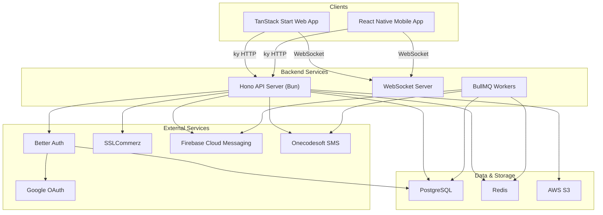
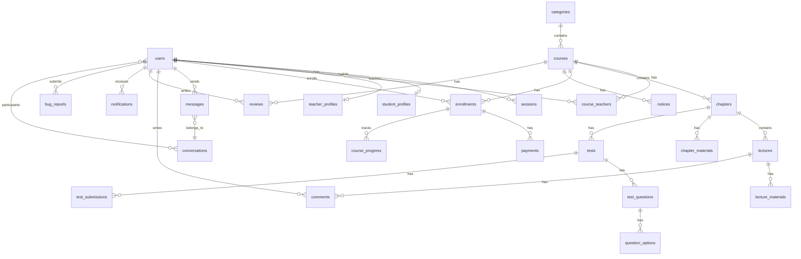

# Mehedi's Math Academy -- LMS Platform Build Plan

**Site Name:** Mehedi's Math Academy
**Domain:** mehedismathacademy.com

---

## Implementation Status Audit -- 2 August 2026

Every phase below was re-verified against the working tree at commit `684289e`. Each phase now carries a
**Delivered** block (what exists, with file paths) and a **Remaining** block (what the phase promised but the
code does not do). Anything not listed under Remaining is built and wired end to end.

### Phase status at a glance

| Phase | Title                                | Status         | Outstanding work                                              |
| ----- | ------------------------------------ | -------------- | ------------------------------------------------------------- |
| 1     | Monorepo Setup                       | ✅ Complete    | --                                                             |
| 2     | Database Schema + Drizzle            | ✅ Complete    | --                                                             |
| 3     | Backend Core (Hono)                  | ✅ Complete    | `/api/v1/users/*` is a deliberate 501 stub                     |
| 4     | Authentication (Better Auth)         | ✅ Complete    | --                                                             |
| 5     | Frontend Foundation + Design System  | ✅ Complete    | Route groups + `pendingComponent` not used (see Deviations)    |
| 6     | User and Profile Management          | ✅ Complete    | --                                                             |
| 7     | Admin Dashboard + Bug Reports        | ✅ Complete    | --                                                             |
| 8     | Category Management                  | ✅ Complete    | --                                                             |
| 9     | Course CRUD + Approval               | ✅ Complete    | --                                                             |
| 10    | Chapters, Lectures, Materials        | ✅ Complete    | --                                                             |
| 11    | File Upload + Media (S3)             | 🟡 In progress | `file-processing` worker never written; video metadata jobs pile up |
| 12    | Tests and Assessments                | ✅ Complete    | --                                                             |
| 13    | Enrollment + Payment (SSLCommerz)    | ✅ Complete    | ⚠️ sandbox/live env flag is broken; never run against the live gateway |
| 14    | Course Player                        | ✅ Complete    | DESIGN.md "chunked" progress bar rendered as a plain bar       |
| 15    | Community and Discussion             | 🟡 In progress | Redis cache for hot comment threads not built                  |
| 16    | Real-time Messaging (WebSocket)      | ✅ Complete    | --                                                             |
| 17    | Notification System (FCM + in-app)   | ✅ Complete    | --                                                             |
| 18    | SMS, Noticeboard, Bulk Comms         | ✅ Complete    | Onecodesoft never exercised against the live gateway           |
| 19    | Analytics, Reviews, PDF, Certificates| ✅ Complete    | --                                                             |
| 20    | SEO Optimization                     | ✅ Complete    | `/sitemap.xml` + `/robots.txt` are served by the API origin only |
| 21    | React Native Mobile App              | 🔴 Not started | `apps/mobile` is still the unmodified `create-expo-app` template |

### Cross-cutting gaps (not owned by any single phase)

These are the items that cut across the whole codebase. They are the real remaining work.

1. **No TanStack Query, no Zustand.** Neither package is in any `package.json`. Every screen fetches with
   `useEffect` + `useState` (112 `useEffect` call sites in `apps/web/src`). Coding Standards §7 mandates
   TanStack Query for server state and Zustand for global UI state. Consequence: no request dedupe, no
   background refetch, no cache invalidation, hand-rolled loading and error state in every route.
2. **No tests of any kind.** Zero `*.test.ts`, `*.test.tsx`, or `*.spec.ts` files in the repo. No
   `playwright.config.*`, no Bun test script in any workspace, no CI test task in `turbo.json`.
   The "Testing (Progressive, Per Phase)" cross-cutting concern was never started.
3. **Redis caching is almost unused.** `apps/api/src/lib/redis.ts` is consumed only by BullMQ queues
   (`lib/queues.ts`), the rate limiter (`middleware/rate-limit.ts`), the WebSocket pub/sub services
   (`message-realtime-service.ts`, `notification-realtime-service.ts`), the health check, and
   `sitemap-service.ts`. Course listings, the category tree, and analytics aggregates hit Postgres on
   every request.
4. **Two BullMQ queues have a producer but no consumer.** `queueNames` declares `email`, `notification`,
   `sms`, and `file-processing`, but only `workers/notification-worker.ts` and `workers/sms-worker.ts`
   exist. Both orphaned queues are actively written to:
   - `upload-service.ts:263` enqueues `extract-video-metadata` onto `file-processing` on every confirmed
     video upload.
   - `staff-account-service.ts:61` enqueues `staff-account-invite` onto `email` with the new staff member's
     temporary password in the payload.

   Those jobs accumulate in Redis and are never processed. The `email` case matters twice over: no mail
   transport is installed anywhere in the repo (no nodemailer, Resend, or SES client), and a plaintext
   temporary password is being parked in Redis indefinitely. Until an email worker exists, staff
   credentials reach the new user only by the admin reading them off the creation response and passing
   them along out of band.
5. **No `pendingComponent` anywhere.** 0 of 49 route files use TanStack Router's `pendingComponent`, which
   §12 requires for page-level skeletons. Skeletons are rendered inline from component state instead.
   `errorComponent` is in place on 47 of 49 route files, so error boundaries are effectively complete.
6. **Skeleton inventory is roughly half built.** Nine skeletons exist: `Skeleton`, `AnalyticsSkeleton`,
   `CourseContentBuilderSkeleton`, `CourseEditorSkeleton`, `CourseGridSkeleton`, `CourseListSkeleton`,
   `CoursePlayerSkeleton`, `DataTableSkeleton`, `ProfilePageSkeleton`. Still missing from the §12 inventory:
   `CourseDetailSkeleton`, `DashboardStatsSkeleton`, `RecentActivitySkeleton`, `ConversationListSkeleton`,
   `MessageThreadSkeleton`, `CommentThreadSkeleton`, `NotificationListSkeleton`, `CategoryTreeSkeleton`,
   `TestBuilderSkeleton`, `TestTakingSkeleton`, `ChartSkeleton`, `StatsGridSkeleton`.
7. **`apps/mobile` is untouched.** See Phase 21.

### Deviations from the plan that are working as intended

These differ from the written plan but are deliberate and should not be "fixed" without a decision.

- **Soft deletes use domain flags, not `deletedAt`.** No table has a `deletedAt` column. Courses soft-delete
  by moving to `status: "ARCHIVED"` (`course-service.ts:376`), users by `isActive: false`
  (`admin-user-service.ts:124`), comments by `isDeleted` (`comment-service.ts:253`). Categories, chapters,
  lectures, materials, tests, questions, notices, and uploads hard-delete.
- **Backend file naming is `kebab-noun-layer.ts`, not `noun.layer.ts`.** The tree uses
  `course-service.ts` / `course-repository.ts`, not the `course.service.ts` shown in §4. The layering itself
  matches the plan exactly.
- **Frontend is not organised by feature.** `src/features/` holds only `landing/`. Everything else lives in
  `src/components/<domain>/` (courses, tests, uploads, categories, notifications, profile, certificates,
  bugs). `src/providers/` is an empty directory.
- **No route groups.** Routes are flat, with `auth.tsx` and `dashboard.tsx` acting as layout routes instead
  of the planned `(public)` / `(auth)` / `(dashboard)` groups.
- **A single root `.env`.** Not the `.env.development` / `.env.production` / `.env.test` tiers in §15. Every
  workspace loads the root file (`apps/api/src/load-root-env.ts`, `bun --env-file ../../.env`).
- **SSLCommerz is hand-rolled**, not the `sslcommerz-lts` package. `services/sslcommerz-service.ts` calls the
  sandbox/live REST API directly and supports a mock gateway mode for local development.
- **Server-side PDFs use `pdf-lib`, not `@react-pdf/renderer`.** The API generates certificates and receipts
  with `pdf-lib`; `@react-pdf/renderer` is a web dependency used for the in-browser certificate preview
  (`components/certificates/certificate-pdf-document.tsx`).
- **`turbo.json` declares a `db:repair-course-review-feedback` task that no workspace implements.** Harmless,
  but dead.
- **Six `animate-spin` submit-button indicators exist** (`profile-editor.tsx`, `auth/sign-in.tsx`,
  `auth/sign-up.tsx`, `admin/users.tsx`). §12 bans spinners; these are form-submit affordances rather than
  data-fetch loaders, so they were left in place.

---

## Architecture Overview


```mermaid
graph TB
    subgraph Clients ["Clients"]
        WebApp["TanStack Start Web App"]
        MobileApp["React Native Mobile App"]
    end

    subgraph Backend ["Backend Services"]
        HonoAPI["Hono API Server (Bun)"]
        WebSocketServer["WebSocket Server"]
        BullMQ["BullMQ Workers"]
    end

    subgraph Storage ["Data & Storage"]
        PostgreSQL["PostgreSQL"]
        Redis["Redis"]
        S3["AWS S3"]
    end

    subgraph External ["External Services"]
        BetterAuth["Better Auth"]
        SSLCommerz["SSLCommerz"]
        FCM["Firebase Cloud Messaging"]
        SMS["Onecodesoft SMS"]
        Google["Google OAuth"]
    end

    WebApp -->|ky HTTP| HonoAPI
    MobileApp -->|ky HTTP| HonoAPI
    WebApp -->|WebSocket| WebSocketServer
    MobileApp -->|WebSocket| WebSocketServer

    HonoAPI --> PostgreSQL
    HonoAPI --> Redis
    HonoAPI --> S3
    HonoAPI --> BetterAuth
    HonoAPI --> SSLCommerz
    HonoAPI --> FCM
    HonoAPI --> SMS

    BullMQ --> Redis
    BullMQ --> PostgreSQL
    BullMQ --> FCM
    BullMQ --> SMS

    BetterAuth --> Google
    BetterAuth --> PostgreSQL
```

## Monorepo Structure

Actual tree as of the 2 August 2026 audit. Differences from the original plan are called out inline.

```
mehedi_math_academy/
├── apps/
│   ├── web/                        # TanStack Start frontend (port 3000)
│   │   └── src/
│   │       ├── routes/             # 49 route files, flat (no (public)/(auth)/(dashboard) groups)
│   │       ├── features/           # ONLY landing/ -- everything else lives in components/
│   │       ├── components/
│   │       │   ├── ui/             # 9 shadcn primitives + skeleton.tsx
│   │       │   ├── layout/         # app-shell, dashboard-layout, public-layout, auth-layout
│   │       │   ├── common/         # fade-in, route-error, data-table-skeleton
│   │       │   ├── courses/ tests/ uploads/ categories/
│   │       │   └── notifications/ profile/ certificates/ bugs/
│   │       ├── hooks/              # only use-auth-session.ts
│   │       ├── lib/
│   │       │   ├── api/            # 17 typed ky modules + client.ts
│   │       │   ├── firebase/       # web-push.ts
│   │       │   ├── forms/          # use-zod-form.ts
│   │       │   └── seo.ts site.ts ssr-api.ts auth.ts auth-server.ts ws-url.ts
│   │       ├── providers/          # EMPTY
│   │       └── styles/app.css      # Tailwind v4 @theme tokens
│   ├── api/                        # Hono backend API (port 3001, dev PORT=3010)
│   │   └── src/
│   │       ├── routes/v1/          # 21 route modules + index.ts
│   │       ├── routes/             # health, site-seo, public-config,
│   │       │                       #   messages-ws-app, notifications-ws-app
│   │       ├── controllers/        # 23 controllers
│   │       ├── services/           # 32 services
│   │       ├── repositories/       # 22 repositories
│   │       ├── middleware/         # auth, error-handler, rate-limit, request-id,
│   │       │                       #   request-logger, session-context, validate
│   │       ├── workers/            # ONLY notification-worker.ts, sms-worker.ts
│   │       ├── websocket/          # EMPTY -- WS apps live in routes/*-ws-app.ts
│   │       ├── lib/                # container, env, logger, queues, redis, s3
│   │       └── utils/              # errors, response, phone-bd
│   └── mobile/                     # UNMODIFIED create-expo-app template (Expo SDK 57)
│       ├── app/                    # (tabs)/index, (tabs)/two, modal, +not-found, +html
│       ├── components/             # Themed.tsx, EditScreenInfo.tsx, StyledText.tsx, ...
│       └── constants/Colors.ts     # No src/, no features/, no API client, no auth
├── packages/
│   ├── db/src/
│   │   ├── schema/                 # 15 entity files + enums.ts, relations.ts, index.ts
│   │   ├── migrations/             # 0000_charming_thunderbolt.sql (32 CREATE TABLE) + meta/
│   │   └── client.ts
│   ├── shared/src/
│   │   ├── types/roles.ts
│   │   ├── validators/             # 17 Zod modules + index.ts
│   │   ├── constants/app.ts
│   │   └── slug.ts
│   ├── auth/src/                   # client, server, tanstack-server, factory (dead), index
│   └── config/                     # eslint.config.mjs, tsconfig.base.json, prettier
├── tooling/
│   └── scripts/                    # seed.ts, backfill-user-slugs.ts, slug.ts (stale copy)
├── turbo.json
├── package.json
├── AGENTS.md / CLAUDE.md           # per-workspace agent docs
├── DESIGN.md
├── PLAN.md
└── .env / .env.example             # single root env file, no per-tier files
```

## Tech Stack Summary (Actually Installed -- 2 August 2026)

Every dependency was bumped to its latest stable release on 2 August 2026. This table reflects what is in
the lockfile, not what the March 2026 plan proposed. Rows where reality diverged from the plan are flagged.

| Layer         | Technology                     | Installed Range   | Notes                                                                    |
| ------------- | ------------------------------ | ----------------- | ------------------------------------------------------------------------ |
| Runtime       | Bun                            | 1.3.11            | `packageManager` pin in root `package.json`                              |
| Monorepo      | Turborepo + Bun workspaces     | ^2.10.8           | `apps/*`, `packages/*`, `tooling/*`                                      |
| Language      | TypeScript                     | ^6.0.3            | TS 7 was trialled and reverted -- typescript-eslint has no TS 7 support  |
| Lint          | ESLint + typescript-eslint     | ^10.8.0 / ^8.65.0 | Flat config in `packages/config/eslint.config.mjs`                       |
| Frontend      | TanStack Router / Start        | ^1.170.18 / ^1.168.34 | React 19.2.8                                                         |
| Bundler       | Vite                           | ^8.2.0            | `@vitejs/plugin-react` ^6.0.5                                            |
| UI Library    | shadcn/ui                      | `components.json` | 9 primitives vendored so far                                             |
| Styling       | Tailwind CSS v4                | ^4.3.3            | `@theme` in `styles/app.css`, no config file                             |
| Forms         | React Hook Form + Zod          | ^7.84.0 / ^4.4.3  | via `lib/forms/use-zod-form.ts`                                          |
| HTTP Client   | ky                             | ^2                | **v2**, not the planned v1 -- hook signatures are the state-object form  |
| Server state  | *(none)*                       | --                | ⚠️ TanStack Query was planned but never installed                        |
| Global UI state | *(none)*                     | --                | ⚠️ Zustand was planned but never installed                               |
| Backend       | Hono                           | ^4.12.33          | Bun runtime                                                              |
| Database      | PostgreSQL                     | 18.x              | via `pg` ^8.22.0 Pool                                                    |
| ORM           | Drizzle ORM / drizzle-kit      | ^0.45.2 / ^0.31.10 | `drizzle-orm/node-postgres`                                             |
| Auth          | Better Auth + Drizzle adapter  | ^1.6.25           | `admin()` and `customSession()` plugins                                  |
| Cache         | ioredis                        | ^6                | **v6** (RESP3 default); fall back to `protocol: 2` if queues misbehave   |
| Queue         | BullMQ                         | ^6                | 4 queues declared, 2 workers written                                     |
| Storage       | AWS S3 SDK v3                  | ^3.1101.0         | `@aws-sdk/client-s3`, `@aws-sdk/s3-request-presigner`                    |
| Payments      | *hand-rolled SSLCommerz*       | --                | ⚠️ `sslcommerz-lts` not used; direct REST calls + mock mode              |
| Notifications | firebase-admin / firebase      | ^14 / ^12         | Web SW `importScripts` pinned to 12.17.0 -- update by hand on each bump  |
| PDF           | pdf-lib (API) / @react-pdf/renderer (web) | ^1.17.1 / ^4.5.1 | ⚠️ Server-side generation uses pdf-lib                       |
| Mobile        | React Native 0.86.2 + Expo SDK 57 | SDK 57         | ⚠️ Plan said SDK 54; React 19.2.3, Reanimated 4.5.1                      |
| WebSocket     | Hono WebSocket                 | built-in (`hono/ws`) | Two separate WS apps, outside the main middleware chain               |
| Validation    | Zod                            | ^4.4.3            | Shared via `@mma/shared`                                                 |
| Logging       | pino                           | ^10.3.1           | Structured JSON logs                                                     |
| Charts        | Recharts                       | ^3.10.1           | Bar, Line, Pie in admin analytics                                        |
| Icons         | lucide-react                   | ^1.28.0           |                                                                          |
| Toasts        | sonner                         | ^2.0.7            | Driven by the ky `afterResponse` hook                                    |

---

## Phase 1: Monorepo Setup and Project Foundation

**Goal:** Scaffold the Turborepo monorepo with Bun workspaces, configure TypeScript, ESLint, and establish the project skeleton for all apps and packages.

**Status:** Completed

**Key tasks:**

- Initialize the root `package.json` with Bun `"workspaces": ["apps/*", "packages/*", "tooling/*"]`
- Configure `turbo.json` with pipelines: `build`, `dev`, `lint`, `typecheck`, `db:generate`, `db:migrate`, `db:seed`
- Create `packages/config/` with shared `tsconfig.base.json`, ESLint flat config, and Prettier config
- Create `.env.example` with all required environment variables (DB, Redis, S3, Firebase, SSLCommerz, Better Auth secrets)
- Set up `packages/shared/` with initial Zod validators and TypeScript types for user roles (`STUDENT`, `TEACHER`, `ACCOUNTANT`, `ADMIN`)
- Set up Git with `.gitignore` covering `node_modules`, `.env`, `dist`, `drizzle/`, generated files
- Install and verify Bun, Turborepo, and all root-level dev dependencies

**Key files:**

- `package.json`, `turbo.json`, `packages/config/tsconfig.base.json`
- `packages/shared/src/types/roles.ts`, `packages/shared/src/validators/index.ts`

**Delivered:**

- Bun 1.3.11 workspaces over `apps/*`, `packages/*`, `tooling/*`; 7 workspaces total.
- `turbo.json` defines `build`, `dev`, `lint`, `typecheck`, `db:generate`, `db:migrate`, `db:seed`,
  `db:backfill-user-slugs`.
- `packages/config/` holds the shared flat ESLint config, `tsconfig.base.json`, and Prettier config.
- `.env.example` documents 40 variables across DB, Redis, S3, Firebase (admin + web), SSLCommerz,
  Onecodesoft, Better Auth, and the seeded admin account.
- `packages/shared/src/types/roles.ts` defines `STUDENT` / `TEACHER` / `ACCOUNTANT` / `ADMIN`.
- `lint`, `typecheck`, and `build` all pass 7/7 as of commit `684289e`.

**Remaining:**

- `turbo.json` declares `db:repair-course-review-feedback`, but no workspace implements that script.
- No CI pipeline is checked in; the lint/typecheck/build gates are run by hand.

---

## Phase 2: Database Schema Design and Drizzle ORM Setup

**Goal:** Design the complete PostgreSQL schema using Drizzle ORM in `packages/db/`, covering all entities needed for the LMS.

**Status:** Completed

**Key tables and relationships:**


```mermaid
erDiagram
    users ||--o{ sessions : has
    users ||--o| student_profiles : has
    users ||--o| teacher_profiles : has
    users ||--o{ course_teachers : teaches
    users ||--o{ enrollments : enrolls
    users ||--o{ messages : sends
    users ||--o{ comments : writes
    users ||--o{ reviews : writes
    users ||--o{ notifications : receives
    users ||--o{ bug_reports : submits

    categories ||--o{ courses : contains
    courses ||--o{ course_teachers : has
    courses ||--o{ chapters : contains
    courses ||--o{ enrollments : has
    courses ||--o{ notices : has
    courses ||--o{ reviews : has

    chapters ||--o{ lectures : contains
    chapters ||--o{ chapter_materials : has
    chapters ||--o{ tests : has

    lectures ||--o{ lecture_materials : has
    lectures ||--o{ comments : has

    tests ||--o{ test_questions : has
    test_questions ||--o{ question_options : has
    tests ||--o{ test_submissions : has

    enrollments ||--o{ payments : has
    enrollments ||--o{ course_progress : tracks

    messages }o--|| conversations : belongs_to
    conversations }o--o{ users : participants
```

**Key tasks:**

- Create `packages/db/src/schema/` with modular schema files: `users.ts`, `courses.ts`, `chapters.ts`, `lectures.ts`, `tests.ts`, `enrollments.ts`, `payments.ts`, `messages.ts`, `comments.ts`, `notifications.ts`, `categories.ts`, `reviews.ts`
- Define Drizzle relations for all tables
- Configure `drizzle.config.ts` with PostgreSQL 18 provider
- Create the DB client in `packages/db/src/client.ts` using `drizzle-orm/node-postgres`
- Write initial migration generation script
- Create seed script in `tooling/scripts/seed.ts` for the admin account (credentials from env vars)

**Core schema highlights:**

- `users` table: id (uuid), email, name, role (enum: STUDENT/TEACHER/ACCOUNTANT/ADMIN), emailVerified, image, profileCompleted (boolean), isActive (boolean, default true -- admin can deactivate), createdAt, updatedAt
- `courses` table: id, title, slug (unique, SEO-friendly URL), description, coverImageUrl, price (0 = free), status (enum: DRAFT/PENDING/PUBLISHED/ARCHIVED), categoryId, createdAt, updatedAt
- `enrollments` table: id, userId, courseId, status (ACTIVE/COMPLETED/CANCELLED), enrolledAt, completedAt
- `payments` table: id, enrollmentId, userId, amount, currency, transactionId, status (PENDING/SUCCESS/FAILED/REFUNDED), provider (SSLCOMMERZ), metadata (jsonb)
- `messages` table: id, conversationId, senderId, content, createdAt (no deletedAt -- messages cannot be deleted)
- `conversations` table: id, participantOneId, participantTwoId, lastMessageAt
- `test_questions` table with `type` enum (MCQ/WRITTEN), `options` for MCQ, `correctAnswer`
- `bug_reports` table: id, userId, title, description, screenshotUrl (optional, S3), status (enum: OPEN/IN_PROGRESS/RESOLVED/CLOSED), adminNotes, priority (LOW/MEDIUM/HIGH), createdAt, resolvedAt

**Delivered:**

- 16 entity files in `packages/db/src/schema/`: `users`, `courses`, `chapters`, `lectures`, `tests`,
  `enrollments`, `payments`, `messages`, `comments`, `notifications`, `categories`, `reviews`,
  `bug-reports`, `sms`, `uploads`, plus `enums.ts`, `relations.ts`, `index.ts`.
- One applied migration, `0000_charming_thunderbolt.sql`, creating 32 tables (the extra tables over the ERD
  are the Better Auth tables, join tables, materials, submissions, FCM tokens, and SMS batches).
- Indexes are dense: `users` 12, `tests` 11, `courses` 8, `enrollments` 6, `messages` 6, `sms` 5,
  `uploads` 4, and 3 each on the rest. Unique slug indexes on `courses`, `categories`, `users`.
- `packages/db/src/client.ts` exports a `pg` Pool-backed Drizzle singleton; `drizzle.config.ts` targets pg.
- `tooling/scripts/seed.ts` provisions the admin account from `ADMIN_EMAIL` / `ADMIN_PASSWORD`;
  `backfill-user-slugs.ts` fills `users.slug` for accounts created before the SEO work.

**Remaining:**

- Nothing outstanding. Note that no table has a `deletedAt` column -- soft deletion is modelled with
  `status`, `isActive`, and `isDeleted` flags instead (see Deviations).

---

## Phase 3: Backend Core -- Hono API Server

**Status:** Completed

**Goal:** Set up the Hono API server in `apps/api/` with middleware stack, error handling, route structure, and shared utilities.

**Key tasks:**

- Initialize `apps/api/` with Bun + Hono
- Implement layered architecture: `routes/ -> controllers/ -> services/ -> repositories/`
- Set up middleware stack:
  - CORS (configured for web and mobile origins)
  - Request logging (pino)
  - Rate limiting (with Redis store)
  - Request ID generation
  - Body size limiting
  - Compression
- Create global error handler with `AppError` hierarchy (ValidationError, NotFoundError, UnauthorizedError, ForbiddenError)
- Create standardized API response helpers: `success()`, `error()`, `paginated()`
- Set up Zod validation middleware for request body/params/query
- Configure Redis client (ioredis) as shared singleton
- Set up BullMQ for background job processing with dedicated worker queues: `email`, `notification`, `sms`, `file-processing`
- Health check endpoint at `GET /api/health`

**Route namespace plan:**

```
/api/v1/auth/*         - Authentication
/api/v1/users/*        - User management
/api/v1/profiles/*     - Profile management
/api/v1/categories/*   - Category management
/api/v1/courses/*      - Course CRUD
/api/v1/enrollments/*  - Enrollment & payment
/api/v1/messages/*     - Messaging
/api/v1/notifications/* - Notifications
/api/v1/admin/*        - Admin-specific routes
/api/v1/analytics/*    - Analytics
/api/v1/upload/*       - File upload
```

**Delivered:**

- `apps/api/src/app.ts` wires the full middleware chain in order: request ID, pino request logger, CORS
  (with `X-Request-Id` and rate-limit headers exposed), `bodyLimit`, `compress`, Redis-backed rate limiting,
  then `sessionContextMiddleware` on `/api/v1/*`.
- Layering is enforced across 21 route modules, 23 controllers, 32 services, 22 repositories. Manual DI
  singletons live in `lib/container.ts`.
- `utils/errors.ts` defines the `AppError` hierarchy (`ValidationError`, `NotFoundError`,
  `UnauthorizedError`, `ForbiddenError`, `ConflictError`); `middleware/error-handler.ts` is the global
  `app.onError`. `utils/response.ts` exports `success()`, `error()`, `paginated()`.
- `middleware/validate.ts` provides the Zod body/params/query validator.
- `lib/redis.ts` is the shared ioredis singleton; `lib/queues.ts` declares all four BullMQ queues.
- Health check at `GET /api/health` with a DB-and-Redis probe (`health-repository.ts`).
- 22 namespaces mounted under `/api/v1` -- the planned list plus `public`, `chapters`, `lectures`,
  `comments`, `questions`, `tests`, `notices`, `og-image`, `progress`.

**Remaining:**

- `/api/v1/users/*` returns HTTP 501 for every method
  (`routes/v1/users.route.ts` -> `createNotImplementedRoute("users")`). All user management is served from
  `/api/v1/admin/users/*` instead, so decide whether to build the namespace out or delete the stub.
- Rate limiting is skipped entirely when `NODE_ENV === "development"` (`app.ts:33`). Intentional, but it
  means the limiter path is never exercised locally.

---

## Phase 4: Authentication System (Better Auth)

**Status:** Completed

**Goal:** Integrate Better Auth with Drizzle adapter, supporting email/password signup (students), Google OAuth, and admin-created accounts for teachers/accountants.

**Key tasks:**

- Create `packages/auth/` with Better Auth configuration shared between web and api
- Configure Better Auth with:
  - Email/password provider (for students)
  - Google OAuth provider
  - Drizzle adapter pointing to `packages/db`
  - `tanstackStartCookies` plugin for the web app
  - Custom session fields (role, profileCompleted)
- Implement role-based middleware in Hono:
  - `requireAuth()` -- verify session and check `isActive === true` (reject deactivated users with 403)
  - `requireRole(...roles)` -- check user role
  - `requireAdmin()` -- shorthand for admin-only
- Build admin endpoints for creating teacher/accountant accounts (generates password, sends invite)
- Run Better Auth CLI to generate auth schema, merge into Drizzle schema
- Implement the seed script to create the single admin account from env vars (`ADMIN_EMAIL`, `ADMIN_PASSWORD`)
- Add auth route handler in TanStack Start at `/api/auth/$`

**Security considerations:**

- Rate limiting on auth endpoints (5 attempts per 15 min)
- Password hashing via Better Auth (Argon2)
- Refresh token rotation
- Session invalidation on role change or account deactivation

**Delivered:**

- `packages/auth/src/server.ts` configures Better Auth with the Drizzle adapter, email/password
  (8-128 chars, `autoSignIn`), Google OAuth (auto-disabled when the client ID is still `replace-me`),
  the `admin()` plugin, and `customSession()` exposing `role`, `slug`, `profileCompleted`, `isActive`.
- Auth rate limits match the plan exactly: 15-minute window, max 5 on `/sign-in/email` and
  `/sign-up/email`, 100 globally, disabled in development.
- `databaseHooks` generate a unique user slug on creation via `generateUniqueSlug` from `@mma/shared`.
- Role guards live in `apps/api/src/middleware/auth.ts` and `services/auth-guard-service.ts`.
- `apps/web/src/routes/api/auth/$.ts` mounts the TanStack Start auth handler; `packages/auth/src/client.ts`
  is the browser client.
- Deactivation invalidates sessions: `admin-user-service.ts` calls
  `authSessionRepository.deleteByUserId()` on both status change and soft delete.
- Trusted origins cover web (3000), API (3001), and Expo (8081) so the mobile app can authenticate later.

**Remaining:**

- Admin-created staff accounts never receive an invite. `staff-account-service.ts:61` enqueues a
  `staff-account-invite` job onto the `email` queue and returns the temporary password to the admin UI, but
  no worker consumes that queue and no mail transport is installed. The password sits in Redis in
  plaintext. Either write the email worker or drop the enqueue and treat the admin response as the only
  delivery channel.
- `packages/auth/src/server.ts` and `tanstack-server.ts` are hand-synced duplicates that differ only by
  `tanstackStartCookies()` and the slug `databaseHooks`. Edits must be applied to both.
- `packages/auth/src/factory.ts` is dead code.

---

## Phase 5: Frontend Foundation -- TanStack Start + Design System

**Status:** Completed

**Goal:** Set up the TanStack Start web app with Tailwind CSS v4, shadcn/ui, and implement the "Digital Atelier" design system from [DESIGN.md](DESIGN.md).

**Key tasks:**

- Initialize `apps/web/` with TanStack Start + React 19
- Install and configure Tailwind CSS v4 with PostCSS
- Initialize shadcn/ui using `npx shadcn@latest init` (CLI v4 has stable TanStack Start support)
- Translate DESIGN.md into Tailwind `@theme` tokens:
  - Surface hierarchy: `--color-surface`, `--color-surface-container-low`, `--color-surface-container-lowest`, `--color-surface-container-highest`
  - Primary colors: `--color-primary` (#000000), `--color-on-primary-container` (#028fb0), `--color-secondary-container` (#6063ee)
  - Typography: Manrope (display/headlines) + Inter (body/labels)
  - Radius tokens: DEFAULT (0.25rem), md (0.375rem)
  - Shadow system: tinted shadows using `rgba(19, 27, 46, 0.08)`, ghost borders at 15% opacity
  - "No-Line Rule" enforced via surface layering, not borders
  - Signature CTA gradient: `primary` to `on-primary-container`
  - Frosted navigation: 80% opacity + 24px backdrop-blur
- Create core layout components:
  - `AppShell` with glassmorphic sidebar navigation
  - `DashboardLayout` (role-based sidebar items)
  - `PublicLayout` (for landing page, course catalog)
- Set up the ky API client wrapper with:
  - Base URL configuration
  - Auth token injection (from Better Auth session)
  - Error interceptor with toast notifications
  - Request/response type inference
- Set up React Hook Form + Zod resolver pattern
- Build the skeleton system:
  - Base `Skeleton` primitive component in `components/ui/skeleton.tsx` using DESIGN.md surface colors with shimmer animation
  - `FadeIn` transition wrapper component (`components/common/fade-in.tsx`) for smooth skeleton-to-content transitions (150ms ease-out opacity + translateY)
  - Define the shimmer `@keyframes` in the global Tailwind `@theme` block as `--animate-shimmer`
  - No spinners, loaders, or "Loading..." text anywhere -- custom skeletons only
- Implement error boundaries at every route level using TanStack Router's `errorComponent`
- Configure TanStack Router with route groups: `(public)`, `(auth)`, `(dashboard)`
- Set up base HTML head with default meta tags: site name "Mehedi's Math Academy", favicon, viewport, theme-color
- Configure default `og:site_name` as "Mehedi's Math Academy" and `og:url` base as `https://mehedismathacademy.com`

**Delivered:**

- TanStack Start + React 19.2 on Vite 8, Tailwind v4 via `@tailwindcss/vite` with all Digital Atelier
  tokens declared in `styles/app.css` `@theme` (no `tailwind.config`).
- shadcn/ui initialised (`components.json`); 9 primitives vendored into `components/ui/`: badge, button,
  card, input, label, password-input, select, skeleton, textarea.
- Layout components: `layout/app-shell.tsx`, `layout/dashboard-layout.tsx` (role-aware sidebar),
  `layout/public-layout.tsx`, `layout/auth-layout.tsx`.
- `lib/api/client.ts` is the ky v2 wrapper -- `credentials: "include"`, `prefix` from `clientEnv`, a
  `beforeRequest` header merger, and an `afterResponse` hook that raises a sonner toast from the API error
  envelope. `lib/ssr-api.ts` is the server-side twin used by route loaders. Do not add a second toast on
  top of the interceptor.
- `lib/forms/use-zod-form.ts` wraps React Hook Form + `@hookform/resolvers` Zod.
- Skeleton primitive with a shimmer keyframe, plus `components/common/fade-in.tsx`; `FadeIn` is used in
  13 files.
- `errorComponent` is set on 47 of 49 route files, backed by `components/common/route-error.tsx`.
- `__root.tsx` sets the default head, favicon, viewport, theme-color, `og:site_name`, and preloads the
  Manrope and Inter woff2 subsets.

**Remaining:**

- No `(public)` / `(auth)` / `(dashboard)` route groups; the tree is flat with `auth.tsx` and
  `dashboard.tsx` as layout routes.
- No `pendingComponent` on any route -- page-level skeletons render from component state instead.
- `src/providers/` is an empty directory; no React context providers were ever created.
- TanStack Query and Zustand are absent (see the cross-cutting gaps).

---

## Phase 6: User and Profile Management

**Status:** Completed

**Goal:** Implement the complete user profile system with role-specific profiles and the first-login profile completion prompt.

**Key tasks:**

- **Backend:**
  - `GET /api/v1/profiles/me` -- get own profile
  - `PUT /api/v1/profiles/me` -- update own profile
  - `GET /api/v1/profiles/teachers/:id` -- public teacher profile
  - `GET /api/v1/admin/users/:id/profile` -- admin views any student profile
  - Student profile fields: name, phone, dateOfBirth, guardianName, guardianPhone, institution, class/grade, address, profilePhoto
  - Teacher profile fields: name, phone, bio, qualifications, specializations, profilePhoto, socialLinks
- **Frontend:**
  - Profile completion modal/page that triggers on first login when `profileCompleted === false`
  - Multi-step profile form with React Hook Form
  - Public teacher profile page showing bio, courses, ratings
  - Student profile page (accessible by the student and admin only)
  - Profile photo upload with S3 integration
  - Skeleton loading states for all profile pages

**Delivered:**

- Endpoints: `GET/PUT /api/v1/profiles/me`, `GET /api/v1/profiles/teachers/:id`,
  `GET /api/v1/profiles/teachers/by-slug/:slug`, `GET /api/v1/admin/users/:id/profile`.
- `profile-service.ts` / `profile-repository.ts` cover both student and teacher profile shapes; validators
  in `packages/shared/src/validators/profiles.ts`. Bangladeshi phone normalisation in `utils/phone-bd.ts`.
- First-login gate is a redirect, not a modal: `routes/dashboard.tsx:31` pushes any session with
  `profileCompleted === false` to `/dashboard/profile-complete`.
- `components/profile/profile-editor.tsx` is the multi-step form; `profile-photo-upload-field.tsx` drives
  the S3 presigned upload.
- Pages: `routes/dashboard/profile.tsx`, `routes/dashboard/profile-complete.tsx`,
  `routes/dashboard/students/$id.tsx` (student + admin only), `routes/teachers/$slug.tsx` (public).
- `ProfilePageSkeleton` exists.

**Remaining:**

- Nothing outstanding.

---

## Phase 7: Admin Dashboard, Account Management, and Bug Reports

**Status:** Completed

**Goal:** Build the admin dashboard with user account CRUD, activate/deactivate users, system overview, and a bug reporting system for students and teachers.

**Key tasks:**

- **Backend -- User Management:**
  - `GET /api/v1/admin/users` -- list all users with filters (role, status, search, pagination)
  - `POST /api/v1/admin/users` -- create teacher/accountant accounts
  - `PUT /api/v1/admin/users/:id` -- update user
  - `PATCH /api/v1/admin/users/:id/status` -- activate or deactivate a user (toggle `isActive`). Backend must enforce: admin cannot deactivate themselves (reject with 403 if `targetId === currentUserId`). Deactivated users cannot log in -- Better Auth session check must verify `isActive === true` and reject otherwise.
  - `DELETE /api/v1/admin/users/:id` -- soft delete user
  - `GET /api/v1/admin/dashboard` -- overview stats (total students, courses, revenue, enrollments, open bugs)
  - Auth middleware update: on every authenticated request, check `isActive` on the user record. If `false`, return 403 "Account deactivated" and invalidate the session.
- **Backend -- Bug Reports:**
  - `POST /api/v1/bugs` -- submit a bug report (students and teachers only). Fields: title, description, screenshotUrl (optional)
  - `GET /api/v1/bugs/me` -- list own submitted bug reports
  - `GET /api/v1/admin/bugs` -- list all bug reports with filters (status, priority, pagination)
  - `PATCH /api/v1/admin/bugs/:id` -- update bug status (OPEN/IN_PROGRESS/RESOLVED/CLOSED), set priority, add admin notes
- **Frontend -- Admin:**
  - Admin dashboard with stats cards (students count, active courses, revenue, pending approvals, open bug count)
  - User management table with search, filter by role and active/inactive status, pagination
  - Activate/deactivate toggle per user row (with confirmation dialog). Admin's own row has the toggle disabled with a tooltip: "Cannot deactivate your own account"
  - Visual indicator for deactivated users: muted row with "Inactive" badge
  - Create account form (teacher/accountant) with auto-generated password option
  - User detail view with activity history
  - Bug report management page: table of all reports with status badges, priority labels, filter/sort
  - Bug detail view: description, screenshot preview, status update dropdown, admin notes textarea
  - All tables use proper skeleton loading states (`DataTableSkeleton`)
- **Frontend -- Student/Teacher:**
  - "Report a Bug" button accessible from the sidebar/footer in the dashboard layout
  - Bug report form: title, description (rich text or plain), optional screenshot upload (S3)
  - "My Bug Reports" page showing submission history with status badges (color-coded: OPEN = amber, IN_PROGRESS = blue, RESOLVED = green, CLOSED = gray)

**Delivered:**

- Admin user endpoints, all present: `GET /admin/users`, `POST /admin/users`, `GET /admin/users/:id`,
  `PUT /admin/users/:id`, `PATCH /admin/users/:id/status`, `DELETE /admin/users/:id`,
  `GET /admin/users/:id/profile`, `GET /admin/dashboard`.
- Self-protection is enforced server-side in `admin-user-service.ts`: `softDeleteUser` and the status
  toggle both reject `targetUserId === currentUserId` with a `ForbiddenError`, and both purge the target's
  sessions through `authSessionRepository.deleteByUserId()`.
- Bug endpoints: `POST /api/v1/bugs`, `GET /api/v1/bugs/me`, `GET /admin/bugs`, `GET /admin/bugs/:id`,
  `PATCH /admin/bugs/:id`.
- Frontend: `routes/dashboard/admin/users.tsx` + `users/$id.tsx`, `routes/dashboard/admin/bugs.tsx` +
  `bugs/$id.tsx`, `routes/dashboard/bugs/index.tsx` ("My Bug Reports"), `routes/dashboard/bugs/report.tsx`,
  `components/bugs/bug-screenshot-upload-field.tsx`, and `routes/dashboard/index.tsx` for the stats
  overview. `DataTableSkeleton` backs the tables.

**Remaining:**

- Nothing outstanding for this phase's key tasks.

---

## Phase 8: Category Management

**Status:** Completed

**Goal:** Implement hierarchical course categories (e.g., SSC, HSC, Admission, etc.) managed by admin.

**Key tasks:**

- **Backend:**
  - `categories` table with id, name, slug (unique, SEO-friendly URL), description, parentId (for subcategories), icon, sortOrder, isActive
  - Full CRUD endpoints under `/api/v1/categories/` (admin only for mutations)
  - `GET /api/v1/categories` is public (for course browsing)
- **Frontend:**
  - Admin category management page with drag-and-drop reordering
  - Category tree view for nested categories
  - Category selector component (reusable in course forms)
  - Public category browsing on the course catalog page

**Delivered:**

- `categories` table carries id, name, slug (unique index), description, parentId, icon, sortOrder,
  isActive.
- Endpoints: public `GET /api/v1/categories` and `GET /api/v1/categories/by-slug/:slug`; admin-guarded
  `POST /`, `GET /:id`, `PUT /:id`, `PATCH /reorder`, `DELETE /:id`.
- Frontend: `routes/dashboard/admin/categories.tsx` with reordering, `components/categories/category-tree.tsx`,
  `category-selector.tsx`, `icon-picker.tsx`, `lib/category-tree.ts` for the nesting helper, and the public
  `routes/categories.tsx` + `routes/categories/$slug.tsx`.

**Remaining:**

- Category deletion is a hard delete (`category-repository.ts:160`) despite `isActive` existing on the
  table. Decide whether that is intended.
- No `CategoryTreeSkeleton` (listed in the §12 inventory).

---

## Phase 9: Course CRUD and Management

**Goal:** Build the complete course creation, editing, and admin approval workflow.

**Status:** Completed

**Key tasks:**

- **Backend:**
  - `POST /api/v1/courses` -- create course (teacher/admin)
  - `GET /api/v1/courses` -- list courses (public: published only; admin: all; teacher: own courses)
  - `GET /api/v1/courses/:id` -- course detail
  - `PUT /api/v1/courses/:id` -- update course
  - `DELETE /api/v1/courses/:id` -- soft delete
  - `POST /api/v1/courses/:id/submit` -- submit for admin review (changes status to PENDING)
  - `POST /api/v1/admin/courses/:id/approve` -- approve course (PUBLISHED)
  - `POST /api/v1/admin/courses/:id/reject` -- reject with feedback
  - `POST /api/v1/courses/:id/teachers` -- add/remove co-teachers
  - Support for "exam-only" courses (flag: `isExamOnly`)
- **Frontend:**
  - Course creation wizard (multi-step form):
    1. Basic info (title, description, category, price, exam-only toggle)
    2. Cover photo upload with preview
    3. Teacher assignment (multi-select for co-teachers)
    4. Review & submit
  - Course listing page with filters (category, price range, status)
  - Course detail page (public view for published courses)
  - Admin course approval queue with approve/reject actions
  - Teacher's "My Courses" dashboard with status badges

**Delivered:**

- Every planned endpoint exists: `POST /courses`, `GET /courses`, `GET /courses/:id`,
  `GET /courses/by-slug/:slug`, `PUT /courses/:id`, `DELETE /courses/:id`, `POST /courses/:id/submit`,
  `POST /admin/courses/:id/approve`, `POST /admin/courses/:id/reject`, `POST /courses/:id/teachers`,
  plus `GET /courses/support/teachers` for the co-teacher picker.
- `DELETE /courses/:id` archives rather than deletes: `course-service.ts:376` sets `status: "ARCHIVED"` and
  clears `publishedAt` / `submittedAt` / `rejectedAt` / `reviewFeedback`.
- `ensureCanManageCourse` gates every mutation on ownership or the ADMIN role.
- Frontend: the wizard at `routes/dashboard/courses/new.tsx` plus `components/courses/course-editor.tsx`
  (with `CourseEditorSkeleton`), `routes/dashboard/courses/index.tsx` (teacher "My Courses" with
  `course-status-badge.tsx`), `routes/dashboard/admin/courses.tsx` (approval queue), the public
  `routes/courses/index.tsx` and `routes/courses/$slug.tsx`, and `components/courses/course-card.tsx` with
  `CourseGridSkeleton` / `CourseListSkeleton`.
- `isExamOnly` is modelled on the `courses` table and honoured by the editor.

**Remaining:**

- No `CourseDetailSkeleton` (the public detail page is server-rendered through a loader, so the gap is
  cosmetic).

---

## Phase 10: Course Content Structure -- Chapters, Lectures, Materials

**Goal:** Build the content management system for courses: chapters containing lectures (video/link) and downloadable materials.

**Status:** Completed

**Key tasks:**

- **Backend:**
  - Chapter CRUD: `/api/v1/courses/:courseId/chapters`
  - Lecture CRUD: `/api/v1/chapters/:chapterId/lectures`
  - Lecture types: VIDEO_UPLOAD, VIDEO_LINK, TEXT
  - Material upload for chapters: `/api/v1/chapters/:chapterId/materials`
  - Material upload for lectures: `/api/v1/lectures/:lectureId/materials`
  - Drag-and-drop reordering (sortOrder field on chapters and lectures)
  - Materials table: id, title, fileUrl, fileType, fileSize, parentType (CHAPTER/LECTURE), parentId
- **Frontend:**
  - Course content builder (drag-and-drop chapter/lecture ordering)
  - Chapter accordion with inline lecture list
  - Lecture form: toggle between video upload, video link (YouTube/Vimeo embed parser), or text content
  - Material upload with file type validation (PDF, DOC, PPT, images)
  - Preview panel for course structure

**Delivered:**

- Chapters: `POST /courses/:courseId/chapters`, `PATCH /courses/:courseId/chapters/reorder`,
  `PUT /chapters/:id`, `DELETE /chapters/:id`.
- Lectures: `POST /chapters/:id/lectures`, `PATCH /chapters/:id/lectures/reorder`, `PUT /lectures/:id`,
  `DELETE /lectures/:id`.
- Materials on both parents: `POST /chapters/:id/materials`, `PUT /chapters/materials/:materialId`,
  `DELETE /chapters/materials/:materialId`, and the same trio under `/lectures`.
- `GET /courses/:courseId/content` returns the assembled tree for the builder and the player.
- All of it flows through `content-service.ts` / `content-repository.ts` and
  `packages/shared/src/validators/content.ts`.
- Frontend: `components/courses/course-content-builder.tsx` (drag-and-drop chapter and lecture ordering,
  accordion, inline lecture list, `CourseContentBuilderSkeleton`), mounted at
  `routes/dashboard/courses/$id/content.tsx`. Lecture type toggle covers video upload, video link, and
  text; `components/uploads/video-uploader.tsx` parses YouTube and Vimeo URLs.

**Remaining:**

- Nothing outstanding.

---

## Phase 11: File Upload and Media Management (AWS S3)

**Goal:** Implement a robust file upload system using AWS S3 with presigned URLs for direct client uploads.

**Status:** In progress -- the upload path is complete, the background processing half is not.

**Key tasks:**

- **Backend:**
  - S3 service using AWS SDK v3 (`@aws-sdk/client-s3`, `@aws-sdk/s3-request-presigner`)
  - `POST /api/v1/upload/presigned` -- generate presigned upload URL (authenticated)
  - `POST /api/v1/upload/confirm` -- confirm upload, save metadata to DB
  - `DELETE /api/v1/upload/:id` -- delete file from S3 and DB
  - File validation: max sizes per type (videos: 500MB, images: 5MB, documents: 50MB)
  - S3 bucket structure: `/{environment}/{type}/{userId}/{uuid}.{ext}`
  - Background job for video metadata extraction (duration, resolution) using BullMQ
- **Frontend:**
  - Reusable `FileUploader` component with:
    - Drag-and-drop zone
    - Progress bar (direct upload to S3 via presigned URL)
    - File type/size validation on client
    - Preview for images
  - `VideoUploader` component with YouTube/Vimeo URL parser + direct upload option
  - Image cropper for profile photos and course covers

**Delivered:**

- `lib/s3.ts` wraps AWS SDK v3 with `createSignedUploadUrl`, `getPublicFileUrl`, `deleteStoredFile`.
- Endpoints: `POST /api/v1/upload/presigned`, `POST /api/v1/upload/confirm`, `DELETE /api/v1/upload/:id`.
- `upload-service.ts` enforces per-purpose limits exactly as planned -- videos 500MB, images 5MB,
  documents 50MB -- across five purposes: `LECTURE_VIDEO`, `COURSE_COVER`, `COURSE_MATERIAL`,
  `PROFILE_PHOTO`, `BUG_SCREENSHOT`. Bad content types and oversize files throw `ValidationError`.
- Key layout matches the spec: `${NODE_ENV}/${pathSegment}/${userId}/${uuid}.${ext}`.
- `requireS3Configuration()` returns 409 when S3 env vars are absent, so the app degrades rather than
  crashing in local development.
- `uploads` table tracks status (`PENDING` -> `READY`), kind, size, dimensions, duration, owner.
- Frontend: `components/uploads/file-uploader.tsx` (drag-and-drop, progress, client-side validation,
  image preview), `video-uploader.tsx`, `image-crop-uploader.tsx` (react-easy-crop) for avatars and covers.

**Remaining:**

- **The `file-processing` worker was never written.** `upload-service.ts:263` fires
  `queues["file-processing"].add("extract-video-metadata", {...})` for every confirmed video, but
  `apps/api/src/workers/` contains only `notification-worker.ts` and `sms-worker.ts`. Those jobs sit in
  Redis forever, and `uploads.durationInSeconds` / `width` / `height` are only ever populated when the
  client passes them to `POST /upload/confirm`.
  To close this: add `workers/file-processing-worker.ts` on the `file-processing` queue, register a
  `worker:file-processing` script in `apps/api/package.json` alongside the two existing worker scripts, and
  have it write metadata back through `upload-repository`.
- No thumbnail variants are generated for course covers (§16 Performance Rules asks for them).

---

## Phase 12: Tests and Assessments (MCQ and Written)

**Goal:** Build the test/exam system supporting MCQ and written questions, with auto-grading for MCQ and manual grading for written.

**Status:** Completed

**Key tasks:**

- **Backend:**
  - Test CRUD: `/api/v1/chapters/:chapterId/tests`
  - Test fields: title, description, duration (minutes), passingScore, isPublished, type (MCQ/WRITTEN/MIXED)
  - Question CRUD: `/api/v1/tests/:testId/questions`
  - MCQ question: questionText, options[] (with isCorrect flag), marks
  - Written question: questionText, marks, expectedAnswer (for teacher reference)
  - Test submission: `/api/v1/tests/:testId/submit`
  - Auto-grade MCQ submissions immediately
  - Teacher grading endpoint for written: `/api/v1/submissions/:id/grade`
  - Result calculation and storage
- **Frontend:**
  - Test builder for teachers: add questions, set marks, set timer
  - MCQ question editor with option management
  - Written question editor with reference answer
  - Student test-taking interface with:
    - Timer countdown
    - Question navigation sidebar
    - Auto-save progress
    - Submit confirmation
  - Results page with score breakdown
  - Teacher grading interface for written answers

**Delivered:**

- Test CRUD: `POST /chapters/:id/tests`, `GET /tests/:id`, `PUT /tests/:id`, `DELETE /tests/:id`,
  `GET /courses/:courseId/tests`.
- Question CRUD: `POST /tests/:testId/questions`, `PATCH /tests/:testId/questions/reorder`,
  `PUT /questions/:id`, `DELETE /questions/:id`. MCQ options live in a `question_options` table with an
  `isCorrect` flag; written questions carry `expectedAnswer` for teacher reference.
- Submission lifecycle is richer than the plan: `POST /tests/:id/submissions/start` (server-stamped start
  time for the timer), `PUT /tests/submissions/:id/answers` (auto-save), `POST /tests/:id/submit`,
  `GET /tests/:id/submissions`, `GET /tests/submissions/:id`, `PUT /tests/submissions/:id/grade`.
- MCQ auto-grading and score calculation live in `test-service.ts`; `tests.ts` schema has 11 indexes.
- Frontend: `components/tests/assessment-builder.tsx` at `routes/dashboard/courses/$id/tests.tsx`;
  student runner at `routes/dashboard/tests/$testId.tsx` with a countdown driven off the server start time
  and a debounced `saveSubmissionAnswers` autosave; results at
  `routes/dashboard/tests/$testId/results/$submissionId.tsx`; teacher grading at
  `routes/dashboard/tests/$testId/submissions.tsx` and `submissions/$submissionId.tsx`.

**Remaining:**

- No `TestBuilderSkeleton` or `TestTakingSkeleton` (§12 inventory).

---

## Phase 13: Course Enrollment and Payment (SSLCommerz)

**Goal:** Implement free and paid enrollment flows with SSLCommerz payment gateway integration.

**Status:** Completed

**Key tasks:**

- **Backend:**
  - `POST /api/v1/enrollments` -- enroll in a course
  - Free courses: immediate enrollment
  - Paid courses: initiate SSLCommerz payment
  - SSLCommerz integration:
    - `POST /api/v1/payments/init` -- initialize payment session
    - `POST /api/v1/payments/success` -- IPN success callback
    - `POST /api/v1/payments/fail` -- IPN failure callback
    - `POST /api/v1/payments/cancel` -- IPN cancel callback
    - `GET /api/v1/payments/validate/:valId` -- validate transaction
  - Payment status tracking in `payments` table
  - `GET /api/v1/enrollments/me` -- list student's enrolled courses
  - Enrollment verification middleware for accessing course content
- **Frontend:**
  - "Enroll Now" button on course detail page (shows price or "Free")
  - Payment flow: redirect to SSLCommerz -> return to success/failure page
  - "My Courses" page for students showing enrolled courses with progress
  - Payment history page
  - Accountant dashboard: revenue reports, payment logs, refund management

**Delivered:**

- `POST /api/v1/enrollments` handles free courses inline and hands paid courses to the payment flow;
  `GET /enrollments/me` and `GET /enrollments/courses/:id/me` back the student views.
- Payments: `POST /payments/init`, `GET|POST /payments/success`, `GET|POST /payments/fail`,
  `GET|POST /payments/cancel`, `GET /payments/validate/:valId`, `GET /payments/me`, `GET /payments`,
  `GET /payments/:id`, and `POST /payments/:id/refund` (beyond the plan).
  Both GET and POST are accepted on the IPN callbacks because SSLCommerz varies by configuration.
- `services/sslcommerz-service.ts` targets `sandbox.sslcommerz.com` or `securepay.sslcommerz.com` off
  `SSLCOMMERZ_SANDBOX_MODE`, and exposes an `isMock` gateway mode so the flow can be walked end to end
  without credentials -- `routes/dashboard/payments/mock.tsx` is that stand-in gateway.
- `payments` table tracks amount, currency, transactionId, status, provider, jsonb metadata.
- Enrollment gating for content access lives in `enrollment-repository` checks called from the content and
  progress services.
- Frontend: enroll CTA on `routes/courses/$slug.tsx`, `routes/dashboard/payments/return.tsx` for the
  gateway hand-back, `routes/dashboard/payments/index.tsx` for history,
  `routes/dashboard/my-courses.tsx` for enrolled courses with progress, and
  `routes/dashboard/accountant/analytics.tsx` for the accountant's revenue view.

**Remaining:**

- **The sandbox/live switch cannot currently be flipped.** Two separate defects compound:
  1. `.env.example:42` documents `SSLCOMMERZ_IS_LIVE`, but nothing in the repo reads that variable. The
     API reads `SSLCOMMERZ_SANDBOX_MODE` (`lib/env.ts:18`), which is undocumented.
  2. That variable is parsed with `z.coerce.boolean().default(true)`. Zod's boolean coercion is
     `Boolean(input)`, so the string `"false"` coerces to `true`. Setting
     `SSLCOMMERZ_SANDBOX_MODE="false"` leaves it on. Only an empty value or a genuine `undefined`-plus-
     changed-default would reach the live gateway.

  Net effect: `sslcommerz-service.ts` will always target `sandbox.sslcommerz.com` no matter what the
  environment says. Fix by parsing the flag as `z.enum(["true","false"]).transform(v => v === "true")` (or
  `z.stringbool()`), settling on one variable name, and documenting it in `.env.example`.
- The live SSLCommerz gateway has never been exercised -- only sandbox and the built-in mock. Validate the
  IPN callbacks against a real store before launch.

---

## Phase 14: Course Player and Learning Experience

**Goal:** Build the immersive course consumption interface with progress tracking, video player, and material downloads.

**Status:** Completed

**Key tasks:**

- **Frontend:**
  - Course player layout:
    - Left: glassmorphic vertical sidebar with chapter/lecture navigation (from DESIGN.md "Course Navigator")
    - Center: video player / text content / test interface
    - Completion checkmarks per lecture
  - Video player integration:
    - For uploaded videos: HTML5 video with S3 streaming URL
    - For YouTube/Vimeo: embed player with responsive iframe
  - Progress tracking: mark lectures as complete
  - Material download buttons per lecture and chapter
  - "Chunked" progress bar (from DESIGN.md "Progress Trackers")
  - Keyboard navigation support
- **Backend:**
  - `POST /api/v1/progress/:lectureId/complete` -- mark lecture complete
  - `GET /api/v1/courses/:courseId/progress` -- get course progress for student
  - Calculate overall course completion percentage
  - Mark enrollment as COMPLETED when all lectures are done

**Delivered:**

- `POST /api/v1/progress/:lectureId/complete` and `GET /api/v1/courses/:courseId/progress`, served by
  `progress-service.ts`, which computes the completion percentage and flips the enrollment to `COMPLETED`
  when the last lecture lands.
- `components/courses/course-player.tsx` (727 lines) mounted at `routes/dashboard/learn/$courseId.tsx`:
  glassmorphic chapter/lecture sidebar, per-lecture completion checkmarks, HTML5 video for S3 uploads,
  responsive iframe embeds for YouTube and Vimeo, text lectures, and per-lecture and per-chapter material
  download lists.
- Keyboard navigation is real: a `keydown` listener at `course-player.tsx:238` moves between lectures.
- `CoursePlayerSkeleton` exists. The noticeboard tab is `components/courses/course-notices-panel.tsx` and
  the discussion thread is `components/courses/lecture-discussion.tsx`.

**Remaining:**

- The progress indicator is a plain bar, not the segmented "chunked" tracker described in DESIGN.md.

---

## Phase 15: Community and Discussion System

**Goal:** Build per-lecture comment/discussion sections where students, teachers, and admins can comment and reply.

**Status:** In progress -- feature-complete except for the Redis cache

**Key tasks:**

- **Backend:**
  - `comments` table: id, lectureId, userId, parentId (for replies), content, createdAt, updatedAt
  - `GET /api/v1/lectures/:lectureId/comments` -- list comments (threaded, paginated)
  - `POST /api/v1/lectures/:lectureId/comments` -- create comment
  - `PUT /api/v1/comments/:id` -- edit own comment
  - `DELETE /api/v1/comments/:id` -- soft delete (admin/own)
  - Redis cache for hot comment threads
- **Frontend:**
  - Threaded comment section below each lecture in the course player
  - Reply-to functionality with nested display (max 2 levels deep for readability)
  - User avatar + name + role badge (Teacher, Admin, Student)
  - Real-time optimistic updates when posting
  - Load more / infinite scroll for comments

**Delivered:**

- `comments` table with `lectureId`, `userId`, `parentId`, `content`, `isDeleted`, timestamps, 3 indexes.
- `GET /api/v1/lectures/:lectureId/comments`, `POST /api/v1/lectures/:lectureId/comments`,
  `PUT /api/v1/comments/:id`, `DELETE /api/v1/comments/:id`.
- Soft delete via the `isDeleted` flag (`comment-service.ts:253`); delete is allowed for the author or an
  ADMIN, and `requireLectureDiscussionAccess` gates every operation on enrollment or teaching rights.
- `components/courses/lecture-discussion.tsx` renders the threaded view with avatar, name, and role badge.

**Remaining:**

- **No Redis cache for hot comment threads.** `comment-service.ts` and `comment-repository.ts` never import
  `lib/redis`; every thread read hits Postgres.
- No `CommentThreadSkeleton` (§12 inventory).

---

## Phase 16: Real-time Messaging System (WebSocket)

**Goal:** Build a 1-to-1 messaging system between teachers and students with WebSocket real-time delivery. Messages cannot be deleted.

**Status:** Completed

**Key tasks:**

- **Backend:**
  - WebSocket server integrated with Hono using `hono/ws`
  - `conversations` table: id, participantOneId, participantTwoId, lastMessageAt, createdAt
  - `messages` table: id, conversationId, senderId, content, readAt, createdAt (NO deletedAt)
  - REST endpoints:
    - `GET /api/v1/messages/conversations` -- list conversations
    - `GET /api/v1/messages/conversations/:id` -- get messages (paginated, cursor-based)
    - `POST /api/v1/messages/conversations` -- start new conversation
    - `POST /api/v1/messages/conversations/:id` -- send message (also broadcast via WS)
  - WebSocket events: `message:new`, `message:read`, `typing:start`, `typing:stop`
  - Auth verification on WebSocket connection via token
  - Redis pub/sub for scaling WebSocket across instances
- **Frontend:**
  - Messaging page with conversation list sidebar + message thread
  - Real-time message delivery via WebSocket
  - Typing indicators
  - Read receipts
  - Message search
  - Online/offline status indicators
  - Unread message count badge in navigation

**Delivered:**

- Two standalone WebSocket Hono apps -- `routes/messages-ws-app.ts` and `routes/notifications-ws-app.ts` --
  mounted outside the main middleware chain, so they do their own session verification. (The
  `src/websocket/` directory the plan proposed is empty.)
- REST: `GET /messages/conversations`, `POST /messages/conversations`,
  `GET /messages/conversations/:id`, `POST /messages/conversations/:id`,
  `POST /messages/conversations/:id/read`, `GET /messages/participants` for starting a new thread.
- `message-realtime-service.ts` publishes over Redis pub/sub and emits every planned event plus one more:
  `message:new`, `message:read`, `typing:start`, `typing:stop`, `presence:update`.
- `messages` table has no `deletedAt` and no delete endpoint exists -- the "messages cannot be deleted"
  rule holds at the schema level.
- `routes/dashboard/messages.tsx` implements the conversation sidebar and thread, live delivery, typing
  indicators, read receipts, presence, conversation search *and* in-thread message search, and an unread
  badge. `lib/ws-url.ts` resolves the socket endpoint.

**Remaining:**

- No `ConversationListSkeleton` or `MessageThreadSkeleton` (§12 inventory).
- Redis pub/sub fan-out has not been verified against more than one API instance.

---

## Phase 17: Notification System (FCM + In-App)

**Goal:** Implement push notifications via Firebase Cloud Messaging and an in-app notification center.

**Status:** Completed

**Key tasks:**

- **Backend:**
  - `notifications` table: id, userId, title, body, type (enum), data (jsonb), readAt, createdAt
  - `fcm_tokens` table: id, userId, token, deviceType (WEB/ANDROID/IOS), createdAt
  - Notification service that: saves to DB + sends via FCM + broadcasts via WebSocket
  - BullMQ worker for processing notification queue (batching, retries)
  - `POST /api/v1/notifications/register-device` -- register FCM token
  - `GET /api/v1/notifications` -- list user's notifications (paginated)
  - `PUT /api/v1/notifications/:id/read` -- mark as read
  - `PUT /api/v1/notifications/read-all` -- mark all as read
  - Admin/teacher endpoints for sending to groups:
    - `POST /api/v1/admin/notifications/send` -- send to role/individual/course enrollees
- **Frontend:**
  - Firebase SDK v10 setup with service worker (`firebase-messaging-sw.js`)
  - Permission request flow
  - Notification bell icon with unread count
  - Notification dropdown/page with read/unread states
  - Click-through to relevant content (course, message, etc.)

**Delivered:**

- `notifications` and `fcm_tokens` tables (4 indexes on notifications).
- `POST /notifications/register-device`, `GET /notifications`, `GET /notifications/unread-count`,
  `PUT /notifications/:id/read`, `PUT /notifications/read-all`,
  `POST /admin/notifications/send` (target a role, an individual, or a course's enrollees).
- `notification-service.ts` writes to the DB, enqueues onto the `notification` queue, and broadcasts over
  the WebSocket via `notification-realtime-service.ts`.
- `workers/notification-worker.ts` consumes the queue at concurrency 4 and delivers through
  `notification-fcm-processor.ts` / `fcm-push-service.ts` (firebase-admin 14).
  Run it with `bun run --filter @mma/api worker:notifications`.
- Web push: `lib/firebase/web-push.ts` handles the permission prompt and token registration;
  `public/firebase-messaging-sw.js` is the service worker, pulling its config at runtime from
  `GET /api/v1/public/firebase-config` so no keys are baked into the bundle.
- `components/notifications/notification-bell.tsx` shows the unread count (capped at "99+");
  `routes/dashboard/notifications/send.tsx` is the admin composer.

**Remaining:**

- `public/firebase-messaging-sw.js` hardcodes its gstatic `importScripts` URLs (currently 12.17.0). It does
  not track the `firebase` package version -- bump it by hand whenever the dependency moves, or the page
  and the worker will run different SDK majors.
- No `NotificationListSkeleton` (§12 inventory).

---

## Phase 18: SMS Module, Noticeboard, and Bulk Communication

**Goal:** Implement admin SMS module (Onecodesoft), course noticeboard, and bulk communication tools.

**Status:** Completed

**Key tasks:**

- **Backend:**
  - SMS service abstraction layer (ready for Onecodesoft integration -- actual docs to be provided later)
  - `POST /api/v1/admin/sms/send` -- send bulk SMS to students (by filter: all, course, role)
  - SMS history and delivery tracking table
  - Course noticeboard:
    - `notices` table: id, courseId, teacherId, title, content, isPinned, createdAt
    - `GET /api/v1/courses/:courseId/notices` -- list notices
    - `POST /api/v1/courses/:courseId/notices` -- create notice (teacher/admin)
    - `PUT /api/v1/notices/:id` -- update notice
    - `DELETE /api/v1/notices/:id` -- delete notice
  - BullMQ worker for SMS delivery queue
- **Frontend:**
  - Admin SMS panel: compose message, select recipients (filter by course/role), send
  - SMS history with delivery status
  - Course noticeboard tab in course player
  - Notice cards with pin support
  - Teacher notice creation form

**Delivered:**

- SMS is fully wired to a real provider, not just abstracted: `services/onecodesoft-sms-provider.ts` posts
  to `https://sms.onecodesoft.com/api/send-bulk-sms` and self-reports `isConfigured()` when
  `ONECODESOFT_API_KEY` and `ONECODESOFT_SENDER_ID` are set.
- `GET /admin/sms/status`, `POST /admin/sms/send`, `GET /admin/sms/history`. Recipients resolve by role,
  by course, or across all students. `packages/db/src/schema/sms.ts` carries batch and delivery tracking
  with 5 indexes; `utils/phone-bd.ts` normalises Bangladeshi numbers before dispatch.
- `workers/sms-worker.ts` drains the `sms` queue at concurrency 2 via `sms-batch-processor.ts`.
  Run it with `bun run --filter @mma/api worker:sms`.
- Noticeboard: `notices` table, `GET|POST /courses/:courseId/notices`, `PUT /notices/:id`,
  `DELETE /notices/:id`, all through `notice-service.ts`.
- Frontend: `routes/dashboard/admin/sms.tsx` (composer, recipient filters, history with delivery status),
  `components/courses/course-notice-manager.tsx` (teacher form, pin support), and
  `components/courses/course-notices-panel.tsx` (the player's noticeboard tab).

**Remaining:**

- The live Onecodesoft gateway has never been called -- the provider path is untested against real
  credentials.

---

## Phase 19: Analytics, Reviews, PDF Generation, and Certificates

**Status:** Completed

**Goal:** Build course analytics dashboards, student reviews, enrollment PDF certificates, and insights.

**Key tasks:**

- **Backend:**
  - Analytics endpoints:
    - `GET /api/v1/analytics/courses/:id` -- course analytics (enrollments over time, completion rate, revenue, avg rating)
    - `GET /api/v1/analytics/admin/overview` -- platform-wide analytics
    - `GET /api/v1/analytics/teacher/overview` -- teacher's courses analytics
  - Accountant analytics: revenue by course, payment status distribution, refund stats
  - Reviews:
    - `POST /api/v1/courses/:id/reviews` -- submit review (only after completion)
    - `GET /api/v1/courses/:id/reviews` -- list reviews
    - Review fields: rating (1-5), comment, createdAt
  - PDF generation endpoints:
    - `GET /api/v1/enrollments/:id/certificate` -- generate completion certificate PDF
    - `GET /api/v1/enrollments/:id/receipt` -- generate payment receipt PDF
- **Frontend:**
  - Admin analytics dashboard with charts (use Recharts):
    - Enrollment trends (line chart)
    - Revenue overview (bar chart)
    - Course completion rates (progress bars)
    - Student demographics
  - Teacher analytics per course
  - Accountant financial reports
  - Course review section with star ratings
  - Review submission form (post-completion)
  - PDF certificate viewer and download (using @react-pdf/renderer)
  - Payment receipt PDF download

**Delivered:**

- Analytics: `GET /analytics/admin/overview`, `GET /analytics/teacher/overview`,
  `GET /analytics/accountant/overview`, `GET /analytics/courses/:id`, backed by
  `analytics-service.ts` / `analytics-repository.ts`.
- Reviews: `POST /courses/:id/reviews`, `GET /courses/:id/reviews`, `GET /courses/:id/review-summary`
  (the summary endpoint also feeds `aggregateRating` into the Course JSON-LD).
- PDFs: `GET /enrollments/:id/certificate` and `GET /enrollments/:id/receipt`, generated server-side by
  `enrollment-pdf-service.ts` using `pdf-lib`.
- Frontend: `routes/dashboard/admin/analytics.tsx` renders Recharts `BarChart`, `LineChart`, and
  `PieChart`; `routes/dashboard/accountant/analytics.tsx` renders the revenue `BarChart`;
  `routes/dashboard/analytics.tsx` and `routes/dashboard/courses/$id/analytics.tsx` cover the teacher
  views. `AnalyticsSkeleton` backs them.
- Certificates in the browser: `components/certificates/certificate-pdf-document.tsx`,
  `certificate-preview-dialog.tsx`, `certificate-display-name.ts` (@react-pdf/renderer).
- Review submission and star ratings appear on `routes/courses/$slug.tsx` and
  `routes/dashboard/my-courses.tsx`.

**Remaining:**

- No `ChartSkeleton` or `StatsGridSkeleton` as distinct components (§12 inventory) --
  `AnalyticsSkeleton` covers the whole page instead.
- Analytics aggregates are recomputed per request with no Redis caching.

---

## Phase 20: SEO Optimization for All Public Pages

**Status:** Completed

**Goal:** Make every public-facing page on mehedismathacademy.com fully SEO-optimized with dynamic meta tags, Open Graph/Twitter cards, structured data (JSON-LD), sitemap, robots.txt, and performance signals -- ensuring discoverability on Google, Facebook, and other platforms.

**Public pages that require SEO:**

| Page                   | Route                     | Dynamic Data                                             |
| ---------------------- | ------------------------- | -------------------------------------------------------- |
| Homepage / Landing     | `/`                       | Static + featured courses                                |
| Course Catalog         | `/courses`                | Category filters, pagination                             |
| Course Detail          | `/courses/:slug`          | Title, description, cover image, price, teachers, rating |
| Category Listing       | `/categories/:slug`       | Category name, courses in category                       |
| Teacher Public Profile | `/teachers/:slug`         | Teacher name, bio, courses, photo                        |
| Login / Signup         | `/login`, `/auth/sign-up` | Static                                                   |
| About / Contact        | `/about`, `/contact`      | Static                                                   |

**Key tasks:**

- **TanStack Start Meta System:**
  - Create a reusable `seo()` utility function in `lib/seo.ts` that generates meta tags from page-specific data
  - Use TanStack Start's `createFileRoute` with `head` export (or `Meta` component) to inject meta tags per route via SSR
  - Every public route file must export meta/head with: `title`, `description`, `canonical`, `og:`_, `twitter:`_
  - Title format: `{Page Title} | Mehedi's Math Academy` (max 60 chars)
  - Description: contextual, 150-160 chars, unique per page
- **Open Graph and Twitter Cards:**
  - Default OG image: branded fallback image stored in S3 (1200x630px) with "Mehedi's Math Academy" branding
  - Course detail pages: use the course cover image as `og:image`, with title and price overlay via a dynamic OG image generation endpoint
  - Teacher profile pages: use teacher photo as `og:image`
  - `og:type`: `website` for static pages, `article` for course detail (or `course` via custom type)
  - Twitter card type: `summary_large_image` for all pages
  - `og:url`: canonical URL using `https://mehedismathacademy.com/...`
  - `og:site_name`: `Mehedi's Math Academy`
- **Structured Data (JSON-LD):**
  - **Homepage:** `Organization` schema with name, url, logo, social links
  - **Course Detail:** `Course` schema with name, description, provider, offers (price), aggregateRating, instructor
  - **Teacher Profile:** `Person` schema with name, jobTitle, image, affiliation
  - **Course Catalog:** `ItemList` schema listing courses
  - **Breadcrumbs:** `BreadcrumbList` schema on all nested pages (e.g., Home > Courses > SSC > Physics)
  - Inject JSON-LD via `<script type="application/ld+json">` in the head of each page
- **Sitemap and Robots:**
  - Dynamic `sitemap.xml` generation endpoint at `/sitemap.xml`:
    - Static pages (homepage, about, contact, login)
    - All published courses with `lastmod` from `updatedAt`
    - All active categories
    - All teacher public profiles
    - Priority weighting: homepage (1.0), courses (0.9), categories (0.8), teachers (0.7)
    - Update frequency hints: homepage (daily), courses (weekly), static (monthly)
  - `robots.txt` at `/robots.txt`:
    - Allow all public pages
    - Disallow `/dashboard/`_, `/api/`_, `/admin/\`
    - Reference sitemap: `Sitemap: https://mehedismathacademy.com/sitemap.xml`
- **Canonical URLs and Routing:**
  - Every public page sets `<link rel="canonical" href="...">` with the full `https://mehedismathacademy.com` URL
  - Course URLs use slugs: `/courses/hsc-physics-complete-guide` (not UUIDs)
  - Category URLs use slugs: `/categories/hsc`
  - Teacher URLs use slugs: `/teachers/mehedi-hasan`
  - Add `slug` columns to `courses`, `categories`, and `users` (for teachers) in the DB schema
  - Implement slug generation utility in `packages/shared`: sanitize, deduplicate, append suffix on conflict
- **Performance SEO Signals:**
  - TanStack Start SSR ensures all public pages are server-rendered with full HTML content (no client-only rendering for SEO pages)
  - Preload critical fonts (Manrope, Inter) with `<link rel="preload">`
  - Set proper `Cache-Control` headers for static assets
  - Image optimization: all course covers served with `width`, `height` attributes to prevent CLS (Cumulative Layout Shift)
  - Implement `loading="lazy"` for below-fold images
- **Social Preview Testing:**
  - Validate all OG tags using Facebook Sharing Debugger, Twitter Card Validator, and LinkedIn Post Inspector
  - Create a developer tool/route at `/dev/seo-preview/:route` (dev-only) that renders a preview of how any page will look when shared
- **Backend SEO Endpoints:**
  - `GET /sitemap.xml` -- dynamic sitemap generation (cached in Redis for 1 hour)
  - `GET /robots.txt` -- static response
  - `GET /api/v1/og-image/:type/:id` -- dynamic OG image generation (optional, for richer social previews)

**Delivered:**

- `apps/web/src/lib/seo.ts` exports `seo()`, `absolutePublicUrl()`, `buildMetaDescription()`,
  `buildDocumentTitle()`, and JSON-LD builders: `organizationJsonLd`, `breadcrumbJsonLd`, `courseJsonLd`,
  `teacherPersonJsonLd`, `itemListJsonLd`, `catalogItemListFromCourses`.
- JSON-LD is emitted on all 8 public routes: `/`, `/about`, `/contact`, `/courses`, `/courses/$slug`,
  `/categories`, `/categories/$slug`, `/teachers/$slug`.
- Slugs are live on `courses`, `categories`, and `users`, each with a unique index; slug generation is
  `packages/shared/src/slug.ts`, and `tooling/scripts/backfill-user-slugs.ts` covers pre-existing rows.
  Lookups are served by dedicated `by-slug` endpoints.
- `GET /sitemap.xml` (from `sitemap-service.ts`, Redis-cached, `Cache-Control: public, max-age=300`) and
  `GET /robots.txt` (`max-age=86400`, disallowing `/dashboard/`, `/api/`, `/admin/`, and pointing at the
  sitemap) are both mounted at the API root by `routes/site-seo.route.ts`.
- The optional dynamic OG image endpoint was built: `GET /api/v1/og-image/default`,
  `/og-image/course/:slug`, `/og-image/teacher/:slug` (`og-image-service.ts`).
- `routes/dev/seo-preview.tsx` is the share-preview developer tool.
- Manrope and Inter woff2 subsets are preloaded from `__root.tsx`.

**Remaining:**

- **`/sitemap.xml` and `/robots.txt` are served by the API origin, not the web app.** Nothing under
  `apps/web/src/routes/` answers those paths, so `https://mehedismathacademy.com/sitemap.xml` will 404
  unless the production reverse proxy forwards both paths to the API. Either add that proxy rule or add
  matching TanStack Start server routes.
- Image CLS work is thin: 1 of 25 `` tags sets `loading="lazy"`, and width/height are not applied
  consistently.
- The OG tags have not been run through the Facebook, Twitter, or LinkedIn validators.

---

## Phase 21: React Native Mobile App

**Goal:** Build the React Native mobile app using Expo, sharing the `packages/shared` types/validators, connecting to the same Hono API.

**Status:** Not started. `apps/mobile` is the unmodified `create-expo-app` tabs template.

**What actually exists today:**

- Expo SDK **57** (not the planned 54), React Native 0.86.2, React 19.2.3, Reanimated 4.5.1,
  expo-router 57.0.9. The SDK was bumped during the 2 August 2026 dependency sweep; nothing else changed.
- Screens are the template's: `app/(tabs)/index.tsx`, `app/(tabs)/two.tsx`, `app/modal.tsx`,
  `app/+not-found.tsx`, `app/+html.tsx`, `app/_layout.tsx`.
- Components are the template's: `Themed.tsx`, `EditScreenInfo.tsx`, `StyledText.tsx`, `ExternalLink.tsx`,
  `useColorScheme.ts`, `useClientOnlyValue.ts`, plus `constants/Colors.ts`.
- **No `src/` directory**, no `features/`, no API client, no auth, no `@mma/shared` dependency. The
  workspace does not depend on any `@mma/*` package.
- It pins its own TypeScript (`~6.0.3`) rather than inheriting the root one; `expo install --fix` owns that
  pin and will move it to whatever the installed SDK expects.
- `bunx expo-doctor` currently reports 2 failures: `app.json` has an additional property `splash` that the
  SDK 57 schema rejects, and there are duplicate native dependencies from bun's hoisting.

**Before starting this phase:** fix the two expo-doctor failures, add `@mma/shared` (and `@mma/auth`
`/client`) to `apps/mobile/package.json`, and confirm the Metro resolver can follow the workspace symlinks
to TypeScript source -- the packages are consumed unbuilt, which Metro does not handle by default.

**Key tasks:**

- ~~Initialize `apps/mobile/` with Expo SDK 54 (React Native 0.81, React 19.1) + TypeScript~~ -- done, but
  on SDK 57 / RN 0.86.2 / React 19.2.3. Treat every version reference below as SDK 57.
- ~~Set up Expo Router for file-based navigation~~ -- present from the template; no app routes written yet.
- Implement authentication flow (Better Auth client for React Native using expo-secure-store)
- Port key screens from web:
  - Login / signup / Google OAuth
  - Profile completion
  - Course catalog with category filters
  - Course detail and enrollment
  - Course player (video + content)
  - Tests (MCQ and written)
  - Messaging (WebSocket real-time)
  - Notifications (FCM for mobile)
  - My courses with progress
- Design system adaptation:
  - Map the "Digital Atelier" color palette to React Native StyleSheet
  - Manrope + Inter fonts via expo-font
  - Custom components matching web design
- Performance optimizations:
  - FlashList for all lists (memoized items, stable callbacks)
  - Memoized components with React.memo and useCallback
  - Reanimated 4 for 60fps native-thread animations
  - Offline-first with TanStack Query + AsyncStorage persistence
  - Use Expo Image (`expo-image`) for all image rendering
- Push notifications:
  - expo-notifications + FCM integration
  - Token registration on login
- Build configuration:
  - `eas.json` for development, preview, and production builds -- no `eas.json` exists yet

---

## Cross-Cutting Concerns (Applied Across All Phases)

> **Audit note (2 August 2026):** error handling is done; loading states are partly done; security is done;
> caching is barely started; testing has not been started at all. Details are inline below.

**Error Handling:** ✅ done

- Backend: `middleware/error-handler.ts` is the global `onError`, over the `AppError` hierarchy in
  `utils/errors.ts`, returning the `success`/`error` envelope from `utils/response.ts`.
- Frontend: `errorComponent` on 47 of 49 route files via `components/common/route-error.tsx`; the ky
  `afterResponse` hook in `lib/api/client.ts` raises the sonner toast. Never add a second toast on top of
  it. Retry is not configured anywhere (there is no query layer to configure it on).

**Loading States (Custom Skeletons Only -- No Spinners/Loaders):** 🟡 about half done -- 9 of the 21
skeletons in the §12 inventory exist, no route uses `pendingComponent`, and 6 `animate-spin` submit-button
indicators remain. `FadeIn` is applied in 13 files.

- **Never use spinner/loader components** (no circular spinners, no progress bars, no "Loading..." text) for data fetching. Every loading state must be a **custom skeleton** that mirrors the exact layout of the content it replaces.
- Each feature builds its own skeleton variants: `CourseCardSkeleton`, `ProfilePageSkeleton`, `MessageListSkeleton`, `DashboardStatsSkeleton`, etc.
- Skeletons must match the content's exact dimensions, spacing, and structure so there is **zero layout shift** when data arrives.
- Skeleton pulse animation uses the DESIGN.md surface colors: animate between `surface-container-low` and `surface-container-highest` for a subtle, premium shimmer effect.
- **Smooth transitions** between skeleton and real content: use CSS `opacity` + `transform` transitions (150-200ms ease-out) so content fades in rather than popping. Never an instant swap.
- Optimistic updates for mutations (comments, messages, progress) -- the UI updates immediately, rolling back only on error.
- TanStack Router `pendingComponent` on each route renders the page-level skeleton. TanStack Query's `isLoading` state renders component-level skeletons inline.

**Security:** ✅ done

- Role-based access control enforced at API layer via middleware
- Input validation with Zod on both client and server (shared validators from `packages/shared`)
- Rate limiting on sensitive endpoints
- CSRF protection via Better Auth
- SQL injection prevention via Drizzle ORM parameterized queries
- XSS prevention via React's built-in escaping + content sanitization for user input

**Caching Strategy:** 🟡 barely started

- ✅ Redis is running and wired: BullMQ queues, the rate limiter, WebSocket pub/sub, the health probe, and
  the sitemap all use it.
- ❌ Course listings, the category tree, and analytics aggregates are **not** cached -- every request hits
  Postgres.
- ❌ No cache invalidation layer exists, because there is nothing to invalidate yet.
- ❌ TanStack Query is not installed, so there is no staleTime/gcTime tuning to do. See the state
  management gap.

**Testing (Progressive, Per Phase):** 🔴 not started

- ❌ Zero test files in the repo -- no `*.test.ts`, `*.test.tsx`, or `*.spec.ts` anywhere.
- ❌ No `test` script in any workspace `package.json`, no `test` task in `turbo.json`.
- ❌ No `playwright.config.*` and no Playwright dependency.
- Suggested entry point, in order of value: unit tests for `test-service.ts` (MCQ auto-grading),
  `upload-service.ts` (size and content-type validation), `packages/shared` validators, and
  `sslcommerz-service.ts` callback parsing -- all pure logic with no live dependencies.

---

## Coding Standards and Style Guide

This section defines the project-wide conventions that every file, function, and component must follow. These rules are non-negotiable and enforced via linting, TypeScript strict mode, and code review.

### 1. Language and Runtime

- **TypeScript strict mode everywhere.** `"strict": true` in the base `tsconfig.json`. No `any` types unless explicitly justified with a `// eslint-disable-next-line` comment explaining why.
- **ESM only.** All packages use `"type": "module"` in `package.json`. No CommonJS `require()`.
- **Path aliases.** Every app/package uses `@/` as the import alias mapped to its `src/` directory.
- **Absolute imports only.** No relative imports that traverse upward more than one level (`../` is fine, `../../` is not -- restructure instead).

### 2. File and Folder Naming

- **Files:** `kebab-case.ts` for all files. Examples: `user-service.ts`, `course-controller.ts`, `use-auth.ts`.
- **React components:** `kebab-case.tsx` for files, but `PascalCase` for the exported component. Example: file `course-card.tsx` exports `CourseCard`.
- **Folders:** `kebab-case` always. Examples: `course-player/`, `file-upload/`.
- **Schema files:** `kebab-case.ts` matching the entity name. Example: `packages/db/src/schema/course-teachers.ts`.
- **Test files:** Co-located next to the file they test with `.test.ts` suffix. Example: `user-service.test.ts` next to `user-service.ts`.

### 3. Module Structure and Exports

- **One concern per file.** A service file contains one service class/object. A schema file contains one table (or a tightly coupled pair).
- **Named exports only.** No `export default`. This ensures consistent import naming and better refactoring.
- **Barrel exports via `index.ts`.** Each package exposes a clean public API through `src/index.ts`. Internal modules are not importable from outside the package.

```typescript
// packages/shared/src/index.ts
export * from "./types/roles";
export * from "./validators/user";
export * from "./constants/app";
```

### 4. Backend Code Architecture (Hono API)

The backend follows a strict **layered architecture** with clear separation of concerns:

```
Route (Hono) -> Controller -> Service -> Repository -> Database (Drizzle)
```

- **Routes** (`routes/`): Define HTTP method, path, middleware chain, and call controller. No business logic. Thin as possible.
- **Controllers** (`controllers/`): Parse and validate request input (via Zod), call service, format response. No direct DB access.
- **Services** (`services/`): All business logic lives here. Services are stateless and receive dependencies via constructor injection. Services call repositories, never DB directly.
- **Repositories** (`repositories/`): Encapsulate all Drizzle queries. Return typed data. One repository per table/entity.
- **Middleware** (`middleware/`): Cross-cutting concerns: auth, rate limiting, logging, validation. Reusable and composable.

**Naming convention for backend layers:**

> ⚠️ The code uses `kebab-noun-layer.ts`, not the dotted form below. Follow what exists.

```
routes/v1/courses.route.ts    -> defines GET/POST/PUT/DELETE for /courses   (matches)
controllers/course-controller.ts -> CourseController class                  (not course.controller.ts)
services/course-service.ts       -> CourseService class                     (not course.service.ts)
repositories/course-repository.ts -> CourseRepository class                 (not course.repository.ts)
```

**Cross-layer rules, enforced by convention:** repositories never import from `services/`; services never
touch the Hono `Context`; controllers never call a repository directly.

**Dependency injection pattern:**

```typescript
// Each layer receives its dependencies explicitly
const courseRepo = new CourseRepository(db);
const courseService = new CourseService(courseRepo, s3Service, cacheService);
const courseController = new CourseController(courseService);
```

### 5. Frontend Code Architecture (TanStack Start)

> ⚠️ The tree below is the target, not the current layout. In reality `src/features/` holds only
> `landing/`, all other domain components live under `src/components/<domain>/`, `src/providers/` is empty,
> and there are no `(public)` / `(auth)` / `(dashboard)` route groups. See the Monorepo Structure section
> for the actual tree.

- **Route files** (`routes/`): TanStack Router file-based routes. Each route file defines loaders, components, and error boundaries. Keep route files thin -- delegate to feature components.
- **Features** (`features/`): Feature-based folder structure. Each feature contains its own components, hooks, and utilities.
- **Components** (`components/`): Shared/reusable components only. Feature-specific components go inside `features/`.
- **Hooks** (`hooks/`): Shared custom hooks. Feature-specific hooks go inside `features/`.
- **API layer** (`lib/api/`): ky client wrapper and typed API functions grouped by resource.

```
apps/web/src/
├── routes/                     # TanStack Router file-based routes
│   ├── __root.tsx
│   ├── (public)/
│   ├── (auth)/
│   └── (dashboard)/
├── features/                   # Feature modules
│   ├── courses/
│   │   ├── components/
│   │   ├── hooks/
│   │   └── utils/
│   ├── messaging/
│   ├── profiles/
│   └── ...
├── components/                 # Shared UI components
│   ├── ui/                     # shadcn/ui components + Skeleton primitive
│   ├── layout/                 # AppShell, Sidebar, etc.
│   ├── skeletons/              # Shared skeleton components (DataTableSkeleton, ChartSkeleton, etc.)
│   └── common/                 # FadeIn, ErrorBoundary, etc.
├── hooks/                      # Shared hooks
├── lib/                        # Utilities
│   ├── api/                    # ky client + typed API functions
│   ├── auth/                   # Better Auth client
│   └── utils/                  # cn(), formatDate(), etc.
├── providers/                  # React context providers
└── styles/                     # Global CSS, Tailwind theme
```

### 6. React Component Patterns

- **Functional components only.** No class components.
- **No `forwardRef`.** We use React 19 where `ref` is a regular prop.
- **Props interface naming:** `{ComponentName}Props`. Example: `CourseCardProps`.
- **Composition over prop drilling.** Use compound components (Card + CardHeader + CardContent) and React context where appropriate.
- **Separation of concerns:**
  - **Container components** (in features/): Fetch data, manage state, pass to presentational.
  - **Presentational components** (in components/): Accept props, render UI, zero side effects.
- **Every data-fetching component must have a co-located custom skeleton.** The skeleton is a sibling export in the same file or a `{component-name}.skeleton.tsx` file next to it. No generic loaders, spinners, or "Loading..." text anywhere in the UI.
- **Error boundaries at every route level.** Use TanStack Router's `errorComponent` on each route.

### 7. State Management

> ⚠️ **Not implemented.** Neither TanStack Query nor Zustand is installed. Server data is fetched with
> `useEffect` + `useState` (112 `useEffect` call sites) or through TanStack Router loaders. Treat this
> section as the target state, not a description of the code. React Hook Form + Zod (below) *is* in place.

- **Server state:** TanStack Query (React Query) for all API data. No `useState` for server-fetched data.
- **Form state:** React Hook Form with Zod resolver. No manual form state management.
- **UI state:** `useState` / `useReducer` for component-local state. Lift state only when needed.
- **Global UI state:** Zustand (lightweight) for truly global UI state (sidebar open/close, theme, toast queue). Not for server data.

### 8. API Client Pattern

All API calls go through typed functions in `lib/api/`, never raw `ky` calls in components:

```typescript
// lib/api/courses.ts
import { api } from "./client";
import type { Course, CreateCourseInput } from "@mma/shared";

export const coursesApi = {
  list: (params?: { categoryId?: string; page?: number }) =>
    api.get("courses", { searchParams: params }).json<PaginatedResponse<Course>>(),

  getById: (id: string) => api.get(`courses/${id}`).json<Course>(),

  create: (data: CreateCourseInput) => api.post("courses", { json: data }).json<Course>()
};
```

### 9. Validation Pattern

- **Single source of truth.** Zod schemas live in `packages/shared/src/validators/` and are used by both frontend (React Hook Form resolver) and backend (Hono middleware).
- **Schema naming:** `{entity}{Action}Schema`. Examples: `createCourseSchema`, `updateProfileSchema`, `loginSchema`.
- **Infer types from schemas:** Use `z.infer<typeof schema>` instead of manually writing duplicate TypeScript types.

```typescript
// packages/shared/src/validators/course.ts
export const createCourseSchema = z.object({
  title: z.string().min(3).max(200),
  description: z.string().min(10),
  categoryId: z.string().uuid(),
  price: z.number().min(0).default(0),
  isExamOnly: z.boolean().default(false)
});

export type CreateCourseInput = z.infer<typeof createCourseSchema>;
```

### 10. Error Handling Pattern

- **Backend:** Every service method that can fail throws a typed `AppError` subclass. The global error handler catches it and returns a structured JSON response. Never return raw Error objects.
- **Frontend:** API errors are caught by the ky error interceptor, which shows a toast notification. Components use TanStack Query's `error` state for inline error display. Critical errors bubble to the route-level `errorComponent`.
- **No silent failures.** Every `catch` block either re-throws, logs, or shows feedback. Empty `catch {}` blocks are forbidden.

### 11. Database and Query Patterns

- **Drizzle query builder** for all queries. No raw SQL strings unless absolutely necessary (and must be documented why).
- **Transactions** for any multi-table mutation. Use Drizzle's `db.transaction()`.
- **Pagination** is cursor-based for infinite scroll (messages, comments) and offset-based for tables (admin user list, course list).
- **Soft deletes** for user-facing data (courses, users, comments). Hard deletes only for transient data (expired tokens, temp uploads).
- **Timestamps** on every table: `createdAt` (default now), `updatedAt` (auto-update via trigger or application logic).

### 12. Skeleton and Transition Rules

**No loaders or spinners.** The only acceptable loading indicator in this project is a **custom skeleton UI** that mirrors the shape and layout of the real content. This applies to every screen, every component, every data-fetching boundary -- web and mobile.

**Skeleton construction rules:**

- Every skeleton must replicate the exact layout grid, card sizes, text line heights, and image aspect ratios of the content it stands in for. A user should be able to predict the final layout from the skeleton alone.
- Skeleton elements use rounded rectangles with `rounded-md` (0.375rem) matching DESIGN.md radius tokens.
- Text skeletons vary in width to simulate natural text: e.g., a title skeleton is 60-75% width, a description line is 90% then 70% for a two-line block.
- Image/avatar skeletons preserve the exact `aspect-ratio` of the real image.

**Skeleton styling (DESIGN.md compliant):**

- Base color: `surface-container-low` (#f2f3ff)
- Shimmer highlight: `surface-container-highest` (#dae2fd)
- Animation: a subtle left-to-right shimmer using CSS `@keyframes` (no JavaScript animation). Duration: 1.5s, ease-in-out, infinite.
- Define the shimmer as a reusable Tailwind `@utility` or a base `Skeleton` primitive component in `components/ui/skeleton.tsx`.

**Content transition rules:**

- When data arrives and replaces a skeleton, the real content must **fade in** using `opacity 0 -> 1` with a `150ms ease-out` transition. No instant swap, no flash of unstyled content.
- Use a thin wrapper component (e.g., `FadeIn`) or a CSS class (`animate-fade-in`) applied to the content container.
- For route transitions (navigating between pages), use TanStack Router's `pendingMs` (set to ~200ms) so that fast navigations skip the skeleton entirely and slow ones show it smoothly.
- **Page-level skeletons** are defined per route via TanStack Router's `pendingComponent`. Each route file exports its own skeleton matching that page's layout.
- **Component-level skeletons** are rendered inline when TanStack Query's `isLoading` is true. Use a ternary, not `&&`, to switch between skeleton and content (prevents flicker).

**What is forbidden:**

- Circular spinners / spinning icons
- Linear progress bars as loading indicators
- "Loading..." or "Please wait" text
- Empty white/blank screens while data loads
- `React.Suspense` with a generic fallback (must always use a custom skeleton as the fallback)
- Layout shift when transitioning from skeleton to content

**Skeleton inventory (each feature must provide these):**

Audited 2 August 2026. Nine of these exist; the rest are outstanding work.

| Feature            | Required Skeletons                                         | Status                                         |
| ------------------ | ---------------------------------------------------------- | ---------------------------------------------- |
| Course catalog     | `CourseCardSkeleton`, `CourseGridSkeleton` (grid of cards) | ✅ `CourseGridSkeleton` + `CourseListSkeleton` |
| Course detail      | `CourseDetailSkeleton` (hero + description + sidebar)      | ❌ missing                                     |
| Course player      | `PlayerSkeleton` (video area + sidebar nav)                | ✅ as `CoursePlayerSkeleton`                   |
| Course editing     | (not originally listed)                                    | ✅ `CourseEditorSkeleton`, `CourseContentBuilderSkeleton` |
| Dashboard          | `DashboardStatsSkeleton`, `RecentActivitySkeleton`         | ❌ both missing                                |
| User table (admin) | `DataTableSkeleton` (rows with column placeholders)        | ✅                                             |
| Profile            | `ProfilePageSkeleton` (avatar + form fields)               | ✅                                             |
| Messages           | `ConversationListSkeleton`, `MessageThreadSkeleton`        | ❌ both missing                                |
| Comments           | `CommentThreadSkeleton` (nested comment shapes)            | ❌ missing                                     |
| Notifications      | `NotificationListSkeleton`                                 | ❌ missing                                     |
| Category tree      | `CategoryTreeSkeleton`                                     | ❌ missing                                     |
| Test/exam          | `TestBuilderSkeleton`, `TestTakingSkeleton`                | ❌ both missing                                |
| Analytics          | `ChartSkeleton`, `StatsGridSkeleton`                       | 🟡 one page-level `AnalyticsSkeleton` instead  |

### 13. CSS and Styling Rules

- **Tailwind utility classes only.** No custom CSS files except for the global `@theme` configuration and third-party overrides.
- `**cn()` utility for conditional class merging. Always use `cn()` from `lib/utils.ts` (clsx + tailwind-merge).
- **Design system adherence:** All colors, spacing, and typography must reference the Tailwind theme tokens defined from DESIGN.md. No hardcoded hex values in components.
- **No `1px solid` borders.** Follow the "No-Line Rule" from DESIGN.md -- use surface layering for separation.
- **Mobile-first.** Base styles target mobile. Use `md:` and `lg:` for larger breakpoints.
- **Transitions on all interactive elements.** Every hover, focus, and state change must have a `transition-colors duration-200` or equivalent. No instant visual jumps.

### 14. Git Conventions

- **Branch naming:** `feature/{phase}-{short-description}`, `fix/{issue}`, `refactor/{scope}`. Examples: `feature/phase-04-auth-system`, `fix/enrollment-payment-race`.
- **Commit messages:** Conventional Commits format. `type(scope): description`. Types: `feat`, `fix`, `refactor`, `docs`, `test`, `chore`, `perf`.
- **One logical change per commit.** Don't mix feature code with formatting fixes.
- **PR per phase** (or sub-phase for larger phases). Each PR must pass CI checks (lint, typecheck, test).

### 15. Environment and Configuration

- **All secrets in `.env`.** Never hardcode API keys, database URLs, or tokens. ✅
- **Type-safe env parsing.** Use Zod to validate and parse environment variables at startup. Fail fast if a required variable is missing. ✅ `apps/api/src/lib/env.ts`, `apps/web/src/lib/env.ts`, and the inline schema in `packages/auth/src/server.ts`.
- **Environment tiers:** ⚠️ Not implemented, deliberately. There is **one** `.env` at the repo root and
  every workspace reads it (`apps/api/src/load-root-env.ts`, `bun --env-file ../../.env` in the API and
  script tasks). Do not add per-workspace `.env` files. `.env.example` documents all 40 variables.

### 16. Performance Rules

- **No barrel file re-exports in app code.** Import directly from the specific module to enable tree-shaking. Barrel files are only allowed in `packages/*/src/index.ts` for public API.
- **Lazy load heavy components.** Use `React.lazy()` or TanStack Router's built-in code splitting for routes.
- **Memoize expensive computations.** Use `useMemo` for derived data, `useCallback` for stable function references passed to child components.
- **Image optimization.** All images served from S3 must have responsive sizing. Course covers should have thumbnail variants.
- **Database indexes.** Every column used in a `WHERE`, `JOIN`, or `ORDER BY` must have an appropriate index. Defined in the Drizzle schema.

### 17. Accessibility Standards

- **WCAG 2.1 AA compliance** as the baseline.
- **Semantic HTML.** Use `<button>` for actions, `<a>` for navigation, `<form>` for forms. No `<div onClick>`.
- **ARIA labels** on all icon-only buttons and interactive elements without visible text.
- **Keyboard navigable.** Every interactive element must be reachable and operable via keyboard.
- **Color contrast** minimum 4.5:1 for normal text, 3:1 for large text (enforced by the DESIGN.md palette).
- **Focus indicators** visible on all interactive elements (styled, not browser defaults).

> Not audited. No accessibility pass has been run against the built pages -- no axe, Lighthouse, or manual
> keyboard sweep. Treat WCAG 2.1 AA as unverified.

---

## Remaining Work Backlog (2 August 2026)

Ordered by consequence, not by phase number. Everything here is the complete set of known outstanding work.

### Correctness -- jobs silently dropped today

1. **Write `workers/file-processing-worker.ts`.** Video metadata jobs have been queued and never consumed
   since Phase 11 shipped. Add the worker, register `worker:file-processing` in `apps/api/package.json`,
   backfill metadata for existing `uploads` rows. (Phase 11)
2. **Decide the fate of the `email` queue.** Either write the email worker and pick a transport, or delete
   the `staff-account-service.ts:61` enqueue. Right now plaintext temporary passwords accumulate in Redis
   and staff invites are never sent. (Phase 4)
3. **Fix the SSLCommerz sandbox/live flag.** `.env.example` documents `SSLCOMMERZ_IS_LIVE`, which nothing
   reads; the code reads `SSLCOMMERZ_SANDBOX_MODE`, which is `z.coerce.boolean()` and therefore treats the
   string `"false"` as `true`. Payments can only ever hit the sandbox gateway. (Phase 13)
4. **Route `/sitemap.xml` and `/robots.txt` on the public origin.** They exist on the API only; without a
   proxy rule the crawler-facing URLs 404. (Phase 20)

### Verification gaps -- built but never run against the real thing

5. **SSLCommerz against a live store.** Only sandbox and the built-in mock have been exercised. Blocked on
   item 3. (Phase 13)
6. **Onecodesoft SMS against real credentials.** The provider has never been called. (Phase 18)
7. **BullMQ 6 / ioredis 6 against a live Redis.** Verified only as a module-graph smoke test during the
   dependency upgrade; no Redis was available. If queues misbehave, try `protocol: 2` in
   `apps/api/src/lib/redis.ts` first.
8. **WebSocket pub/sub across more than one API instance.** (Phase 16)

### Architecture debt

9. **Adopt TanStack Query.** 112 `useEffect` fetch sites, no dedupe, no cache, no invalidation, hand-rolled
   loading state everywhere. This is the single largest divergence from the plan and it gets more expensive
   with every screen added -- do it before Phase 21, so the mobile app can share the pattern.
10. **Add Zustand** for the small amount of genuinely global UI state.
11. **Start testing.** Unit tests first, on the pure logic listed under Cross-Cutting Concerns.
12. **Add Redis caching** for course listings, the category tree, and analytics aggregates, with
    invalidation on the corresponding mutations.
13. **Resolve `/api/v1/users/*`** -- build it out or delete the 501 stub.

### Polish

14. Fill in the 12 missing skeletons and adopt `pendingComponent` for page-level loading.
15. Replace the plain progress bar in the course player with the DESIGN.md chunked tracker.
16. Image CLS: apply `loading="lazy"` and explicit width/height across all 25 `` sites; generate
    course cover thumbnails.
17. Run the OG tags through the Facebook, Twitter, and LinkedIn validators.
18. Run an accessibility pass (§17 is entirely unverified).
19. Housekeeping: delete `packages/auth/src/factory.ts`, drop the dead
    `db:repair-course-review-feedback` task from `turbo.json`, reconcile `tooling/scripts/slug.ts` with
    `packages/shared/src/slug.ts`, and fix the two `bunx expo-doctor` failures in `apps/mobile`.
20. Revisit TypeScript 7 once typescript-eslint supports it (fix lands in TS 7.1). It typechecked ~6x
    faster but disabled linting across all 7 workspaces, which is why 6.0.3 is pinned.

### Then

21. **Phase 21, the mobile app.** Nothing has been done. See that phase for the prerequisites.
